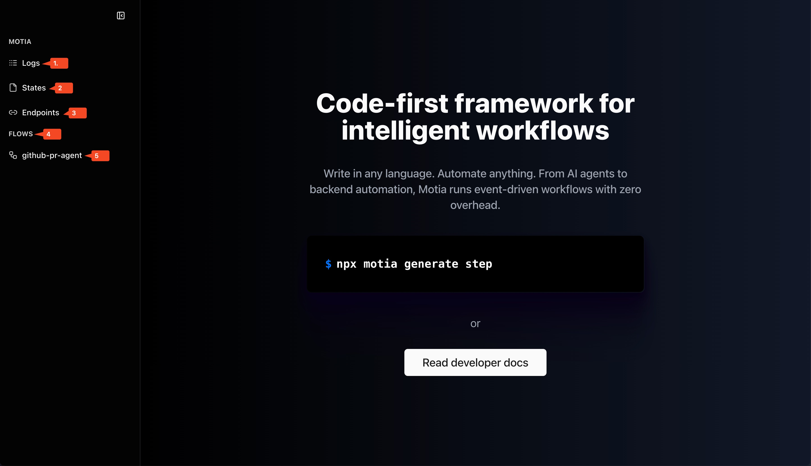
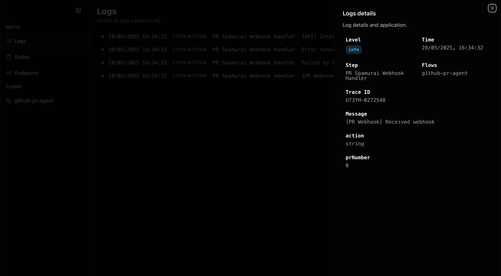
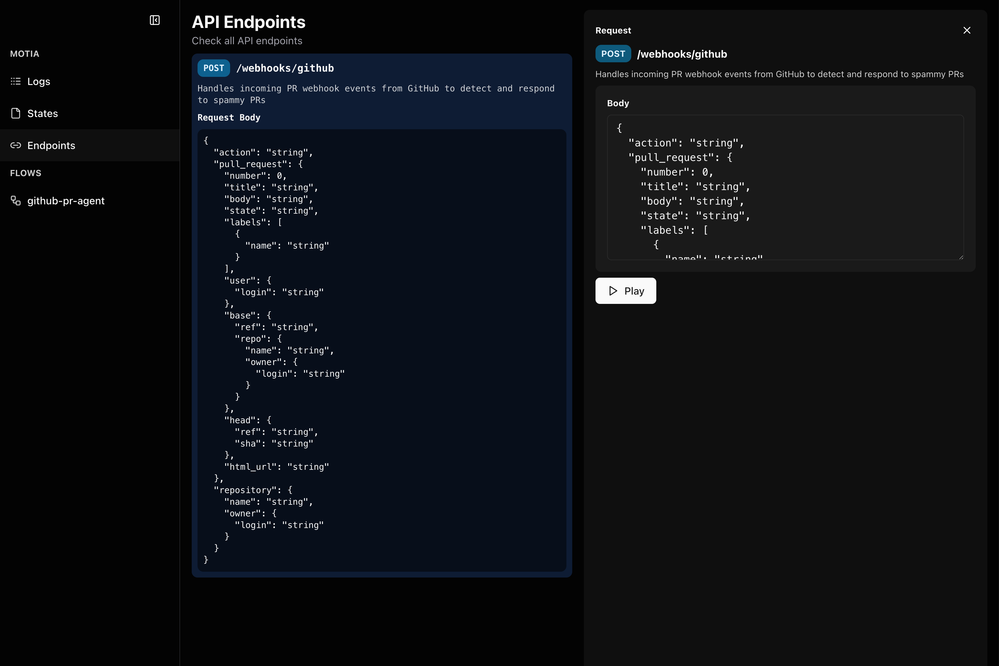
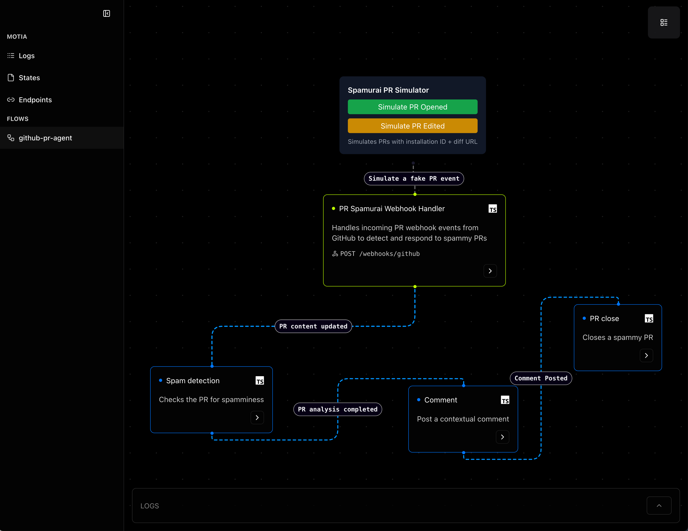

## Motia Workbench

Motia Workbench is your local development dashboard for building, testing, and debugging event-driven, AI-native backend systems. It provides an intuitive UI to inspect flows, view logs, see API spec, test endpoints, and understand how data moves through your application.

Using Motia Workbench, you can:

- **View and inspect logs** in real-time
- **Explore flows** visually and understand how steps are connected
- **See API spec and test endpoints** from within the Workbench
- **Preview stream activity**, background jobs, and agent executions
- **Debug locally** across flows and handlers

## Start the Workbench
To launch the Motia Workbench for your project, simply run the following command:
```bash
pnpm run dev
```
It will open the Workbench on port `3000` by default. If port `3000` is occupied, you can launch it on some other port using the `--port` command:
``` bash
pnpm run dev --port 3003
```


1. **Logs** – View real-time, structured logs with `level`, `Time`, `Step`, `Flows`, `Trace ID` and more.

2. **States** – Inspect state values across flow steps. Useful for debugging shared data passed between steps.

3. **Endpoints** – See your full API spec and test routes directly. See `Request` body, `Response` body and hit `Play` to test your API endpoints, without leaving the Workbench.

4. **Flows** – Visual map of your flow execution. Understand step order, trigger points, subscribed and emitted events at a glance. Click steps to see description, language and events a step subscribes to and emits.

4. **Your Workflows** - Each Motia Workflow you write will show up under `Flows`. Click on any workflow to inspect the steps of that workflow.

## Next Steps
- Checkout how to write different steps (like [API step](/docs/concepts/step-types/api)) for your workflow.
- Use Motia's built-in [Logger](/docs/concepts/toolkit/logger) to log, debug and track workflows.
- Leverage [Streams](/docs/concepts/toolkit/streams) to write real-time, event-driven apps.