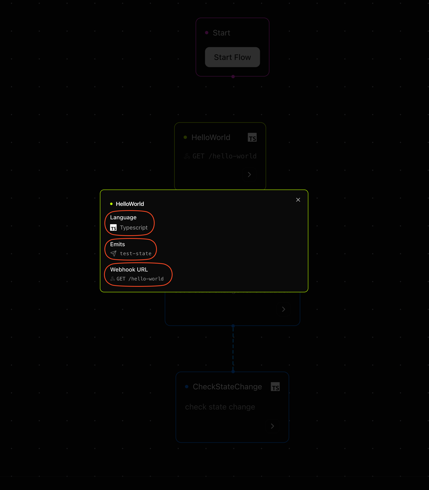

## Motia Workbench

Motia Workbench is your all-in-one development utility. Think of it as the mission control for your workflows.

From here, you can visualize your flows, inspect data at every step, see what language a step is written in, test API endpoints, deploy workflows, and monitor everything in real-time.

If you’re working with steps, events, and flows in Motia, Workbench is where it all comes together.

## But what are Workflows?
A workflow in Motia is a connected sequence of [Steps](/docs/foundations/steps) that collectively perform a larger task. 

Workflows are built to emulate real-life flows in businesses such as onboarding a customer, handling a support ticket, or running an AI-powered automation etc. Each Step in the workflow is responsible for a specific piece of logic and can be triggered by [APIs](/docs/foundations/types-of-step#2-api-step), [events](/docs/foundations/types-of-step#1-event-step), or [schedules](/docs/foundations/types-of-step#3-cron-steps).

This structure allows developers to break down complex backend processes into modular, testable, and observable units that flow in a predictable and maintainable way.


## Getting Started with Motia Workbench

To start the Workbench, simply run the `motia dev` command:

```bash
npm run dev [options]
# or
yarn dev [options]
# or
pnpm dev [options]
# or
bun run dev [options]
```

The `motia dev` command comes with a few options flags:
<Callout title="Options" type="info">
`motia dev [options]`

Options:

  `-p`, `--port`: The port to run the server on (default: 3000)

  `-v`, `--verbose`: Enable verbose logging

  `-d`, `--debug`: Enable debug logging
  
  `-m`, `--mermaid`: Enable mermaid diagram generation
</Callout>

<Callout title="Motia CLI" type="info">
You can read more about our CLI commands in the [reference table.](/docs/foundations/happy-practices#cli-command-reference-table)
</Callout>

Running the `dev` command starts:

- **Motia Server** – Your backend APIs and flow execution engine.
- **Motia Workbench** – A local web UI served at `http://localhost:3000` by default.
- **Development Mode** – Hot reload on file changes, so you can iterate fast.
---

## Key Features
<Steps>
<Step>
### Flow Visualization
Flow Visualization in Motia Workbench provides a clear, interactive map of your entire backend workflow, making even complex systems easy to grasp at a glance. 

Each step in your flow appears as a visual node, with API steps distinctly marked as entry points. Event emissions and topic connections are drawn as lines between steps, giving you a real-time view of how data moves through your system. 

By clicking on any step, you can inspect which language that step was written in, which event it emits and which event it subscribes to. Additionally, for API steps, you also get information about the endpoint URL and the http request type.

This visual representation brings intuition to an otherwise complex backend flow, from trigger to output.



---
</Step>
<Step>
### Real-time Testing
Real-time Testing in Motia Workbench lets you interactively test and debug your workflows right from the Workbench UI. You can send mock requests to API steps, trigger events, and watch them propagate through your flow in real time. As data moves from step to step, you’ll see [logs](/docs/foundations/happy-practices#fail-loud-log-clearly) for how it’s transformed, routed, or handled, offering immediate feedback on your logic. 

Click on `API` in the sidebar to see detailed execution results, including inputs, outputs, and errors. 


Whether you’re fine-tuning behavior or chasing down a bug, real-time testing gives you the visibility and control you need to ship with confidence.

---
</Step>
<Step>
### Live Logs

Motia Workbench brings real-time logging directly into your development environment. No terminal required. 

Logs from your running flows stream live in the interface, giving you instant visibility into what’s happening behind the scenes.  Messages are scoped by flow, so you can easily trace the lifecycle of a request, monitor state transitions, or spot unexpected behavior. 

Whether it’s an info-level confirmation or a debug trace of internal logic, the Workbench keeps you in the loop—step by step, event by event.

```log
[INFO] [booking-flow] Received booking payload.
[DEBUG] [booking-flow] Creating invoice...
[INFO] [booking-flow] Booking confirmed.
```

---
</Step>
<Step>
### Development Tools

Motia Workbench has been designed for rapid iteration and workflow visualization:

- **Hot Reload** – See changes instantly without restarts.
- **Log Panels** – Get detailed error messages and context for every failed step.
- **State Inspector** – Monitor and explore the `state` object across steps and flows.
- **Endpoints** - Inspect the `API` endpoints exposed by your steps, test them directly from the UI, and get detailed error messages when requests fail.

Motia Workbench has everything you need to build, debug, and refine your workflows, without ever having to leave the browser.

---
</Step>
</Steps>


Motia Workbench is an integral part of your development workflow.

It reduces debugging time, improves visibility, and brings your entire step-based architecture to life. 

Whether you're building your first flow or orchestrating a complex set of APIs and events, Workbench helps you stay in control, visualize your flows and iterate fast.

As your flows grow, Workbench grows with you, so open it up, dive in, and build something great!

---
<Cards>
  <Card
    title="Deploy Your Flows"
    description="Take your flows to production with Motia's built-in deployment support and versioning."
    href="/docs/foundations/deployment"
    icon="🚀"
  />
  <Card
    title="Observability & Logging"
    description="Get better visibility into your flows using trace IDs, logs, and detailed error panels."
    href="/docs/foundations/observability-and-logging"
    icon="📊"
  />
</Cards>