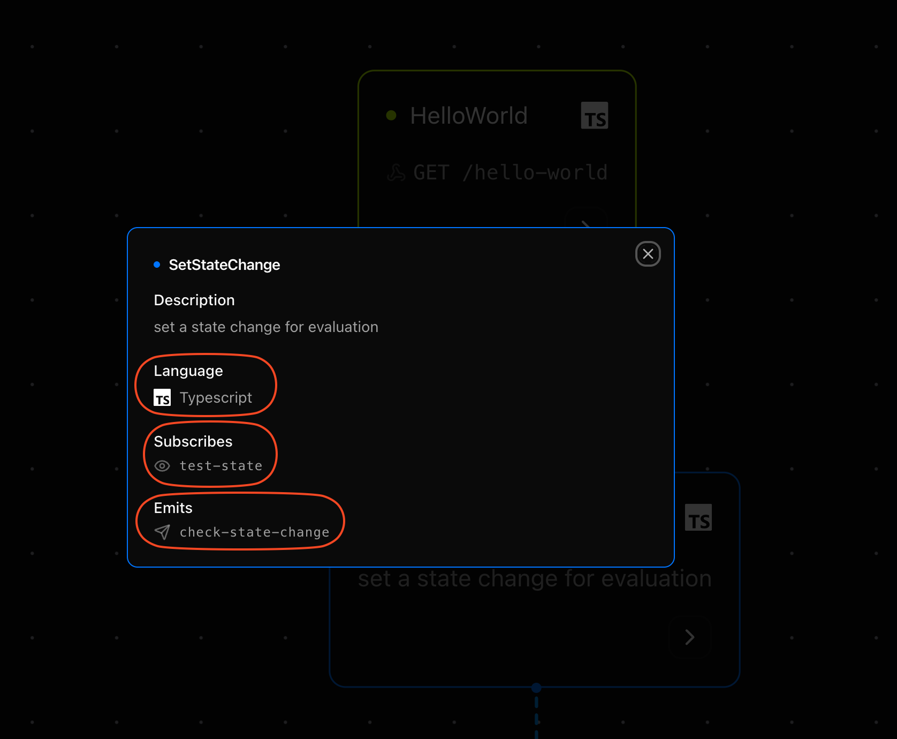

A Step is a language and runtime agnostic, modular, self-contained unit of backend logic. It’s the core abstraction in Motia—similar to what Components are in React. Just as Components manage UI, Steps manage backend logic and workflows.

> In a Motia app, everything is a Step.

## Why Steps?

Modern backends are becoming increasingly fragmented. Developers juggle between:

- Background jobs
- Queues and schedulers
- AI agents
- REST or GraphQL APIs

This leads to brittle systems stitched together with manual glue code.


Motia introduces Steps as a unifying concept: every backend action, whether it's calling an API, reacting to an event, or invoking an AI, becomes a Step.

## Anatomy of a Step
Each Step has two parts:

1. Configuration: Describes how the step behaves (`exports.config`)
2. Handler: Contains the logic that gets executed (`exports.handler`)

> Steps can be written in multiple languages (JS, TS, Python and more), even within the same workflow!
```ts
exports.config = {
  type: 'api',
  path: '/hello',
  method: 'GET',
  name: 'HelloStep',
  emits: [],
  flows: ['default'],
}

exports.handler = async ({ query }) => {
  return {
    status: 200,
    body: { message: `Hello ${query.name}` },
  }
}
```

### Common step configuration

A step's configuration is defined through a `config` object that must be exported. This object contains essential properties that tell Motia how to interact with the step. Here's the common configuration of steps:

<DescriptionTable
  type={{
    type: {
      description: 'The step type: event, api, or cron',
      type: 'string',
    },
    name: {
      description: 'A unique identifier for the step, used in Motia Workbench visualization tool',
      type: 'string',
    },
    subscribes: {
      description: 'A list of topics this step listens to',
      type: 'string[]',
      default: []
    },
    emits: {
      description: 'A list of topics this step can emit',
      type: 'string[]',
    },
    flows: {
      description: 'A list of flow identifiers that this step belongs to',
      type: 'string[]',
    },
    description: {
      description: 'Optional description for documentation and visualization',
      type: 'string',
    }
  }}
/>
<Callout title="Steps" type="warning">
  Note that in addition to common configuration, some steps have additional properties. Take a look at the respective <a href="/docs/foundation/types-of-step">type of step</a> to know the exact configuration of that step type.
</Callout>

## The two behaviours of a Step:
Each step has two behaviors - Subscription, and Emission:
1. Subscribe: This behavior dictates the events to which a step listens to.  
Example: `subscribes: ['user.registered', 'payment.success']`
2. Emit: This behavior dictates to which step is the current one passing the baton to. A step can emit to zero/one/many step(s).  
Example: `emits: ['send-welcome-email', 'trigger-invoice']`

You can see the subscription and emission of each step from the Workbench as well.

> The Workbench also shows you which language the step was written in. Each step can be written a different language, even within the same workflow.


## Next steps
Steps are the single-most important part of a Motia apps. Therefore, it makes tremendous sense to learn about them well. Here's where you can go to for the same:
<Cards>
  <Card
    href="/docs/foundations/types-of-step"
    title="Types of Steps"
    icon="📦"
  >
  Adopt a new mental model for AI-native, modern backends - one Step at a time.
  </Card>

  <Card
  href="/docs/foundations/steps-advanced"
  title="Powering Up Your Steps"
  icon="🛠️"
>
Explore advanced capabilities of Steps: custom visuals, no-operation (NOOP) and more!
</Card>
</Cards>
---