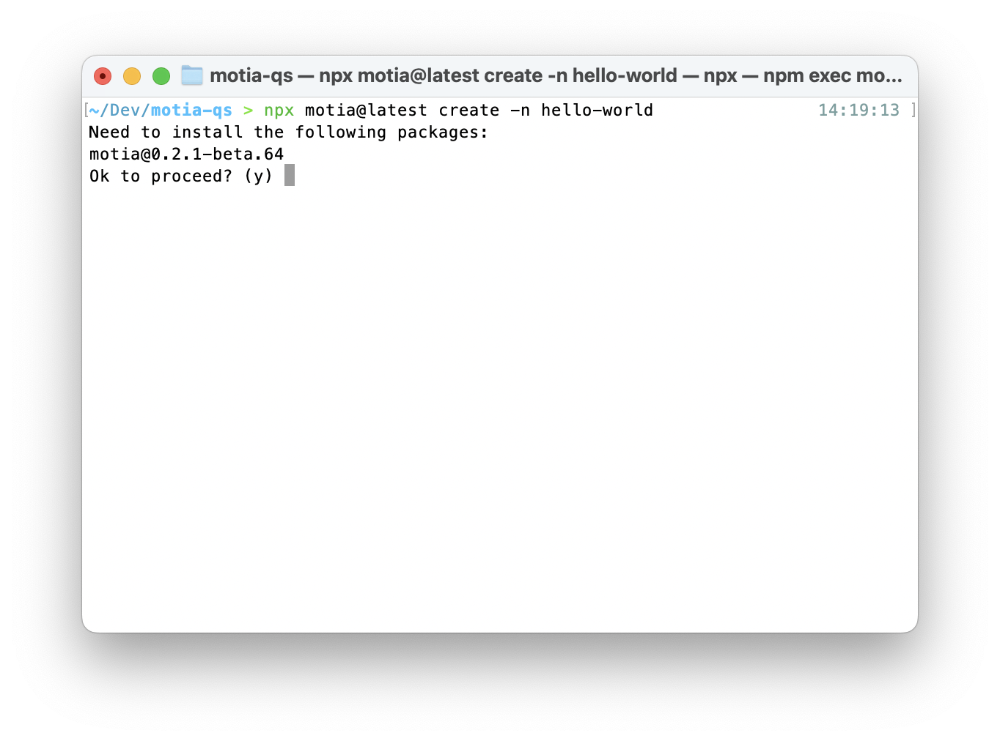
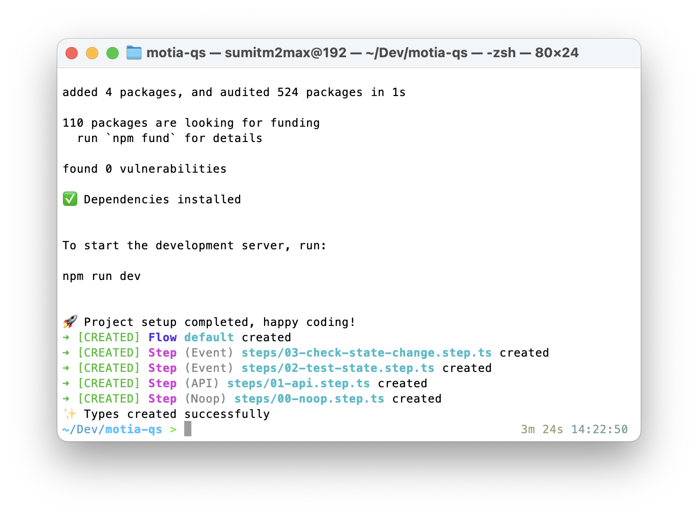
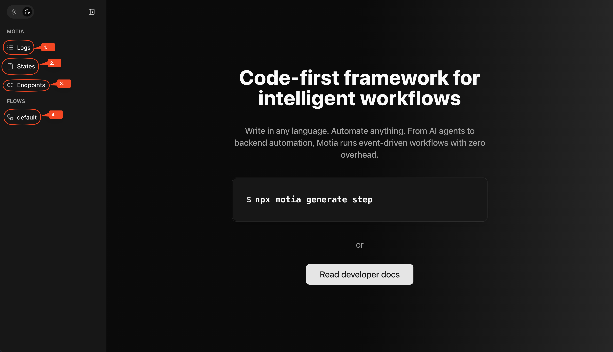
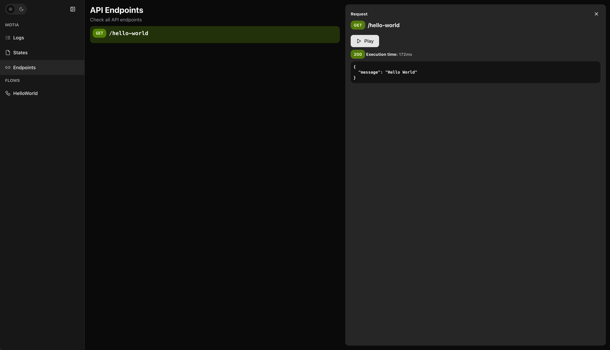
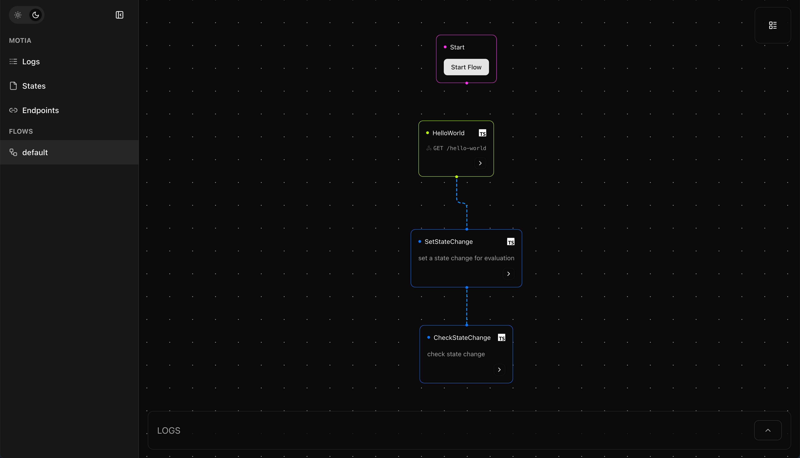

This quickstart will give you 90% of what you'll use on a daily basis. Let's spin up a Motia app and see everything in action, _in less than 60 seconds!_
<Accordions type="single">
  <Accordion title="What you will learn">
    <ul>
      <li>How to initialize a new Motia app</li>
      <li>How to write steps</li>
      <li>How to use Motia Workbench</li>
      <li>Where to learn more</li>
    </ul>
  </Accordion>
</Accordions>
<Steps>
<Step>
## Initialize a new project
Execute the following command and Motia will scaffold a new project and install all the dependencies:
```bash
npx motia@latest create -n <your-project-name>
```
  
 This command will:
- scaffold a new Motia project,
- install all the dependencies, and
- create empty files for different steps.
  

<Callout title="Steps" type="info">
  Steps are to a Motia app what Components are to a React app. Steps are the fundamental, building blocks of a Motia app. They are reusable units of code, each of which can recieve an input data, perform logic and output data or trigger another event. Read more about them in our [introductory blog](https://dev.to/motiadev/introducing-motia-3oja-temp-slug-3967652?preview=c67eba085f74a7cf7b2c509a1548676bce436734e51ef49f52b1927b110de0fa2e214aa713e90c7a3301332e5d0eb658a6d1bdacb9a4777d93f37b52).
</Callout>
</Step>
<Step>
## Write a step

  Now, `cd` into the directory, open up your favourite code editor there, and let's write our first step. Open up the `01-api.step.ts` file and paste the following into it:
  ```ts
  exports.config = {
  type: 'api', // "event", "api", "noop" or "cron"
  path: '/hello-world',
  method: 'GET',
  name: 'HelloWorld',
  emits: ['test-state'],
  flows: ['default'],
}

exports.handler = async () => {
  return {
    status: 200,
    body: { message: 'Hello World' },
  }
}
  ```
  Here are the details about this step:
  - `type: 'api'` - This is an API step that we can trigger this via HTTP request. Steps can be of four types - `API`, `Event`, `NOOP`, and `Cron`.
  - `path: '/hello-world'` - The URL path to access this step. This is the API Endpoint.
  - `method: 'GET'` -  HTTP request method.
  - `name: 'HelloWorld'` -  Name for this step
  - `emits: []` -  Add follow-up event(s).
  - `flows: ['default']` -  Flow to which this step belongs. By default, all steps belong to the _default_ flow.

> Everything is a Step. Steps are like React Components - reusable, isolated units of logic that handle specific tasks. Combine individual steps and you get a workflow. Learn how to [think in Steps](/docs/what-are-steps).
</Step>
<Step>
## Using Motia Workbench
  Now, fire up the Motia workbench to visualize the data flow, test API endpoints and debug locally. To start it, simply run `pnpm run dev` and it will launch at [`http://localhost:3000`](http://localhost:3000).
  
  From the Workbench, you can navigate to:
  1. Logs: To get structured logs for each step execution, including inputs, outputs, and errors.
  2. States: To view the internal state and data passed between steps using `traceID` and `field`.
  3. Endpoints: To see and test all your API endpoints from within the Workbench:
    
  4. Flows: To visually inspect how your steps are connected and triggered, what each step does, which language it was written in, what events does it subscribe/emit to and more:
  
  > You can click on any step to know more about it - the language it was written in, what events does it emit/subscribe to and more!
</Step>

<Step>
## You're up and running! 🎉
That's it! This is how simple it is to have a fully functional Motia app - with an API step, automatic routing, a visual debugger, and zero setup hassle.

From here, you can:

- 🔧 Add new steps (.step.ts) to handle events, schedule jobs, or trigger AI agents
- 📡 Wire up complex workflows using just event emissions
- 🔭 Debug and iterate in real-time with the Workbench
- 🤖 Add AI agentic logic to one/many step(s), and 
- 🏗️ Build out full-blown backend systems with modular logic
</Step>
</Steps>


## Next Steps?
When writing a Motia app, 90% of your time will be spent on writing, modifying and managing Steps. 

Just like Components in a React app, Steps are the building blocks of your Motia app and they're what you'll spend most of your time on. So, learning more about Steps makes tremendous sense.

Here's where you can go to next, if you wanna dive deeper:
<Cards>
  <Card
    href="/docs/what-are-steps"
    title="Thinking in Steps"
    icon="🧠"
  >
  Adopt a new mental model for AI-native, modern backends - one Step at a time.
  </Card>

  <Card
  href="/docs/understanding-steps"
  title="Understanding Steps"
  icon="🧱"
>
  Get to know the core building block of Motia - how Steps receive, process, and emit data.
</Card>
  <Card
    href="/docs/beyond-hello-world"
    title="Beyond hello world"
    icon="🔀"
  >
  Extend the _Hello World_ app from our quickest start and get hands-on with more Motia features.
  </Card>
    <Card
    href="/docs/beyond-hello-world"
    title="Automate real-world tasks"
    icon="✏️"
  >
  Follow guides to automate tasks with AI and APIs - like sending emails with GPT.
  </Card>
</Cards>
---