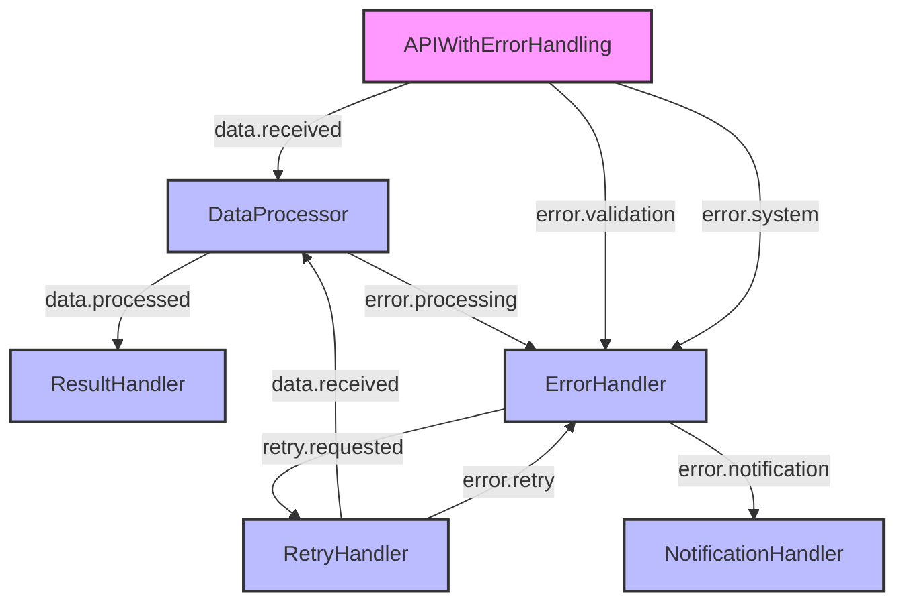

# Error Handling Pattern

The Error Handling pattern provides strategies for gracefully handling errors and exceptions in your Motia workflows. Proper error handling is essential for building robust, production-ready applications that can recover from failures and provide meaningful feedback to users.

## Problem Statement

In any workflow, errors can occur for various reasons: invalid input data, external service failures, network issues, or bugs in your code. Without proper error handling, these issues can cause your workflows to fail unexpectedly, leading to:

- Incomplete processing
- Lost data
- Inconsistent state
- Poor user experience
- Difficult debugging

## Solution Overview

The Error Handling pattern in Motia involves:

1. **Detecting errors** at various points in your workflow
2. **Handling errors** appropriately based on their type and severity
3. **Recovering** from errors when possible
4. **Providing feedback** about errors to users and developers

This pattern leverages Motia's event-driven architecture to create robust error handling mechanisms that can respond to different types of failures.

## Implementation

### Step 1: Create a Basic API with Error Handling

First, let's create an API step that includes basic error handling:

<Tabs items={['TypeScript', 'JavaScript', 'Python', 'Ruby']}>
  <Tab value="TypeScript">
    ```typescript
    // api-with-error-handling.step.ts
    export const config = {
      type: 'api',
      name: 'APIWithErrorHandling',
      path: '/process-data',
      method: 'POST',
      emits: ['data.received', 'error.validation'],
      flows: ['error-handling']
    };

    export const handler = async (request, { emit, logger }) => {
      try {
        const data = request.body;
        
        // Validate input data
        if (!data) {
          logger.warn('Missing request body');
          
          // Emit validation error event
          await emit({
            topic: 'error.validation',
            data: {
              error: 'Missing request body',
              requestId: request.id
            }
          });
          
          return {
            status: 400,
            body: {
              error: 'Missing request body',
              requestId: request.id
            }
          };
        }
        
        if (!data.items || !Array.isArray(data.items)) {
          logger.warn('Invalid items format');
          
          // Emit validation error event
          await emit({
            topic: 'error.validation',
            data: {
              error: 'Items must be an array',
              requestId: request.id
            }
          });
          
          return {
            status: 400,
            body: {
              error: 'Items must be an array',
              requestId: request.id
            }
          };
        }
        
        // Process valid data
        logger.info(`Processing ${data.items.length} items`);
        
        // Emit data received event
        await emit({
          topic: 'data.received',
          data: {
            items: data.items,
            requestId: request.id
          }
        });
        
        return {
          status: 202,
          body: {
            message: `Processing ${data.items.length} items`,
            requestId: request.id
          }
        };
      } catch (error) {
        // Log unexpected errors
        logger.error('Unexpected error processing request', error);
        
        // Emit system error event
        await emit({
          topic: 'error.system',
          data: {
            error: error.message,
            stack: error.stack,
            requestId: request.id
          }
        });
        
        return {
          status: 500,
          body: {
            error: 'Internal server error',
            requestId: request.id
          }
        };
      }
    };
    ```
  </Tab>
  <Tab value="JavaScript">
    ```javascript
    // api-with-error-handling.step.js
    export const config = {
      type: 'api',
      name: 'APIWithErrorHandling',
      path: '/process-data',
      method: 'POST',
      emits: ['data.received', 'error.validation'],
      flows: ['error-handling']
    };

    export const handler = async (request, { emit, logger }) => {
      try {
        const data = request.body;
        
        // Validate input data
        if (!data) {
          logger.warn('Missing request body');
          
          // Emit validation error event
          await emit({
            topic: 'error.validation',
            data: {
              error: 'Missing request body',
              requestId: request.id
            }
          });
          
          return {
            status: 400,
            body: {
              error: 'Missing request body',
              requestId: request.id
            }
          };
        }
        
        if (!data.items || !Array.isArray(data.items)) {
          logger.warn('Invalid items format');
          
          // Emit validation error event
          await emit({
            topic: 'error.validation',
            data: {
              error: 'Items must be an array',
              requestId: request.id
            }
          });
          
          return {
            status: 400,
            body: {
              error: 'Items must be an array',
              requestId: request.id
            }
          };
        }
        
        // Process valid data
        logger.info(`Processing ${data.items.length} items`);
        
        // Emit data received event
        await emit({
          topic: 'data.received',
          data: {
            items: data.items,
            requestId: request.id
          }
        });
        
        return {
          status: 202,
          body: {
            message: `Processing ${data.items.length} items`,
            requestId: request.id
          }
        };
      } catch (error) {
        // Log unexpected errors
        logger.error('Unexpected error processing request', error);
        
        // Emit system error event
        await emit({
          topic: 'error.system',
          data: {
            error: error.message,
            stack: error.stack,
            requestId: request.id
          }
        });
        
        return {
          status: 500,
          body: {
            error: 'Internal server error',
            requestId: request.id
          }
        };
      }
    };
    ```
  </Tab>
  <Tab value="Python">
    ```python
    # api_with_error_handling.step.py
    import traceback
    
    config = {
      "type": "api",
      "name": "APIWithErrorHandling",
      "path": "/process-data",
      "method": "POST",
      "emits": ["data.received", "error.validation", "error.system"],
      "flows": ["error-handling"]
    }

    async def handler(request, context):
      try:
        data = request.body
        
        # Validate input data
        if not data:
          context.logger.warn("Missing request body")
          
          # Emit validation error event
          await context.emit({
            "topic": "error.validation",
            "data": {
              "error": "Missing request body",
              "requestId": request.id
            }
          })
          
          return {
            "status": 400,
            "body": {
              "error": "Missing request body",
              "requestId": request.id
            }
          }
        
        if "items" not in data or not isinstance(data["items"], list):
          context.logger.warn("Invalid items format")
          
          # Emit validation error event
          await context.emit({
            "topic": "error.validation",
            "data": {
              "error": "Items must be an array",
              "requestId": request.id
            }
          })
          
          return {
            "status": 400,
            "body": {
              "error": "Items must be an array",
              "requestId": request.id
            }
          }
        
        # Process valid data
        context.logger.info(f"Processing {len(data['items'])} items")
        
        # Emit data received event
        await context.emit({
          "topic": "data.received",
          "data": {
            "items": data["items"],
            "requestId": request.id
          }
        })
        
        return {
          "status": 202,
          "body": {
            "message": f"Processing {len(data['items'])} items",
            "requestId": request.id
          }
        }
      except Exception as e:
        # Log unexpected errors
        context.logger.error("Unexpected error processing request", exc_info=True)
        
        # Emit system error event
        await context.emit({
          "topic": "error.system",
          "data": {
            "error": str(e),
            "stack": traceback.format_exc(),
            "requestId": request.id
          }
        })
        
        return {
          "status": 500,
          "body": {
            "error": "Internal server error",
            "requestId": request.id
          }
        }
    ```
  </Tab>
  <Tab value="Ruby">
    ```ruby
    # api_with_error_handling.step.rb
    config = {
      type: 'api',
      name: 'APIWithErrorHandling',
      path: '/process-data',
      method: 'POST',
      emits: ['data.received', 'error.validation', 'error.system'],
      flows: ['error-handling']
    }

    def handler(request, context)
      begin
        data = request.body
        
        # Validate input data
        if data.nil?
          context.logger.warn('Missing request body')
          
          # Emit validation error event
          context.emit(
            topic: 'error.validation',
            data: {
              error: 'Missing request body',
              requestId: request.id
            }
          )
          
          return {
            status: 400,
            body: {
              error: 'Missing request body',
              requestId: request.id
            }
          }
        end
        
        if !data.key?('items') || !data['items'].is_a?(Array)
          context.logger.warn('Invalid items format')
          
          # Emit validation error event
          context.emit(
            topic: 'error.validation',
            data: {
              error: 'Items must be an array',
              requestId: request.id
            }
          )
          
          return {
            status: 400,
            body: {
              error: 'Items must be an array',
              requestId: request.id
            }
          }
        end
        
        # Process valid data
        context.logger.info("Processing #{data['items'].length} items")
        
        # Emit data received event
        context.emit(
          topic: 'data.received',
          data: {
            items: data['items'],
            requestId: request.id
          }
        )
        
        return {
          status: 202,
          body: {
            message: "Processing #{data['items'].length} items",
            requestId: request.id
          }
        }
      rescue => e
        # Log unexpected errors
        context.logger.error("Unexpected error processing request: #{e.message}")
        context.logger.error(e.backtrace.join("\n"))
        
        # Emit system error event
        context.emit(
          topic: 'error.system',
          data: {
            error: e.message,
            stack: e.backtrace.join("\n"),
            requestId: request.id
          }
        )
        
        return {
          status: 500,
          body: {
            error: 'Internal server error',
            requestId: request.id
          }
        }
      end
    end
    ```
  </Tab>
</Tabs>

### Step 2: Create a Data Processor with Error Handling

Next, create a step that processes the data and includes error handling:

<Tabs items={['TypeScript', 'JavaScript', 'Python', 'Ruby']}>
  <Tab value="TypeScript">
    ```typescript
    // data-processor.step.ts
    export const config = {
      type: 'event',
      name: 'DataProcessor',
      subscribes: ['data.received'],
      emits: ['data.processed', 'error.processing'],
      flows: ['error-handling']
    };

    export const handler = async (input, { emit, logger }) => {
      const { items, requestId } = input;
      
      logger.info(`Processing ${items.length} items for request ${requestId}`);
      
      try {
        // Process each item with error handling
        const results = await Promise.all(items.map(async (item, index) => {
          try {
            // Simulate processing
            await new Promise(resolve => setTimeout(resolve, 100));
            
            // Simulate random errors for demonstration
            if (Math.random() < 0.2) { // 20% chance of error
              throw new Error(`Processing failed for item at index ${index}`);
            }
            
            // Process the item
            return {
              originalItem: item,
              processed: true,
              processingTime: new Date().toISOString()
            };
          } catch (itemError) {
            // Log item-specific error
            logger.warn(`Error processing item at index ${index}`, itemError);
            
            // Return error result instead of throwing
            return {
              originalItem: item,
              processed: false,
              error: itemError.message
            };
          }
        }));
        
        // Separate successful and failed items
        const successfulItems = results.filter(result => result.processed);
        const failedItems = results.filter(result => !result.processed);
        
        // Log processing summary
        logger.info(`Processed ${successfulItems.length} items successfully, ${failedItems.length} items failed`);
        
        // Emit processing results
        await emit({
          topic: 'data.processed',
          data: {
            requestId,
            successfulItems,
            failedItems,
            totalItems: items.length
          }
        });
        
        // If any items failed, also emit an error event
        if (failedItems.length > 0) {
          await emit({
            topic: 'error.processing',
            data: {
              requestId,
              failedItems,
              totalItems: items.length,
              successfulItems: successfulItems.length
            }
          });
        }
      } catch (error) {
        // Handle unexpected errors during processing
        logger.error('Unexpected error during batch processing', error);
        
        // Emit system error
        await emit({
          topic: 'error.system',
          data: {
            error: error.message,
            stack: error.stack,
            requestId
          }
        });
      }
    };
    ```
  </Tab>
  <Tab value="JavaScript">
    ```javascript
    // data-processor.step.js
    export const config = {
      type: 'event',
      name: 'DataProcessor',
      subscribes: ['data.received'],
      emits: ['data.processed', 'error.processing'],
      flows: ['error-handling']
    };

    export const handler = async (input, { emit, logger }) => {
      const { items, requestId } = input;
      
      logger.info(`Processing ${items.length} items for request ${requestId}`);
      
      try {
        // Process each item with error handling
        const results = await Promise.all(items.map(async (item, index) => {
          try {
            // Simulate processing
            await new Promise(resolve => setTimeout(resolve, 100));
            
            // Simulate random errors for demonstration
            if (Math.random() < 0.2) { // 20% chance of error
              throw new Error(`Processing failed for item at index ${index}`);
            }
            
            // Process the item
            return {
              originalItem: item,
              processed: true,
              processingTime: new Date().toISOString()
            };
          } catch (itemError) {
            // Log item-specific error
            logger.warn(`Error processing item at index ${index}`, itemError);
            
            // Return error result instead of throwing
            return {
              originalItem: item,
              processed: false,
              error: itemError.message
            };
          }
        }));
        
        // Separate successful and failed items
        const successfulItems = results.filter(result => result.processed);
        const failedItems = results.filter(result => !result.processed);
        
        // Log processing summary
        logger.info(`Processed ${successfulItems.length} items successfully, ${failedItems.length} items failed`);
        
        // Emit processing results
        await emit({
          topic: 'data.processed',
          data: {
            requestId,
            successfulItems,
            failedItems,
            totalItems: items.length
          }
        });
        
        // If any items failed, also emit an error event
        if (failedItems.length > 0) {
          await emit({
            topic: 'error.processing',
            data: {
              requestId,
              failedItems,
              totalItems: items.length,
              successfulItems: successfulItems.length
            }
          });
        }
      } catch (error) {
        // Handle unexpected errors during processing
        logger.error('Unexpected error during batch processing', error);
        
        // Emit system error
        await emit({
          topic: 'error.system',
          data: {
            error: error.message,
            stack: error.stack,
            requestId
          }
        });
      }
    };
    ```
  </Tab>
  <Tab value="Python">
    ```python
    # data_processor.step.py
    import asyncio
    import random
    import traceback
    from datetime import datetime
    
    config = {
      "type": "event",
      "name": "DataProcessor",
      "subscribes": ["data.received"],
      "emits": ["data.processed", "error.processing", "error.system"],
      "flows": ["error-handling"]
    }

    async def handler(input, context):
      items = input["items"]
      request_id = input["requestId"]
      
      context.logger.info(f"Processing {len(items)} items for request {request_id}")
      
      try:
        # Process each item with error handling
        results = []
        for index, item in enumerate(items):
          try:
            # Simulate processing
            await asyncio.sleep(0.1)
            
            # Simulate random errors for demonstration
            if random.random() < 0.2:  # 20% chance of error
              raise Exception(f"Processing failed for item at index {index}")
            
            # Process the item
            results.append({
              "originalItem": item,
              "processed": True,
              "processingTime": datetime.now().isoformat()
            })
          except Exception as item_error:
            # Log item-specific error
            context.logger.warn(f"Error processing item at index {index}: {str(item_error)}")
            
            # Add error result instead of raising
            results.append({
              "originalItem": item,
              "processed": False,
              "error": str(item_error)
            })
        
        # Separate successful and failed items
        successful_items = [result for result in results if result["processed"]]
        failed_items = [result for result in results if not result["processed"]]
        
        # Log processing summary
        context.logger.info(f"Processed {len(successful_items)} items successfully, {len(failed_items)} items failed")
        
        # Emit processing results
        await context.emit({
          "topic": "data.processed",
          "data": {
            "requestId": request_id,
            "successfulItems": successful_items,
            "failedItems": failed_items,
            "totalItems": len(items)
          }
        })
        
        # If any items failed, also emit an error event
        if len(failed_items) > 0:
          await context.emit({
            "topic": "error.processing",
            "data": {
              "requestId": request_id,
              "failedItems": failed_items,
              "totalItems": len(items),
              "successfulItems": len(successful_items)
            }
          })
      except Exception as e:
        # Handle unexpected errors during processing
        context.logger.error("Unexpected error during batch processing", exc_info=True)
        
        # Emit system error
        await context.emit({
          "topic": "error.system",
          "data": {
            "error": str(e),
            "stack": traceback.format_exc(),
            "requestId": request_id
          }
        })
    ```
  </Tab>
  <Tab value="Ruby">
    ```ruby
    # data_processor.step.rb
    config = {
      type: 'event',
      name: 'DataProcessor',
      subscribes: ['data.received'],
      emits: ['data.processed', 'error.processing', 'error.system'],
      flows: ['error-handling']
    }

    def handler(input, context)
      items = input[:items]
      request_id = input[:requestId]
      
      context.logger.info("Processing #{items.length} items for request #{request_id}")
      
      begin
        # Process each item with error handling
        results = []
        items.each_with_index do |item, index|
          begin
            # Simulate processing
            sleep(0.1)
            
            # Simulate random errors for demonstration
            if rand < 0.2  # 20% chance of error
              raise "Processing failed for item at index #{index}"
            end
            
            # Process the item
            results << {
              originalItem: item,
              processed: true,
              processingTime: Time.now.iso8601
            }
          rescue => item_error
            # Log item-specific error
            context.logger.warn("Error processing item at index #{index}: #{item_error.message}")
            
            # Add error result instead of raising
            results << {
              originalItem: item,
              processed: false,
              error: item_error.message
            }
          end
        end
        
        # Separate successful and failed items
        successful_items = results.select { |result| result[:processed] }
        failed_items = results.select { |result| !result[:processed] }
        
        # Log processing summary
        context.logger.info("Processed #{successful_items.length} items successfully, #{failed_items.length} items failed")
        
        # Emit processing results
        context.emit(
          topic: 'data.processed',
          data: {
            requestId: request_id,
            successfulItems: successful_items,
            failedItems: failed_items,
            totalItems: items.length
          }
        )
        
        # If any items failed, also emit an error event
        if failed_items.length > 0
          context.emit(
            topic: 'error.processing',
            data: {
              requestId: request_id,
              failedItems: failed_items,
              totalItems: items.length,
              successfulItems: successful_items.length
            }
          )
        end
      rescue => e
        # Handle unexpected errors during processing
        context.logger.error("Unexpected error during batch processing: #{e.message}")
        context.logger.error(e.backtrace.join("\n"))
        
        # Emit system error
        context.emit(
          topic: 'error.system',
          data: {
            error: e.message,
            stack: e.backtrace.join("\n"),
            requestId: request_id
          }
        )
      end
    end
    ```
  </Tab>
</Tabs>

### Step 3: Create an Error Handler Step

Now, create a step that specifically handles errors:

<Tabs items={['TypeScript', 'JavaScript', 'Python', 'Ruby']}>
  <Tab value="TypeScript">
    ```typescript
    // error-handler.step.ts
    export const config = {
      type: 'event',
      name: 'ErrorHandler',
      subscribes: ['error.validation', 'error.processing', 'error.system'],
      emits: ['error.notification', 'retry.requested'],
      flows: ['error-handling']
    };

    export const handler = async (input, { emit, state, logger }) => {
      const { requestId } = input;
      const errorType = input.topic || 'unknown';
      
      logger.info(`Handling error of type ${errorType} for request ${requestId}`);
      
      // Get or initialize error stats
      const statsKey = 'error-stats';
      const stats = await state.get(statsKey) || {
        validation: 0,
        processing: 0,
        system: 0,
        total: 0,
        lastError: null
      };
      
      // Update error stats
      switch (errorType) {
        case 'error.validation':
          stats.validation++;
          break;
        case 'error.processing':
          stats.processing++;
          break;
        case 'error.system':
          stats.system++;
          break;
      }
      
      stats.total++;
      stats.lastError = {
        type: errorType,
        timestamp: new Date().toISOString(),
        requestId,
        details: input
      };
      
      // Save updated stats
      await state.set(statsKey, stats);
      
      // Handle different error types
      switch (errorType) {
        case 'error.validation':
          // For validation errors, just log and notify
          logger.info(`Validation error: ${input.error}`);
          
          await emit({
            topic: 'error.notification',
            data: {
              level: 'warning',
              message: `Validation error: ${input.error}`,
              requestId
            }
          });
          break;
          
        case 'error.processing':
          // For processing errors, log, notify, and consider retry
          const { failedItems, totalItems, successfulItems } = input;
          const failureRate = failedItems.length / totalItems;
          
          logger.info(`Processing error: ${failedItems.length} of ${totalItems} items failed (${Math.round(failureRate * 100)}%)`);
          
          await emit({
            topic: 'error.notification',
            data: {
              level: 'warning',
              message: `Processing error: ${failedItems.length} of ${totalItems} items failed`,
              requestId,
              failureRate
            }
          });
          
          // If failure rate is below threshold, request retry for failed items
          if (failureRate < 0.5) {
            logger.info(`Requesting retry for ${failedItems.length} failed items`);
            
            await emit({
              topic: 'retry.requested',
              data: {
                requestId,
                items: failedItems.map(item => item.originalItem),
                attempt: input.attempt || 1
              }
            });
          } else {
            logger.warn(`Failure rate too high (${Math.round(failureRate * 100)}%), not requesting retry`);
          }
          break;
          
        case 'error.system':
          // For system errors, log, notify, and alert
          logger.error(`System error: ${input.error}`);
          
          await emit({
            topic: 'error.notification',
            data: {
              level: 'error',
              message: `System error: ${input.error}`,
              requestId,
              stack: input.stack
            }
          });
          break;
          
        default:
          // For unknown errors, log and notify
          logger.error(`Unknown error type: ${errorType}`);
          
          await emit({
            topic: 'error.notification',
            data: {
              level: 'error',
              message: `Unknown error type: ${errorType}`,
              requestId,
              details: input
            }
          });
      }
    };
    ```
  </Tab>
  <Tab value="JavaScript">
    ```javascript
    // error-handler.step.js
    export const config = {
      type: 'event',
      name: 'ErrorHandler',
      subscribes: ['error.validation', 'error.processing', 'error.system'],
      emits: ['error.notification', 'retry.requested'],
      flows: ['error-handling']
    };

    export const handler = async (input, { emit, state, logger }) => {
      const { requestId } = input;
      const errorType = input.topic || 'unknown';
      
      logger.info(`Handling error of type ${errorType} for request ${requestId}`);
      
      // Get or initialize error stats
      const statsKey = 'error-stats';
      const stats = await state.get(statsKey) || {
        validation: 0,
        processing: 0,
        system: 0,
        total: 0,
        lastError: null
      };
      
      // Update error stats
      switch (errorType) {
        case 'error.validation':
          stats.validation++;
          break;
        case 'error.processing':
          stats.processing++;
          break;
        case 'error.system':
          stats.system++;
          break;
      }
      
      stats.total++;
      stats.lastError = {
        type: errorType,
        timestamp: new Date().toISOString(),
        requestId,
        details: input
      };
      
      // Save updated stats
      await state.set(statsKey, stats);
      
      // Handle different error types
      switch (errorType) {
        case 'error.validation':
          // For validation errors, just log and notify
          logger.info(`Validation error: ${input.error}`);
          
          await emit({
            topic: 'error.notification',
            data: {
              level: 'warning',
              message: `Validation error: ${input.error}`,
              requestId
            }
          });
          break;
          
        case 'error.processing':
          // For processing errors, log, notify, and consider retry
          const { failedItems, totalItems, successfulItems } = input;
          const failureRate = failedItems.length / totalItems;
          
          logger.info(`Processing error: ${failedItems.length} of ${totalItems} items failed (${Math.round(failureRate * 100)}%)`);
          
          await emit({
            topic: 'error.notification',
            data: {
              level: 'warning',
              message: `Processing error: ${failedItems.length} of ${totalItems} items failed`,
              requestId,
              failureRate
            }
          });
          
          // If failure rate is below threshold, request retry for failed items
          if (failureRate < 0.5) {
            logger.info(`Requesting retry for ${failedItems.length} failed items`);
            
            await emit({
              topic: 'retry.requested',
              data: {
                requestId,
                items: failedItems.map(item => item.originalItem),
                attempt: input.attempt || 1
              }
            });
          } else {
            logger.warn(`Failure rate too high (${Math.round(failureRate * 100)}%), not requesting retry`);
          }
          break;
          
        case 'error.system':
          // For system errors, log, notify, and alert
          logger.error(`System error: ${input.error}`);
          
          await emit({
            topic: 'error.notification',
            data: {
              level: 'error',
              message: `System error: ${input.error}`,
              requestId,
              stack: input.stack
            }
          });
          break;
          
        default:
          // For unknown errors, log and notify
          logger.error(`Unknown error type: ${errorType}`);
          
          await emit({
            topic: 'error.notification',
            data: {
              level: 'error',
              message: `Unknown error type: ${errorType}`,
              requestId,
              details: input
            }
          });
      }
    };
    ```
  </Tab>
  <Tab value="Python">
    ```python
    # error_handler.step.py
    import traceback
    from datetime import datetime
    
    config = {
      "type": "event",
      "name": "ErrorHandler",
      "subscribes": ["error.validation", "error.processing", "error.system"],
      "emits": ["error.notification", "retry.requested"],
      "flows": ["error-handling"]
    }

    async def handler(input, context):
      request_id = input.get("requestId")
      error_type = input.get("topic", "unknown")
      
      context.logger.info(f"Handling error of type {error_type} for request {request_id}")
      
      # Get or initialize error stats
      stats_key = "error-stats"
      stats = await context.state.get(stats_key) or {
        "validation": 0,
        "processing": 0,
        "system": 0,
        "total": 0,
        "lastError": None
      }
      
      # Update error stats
      if error_type == "error.validation":
        stats["validation"] += 1
      elif error_type == "error.processing":
        stats["processing"] += 1
      elif error_type == "error.system":
        stats["system"] += 1
      
      stats["total"] += 1
      stats["lastError"] = {
        "type": error_type,
        "timestamp": datetime.now().isoformat(),
        "requestId": request_id,
        "details": input
      }
      
      # Save updated stats
      await context.state.set(stats_key, stats)
      
      # Handle different error types
      if error_type == "error.validation":
        # For validation errors, just log and notify
        context.logger.info(f"Validation error: {input.get('error')}")
        
        await context.emit({
          "topic": "error.notification",
          "data": {
            "level": "warning",
            "message": f"Validation error: {input.get('error')}",
            "requestId": request_id
          }
        })
      
      elif error_type == "error.processing":
        # For processing errors, log, notify, and consider retry
        failed_items = input.get("failedItems", [])
        total_items = input.get("totalItems", 0)
        successful_items = input.get("successfulItems", 0)
        
        if total_items > 0:
          failure_rate = len(failed_items) / total_items
        else:
          failure_rate = 0
        
        context.logger.info(f"Processing error: {len(failed_items)} of {total_items} items failed ({round(failure_rate * 100)}%)")
        
        await context.emit({
          "topic": "error.notification",
          "data": {
            "level": "warning",
            "message": f"Processing error: {len(failed_items)} of {total_items} items failed",
            "requestId": request_id,
            "failureRate": failure_rate
          }
        })
        
        # If failure rate is below threshold, request retry for failed items
        if failure_rate < 0.5:
          context.logger.info(f"Requesting retry for {len(failed_items)} failed items")
          
          await context.emit({
            "topic": "retry.requested",
            "data": {
              "requestId": request_id,
              "items": [item.get("originalItem") for item in failed_items],
              "attempt": input.get("attempt", 1)
            }
          })
        else:
          context.logger.warn(f"Failure rate too high ({round(failure_rate * 100)}%), not requesting retry")
      
      elif error_type == "error.system":
        # For system errors, log, notify, and alert
        context.logger.error(f"System error: {input.get('error')}")
        
        await context.emit({
          "topic": "error.notification",
          "data": {
            "level": "error",
            "message": f"System error: {input.get('error')}",
            "requestId": request_id,
            "stack": input.get("stack")
          }
        })
      
      else:
        # For unknown errors, log and notify
        context.logger.error(f"Unknown error type: {error_type}")
        
        await context.emit({
          "topic": "error.notification",
          "data": {
            "level": "error",
            "message": f"Unknown error type: {error_type}",
            "requestId": request_id,
            "details": input
          }
        })
    ```
  </Tab>
  <Tab value="Ruby">
    ```ruby
    # error_handler.step.rb
    config = {
      type: 'event',
      name: 'ErrorHandler',
      subscribes: ['error.validation', 'error.processing', 'error.system'],
      emits: ['error.notification', 'retry.requested'],
      flows: ['error-handling']
    }

    def handler(input, context)
      request_id = input[:requestId]
      error_type = input[:topic] || 'unknown'
      
      context.logger.info("Handling error of type #{error_type} for request #{request_id}")
      
      # Get or initialize error stats
      stats_key = 'error-stats'
      stats = context.state.get(stats_key) || {
        validation: 0,
        processing: 0,
        system: 0,
        total: 0,
        lastError: nil
      }
      
      # Update error stats
      case error_type
      when 'error.validation'
        stats[:validation] += 1
      when 'error.processing'
        stats[:processing] += 1
      when 'error.system'
        stats[:system] += 1
      end
      
      stats[:total] += 1
      stats[:lastError] = {
        type: error_type,
        timestamp: Time.now.iso8601,
        requestId: request_id,
        details: input
      }
      
      # Save updated stats
      context.state.set(stats_key, stats)
      
      # Handle different error types
      case error_type
      when 'error.validation'
        # For validation errors, just log and notify
        context.logger.info("Validation error: #{input[:error]}")
        
        context.emit(
          topic: 'error.notification',
          data: {
            level: 'warning',
            message: "Validation error: #{input[:error]}",
            requestId: request_id
          }
        )
        
      when 'error.processing'
        # For processing errors, log, notify, and consider retry
        failed_items = input[:failedItems] || []
        total_items = input[:totalItems] || 0
        successful_items = input[:successfulItems] || 0
        
        failure_rate = total_items > 0 ? failed_items.length.to_f / total_items : 0
        
        context.logger.info("Processing error: #{failed_items.length} of #{total_items} items failed (#{(failure_rate * 100).round}%)")
        
        context.emit(
          topic: 'error.notification',
          data: {
            level: 'warning',
            message: "Processing error: #{failed_items.length} of #{total_items} items failed",
            requestId: request_id,
            failureRate: failure_rate
          }
        )
        
        # If failure rate is below threshold, request retry for failed items
        if failure_rate < 0.5
          context.logger.info("Requesting retry for #{failed_items.length} failed items")
          
          context.emit(
            topic: 'retry.requested',
            data: {
              requestId: request_id,
              items: failed_items.map { |item| item[:originalItem] },
              attempt: input[:attempt] || 1
            }
          )
        else
          context.logger.warn("Failure rate too high (#{(failure_rate * 100).round}%), not requesting retry")
        end
        
      when 'error.system'
        # For system errors, log, notify, and alert
        context.logger.error("System error: #{input[:error]}")
        
        context.emit(
          topic: 'error.notification',
          data: {
            level: 'error',
            message: "System error: #{input[:error]}",
            requestId: request_id,
            stack: input[:stack]
          }
        )
        
      else
        # For unknown errors, log and notify
        context.logger.error("Unknown error type: #{error_type}")
        
        context.emit(
          topic: 'error.notification',
          data: {
            level: 'error',
            message: "Unknown error type: #{error_type}",
            requestId: request_id,
            details: input
          }
        )
      end
    end
    ```
  </Tab>
</Tabs>

### Step 4: Create a Retry Handler Step

Finally, create a step that handles retry requests:

<Tabs items={['TypeScript', 'JavaScript', 'Python', 'Ruby']}>
  <Tab value="TypeScript">
    ```typescript
    // retry-handler.step.ts
    export const config = {
      type: 'event',
      name: 'RetryHandler',
      subscribes: ['retry.requested'],
      emits: ['data.received', 'error.retry'],
      flows: ['error-handling']
    };

    export const handler = async (input, { emit, state, logger }) => {
      const { requestId, items, attempt } = input;
      
      logger.info(`Handling retry request for ${items.length} items, attempt ${attempt}`);
      
      // Check if we've exceeded the maximum retry attempts
      const MAX_RETRY_ATTEMPTS = 3;
      
      if (attempt > MAX_RETRY_ATTEMPTS) {
        logger.warn(`Exceeded maximum retry attempts (${MAX_RETRY_ATTEMPTS}) for request ${requestId}`);
        
        await emit({
          topic: 'error.retry',
          data: {
            requestId,
            items,
            attempt,
            error: `Exceeded maximum retry attempts (${MAX_RETRY_ATTEMPTS})`
          }
        });
        
        return;
      }
      
      // Add a delay before retrying (exponential backoff)
      const delayMs = Math.pow(2, attempt - 1) * 1000; // 1s, 2s, 4s, ...
      logger.info(`Waiting ${delayMs}ms before retry attempt ${attempt}`);
      await new Promise(resolve => setTimeout(resolve, delayMs));
      
      // Retry processing the items
      logger.info(`Retrying ${items.length} items for request ${requestId}`);
      
      await emit({
        topic: 'data.received',
        data: {
          requestId: `${requestId}-retry-${attempt}`,
          items,
          isRetry: true,
          originalRequestId: requestId,
          attempt: attempt + 1
        }
      });
    };
    ```
  </Tab>
  <Tab value="JavaScript">
    ```javascript
    // retry-handler.step.js
    export const config = {
      type: 'event',
      name: 'RetryHandler',
      subscribes: ['retry.requested'],
      emits: ['data.received', 'error.retry'],
      flows: ['error-handling']
    };

    export const handler = async (input, { emit, state, logger }) => {
      const { requestId, items, attempt } = input;
      
      logger.info(`Handling retry request for ${items.length} items, attempt ${attempt}`);
      
      // Check if we've exceeded the maximum retry attempts
      const MAX_RETRY_ATTEMPTS = 3;
      
      if (attempt > MAX_RETRY_ATTEMPTS) {
        logger.warn(`Exceeded maximum retry attempts (${MAX_RETRY_ATTEMPTS}) for request ${requestId}`);
        
        await emit({
          topic: 'error.retry',
          data: {
            requestId,
            items,
            attempt,
            error: `Exceeded maximum retry attempts (${MAX_RETRY_ATTEMPTS})`
          }
        });
        
        return;
      }
      
      // Add a delay before retrying (exponential backoff)
      const delayMs = Math.pow(2, attempt - 1) * 1000; // 1s, 2s, 4s, ...
      logger.info(`Waiting ${delayMs}ms before retry attempt ${attempt}`);
      await new Promise(resolve => setTimeout(resolve, delayMs));
      
      // Retry processing the items
      logger.info(`Retrying ${items.length} items for request ${requestId}`);
      
      await emit({
        topic: 'data.received',
        data: {
          requestId: `${requestId}-retry-${attempt}`,
          items,
          isRetry: true,
          originalRequestId: requestId,
          attempt: attempt + 1
        }
      });
    };
    ```
  </Tab>
  <Tab value="Python">
    ```python
    # retry_handler.step.py
    import asyncio
    import math
    
    config = {
      "type": "event",
      "name": "RetryHandler",
      "subscribes": ["retry.requested"],
      "emits": ["data.received", "error.retry"],
      "flows": ["error-handling"]
    }

    async def handler(input, context):
      request_id = input.get("requestId")
      items = input.get("items", [])
      attempt = input.get("attempt", 1)
      
      context.logger.info(f"Handling retry request for {len(items)} items, attempt {attempt}")
      
      # Check if we've exceeded the maximum retry attempts
      MAX_RETRY_ATTEMPTS = 3
      
      if attempt > MAX_RETRY_ATTEMPTS:
        context.logger.warn(f"Exceeded maximum retry attempts ({MAX_RETRY_ATTEMPTS}) for request {request_id}")
        
        await context.emit({
          "topic": "error.retry",
          "data": {
            "requestId": request_id,
            "items": items,
            "attempt": attempt,
            "error": f"Exceeded maximum retry attempts ({MAX_RETRY_ATTEMPTS})"
          }
        })
        
        return
      
      # Add a delay before retrying (exponential backoff)
      delay_ms = math.pow(2, attempt - 1) * 1000  # 1s, 2s, 4s, ...
      context.logger.info(f"Waiting {delay_ms}ms before retry attempt {attempt}")
      await asyncio.sleep(delay_ms / 1000)  # Convert to seconds
      
      # Retry processing the items
      context.logger.info(f"Retrying {len(items)} items for request {request_id}")
      
      await context.emit({
        "topic": "data.received",
        "data": {
          "requestId": f"{request_id}-retry-{attempt}",
          "items": items,
          "isRetry": True,
          "originalRequestId": request_id,
          "attempt": attempt + 1
        }
      })
    ```
  </Tab>
  <Tab value="Ruby">
    ```ruby
    # retry_handler.step.rb
    config = {
      type: 'event',
      name: 'RetryHandler',
      subscribes: ['retry.requested'],
      emits: ['data.received', 'error.retry'],
      flows: ['error-handling']
    }

    def handler(input, context)
      request_id = input[:requestId]
      items = input[:items] || []
      attempt = input[:attempt] || 1
      
      context.logger.info("Handling retry request for #{items.length} items, attempt #{attempt}")
      
      # Check if we've exceeded the maximum retry attempts
      MAX_RETRY_ATTEMPTS = 3
      
      if attempt > MAX_RETRY_ATTEMPTS
        context.logger.warn("Exceeded maximum retry attempts (#{MAX_RETRY_ATTEMPTS}) for request #{request_id}")
        
        context.emit(
          topic: 'error.retry',
          data: {
            requestId: request_id,
            items: items,
            attempt: attempt,
            error: "Exceeded maximum retry attempts (#{MAX_RETRY_ATTEMPTS})"
          }
        )
        
        return
      end
      
      # Add a delay before retrying (exponential backoff)
      delay_ms = (2 ** (attempt - 1)) * 1000  # 1s, 2s, 4s, ...
      context.logger.info("Waiting #{delay_ms}ms before retry attempt #{attempt}")
      sleep(delay_ms / 1000.0)  # Convert to seconds
      
      # Retry processing the items
      context.logger.info("Retrying #{items.length} items for request #{request_id}")
      
      context.emit(
        topic: 'data.received',
        data: {
          requestId: "#{request_id}-retry-#{attempt}",
          items: items,
          isRetry: true,
          originalRequestId: request_id,
          attempt: attempt + 1
        }
      )
    end
    ```
  </Tab>
</Tabs>

## Running the Workflow

To run this workflow:

1. Start the Motia server:

```bash
npx motia dev
```

2. Send a request with valid data:

```bash
curl -X POST "http://localhost:3000/process-data" \
  -H "Content-Type: application/json" \
  -d '{"items": [1, 2, 3, 4, 5, 6, 7, 8, 9, 10]}'
```

You should receive a response like:

```json
{
  "message": "Processing 10 items",
  "requestId": "abc123"
}
```

3. Send a request with invalid data to see error handling in action:

```bash
curl -X POST "http://localhost:3000/process-data" \
  -H "Content-Type: application/json" \
  -d '{"not_items": [1, 2, 3]}'
```

You should receive a response like:

```json
{
  "error": "Items must be an array",
  "requestId": "def456"
}
```

## Workflow Visualization

In the Motia Workbench, your workflow will look something like this:



## Error Handling Strategies

### 1. Validation Errors

Validation errors occur when input data doesn't meet expected requirements. The best strategy is to:

- Validate input data as early as possible
- Return clear error messages to the client
- Log validation errors for monitoring
- Avoid processing invalid data

### 2. Processing Errors

Processing errors occur during data processing. The best strategy is to:

- Use try/catch blocks around processing logic
- Handle errors at the item level when possible
- Continue processing other items when one fails
- Implement retry mechanisms for transient errors
- Track failure rates to detect systemic issues

### 3. System Errors

System errors are unexpected errors that affect the entire workflow. The best strategy is to:

- Catch all unexpected errors
- Log detailed error information
- Notify administrators
- Fail gracefully with appropriate error responses
- Implement circuit breakers for external dependencies

### 4. Retry Mechanism

Retry mechanisms help recover from transient errors. The best strategy is to:

- Implement exponential backoff to avoid overwhelming the system
- Set maximum retry attempts to prevent infinite loops
- Track retry attempts to identify problematic items
- Consider circuit breakers for persistent failures

## Variations

### Circuit Breaker Pattern

The Circuit Breaker pattern prevents a cascade of failures when a service is unavailable:

```typescript
// circuit-breaker.step.ts
export const config = {
  type: 'event',
  name: 'CircuitBreaker',
  subscribes: ['service.call.requested'],
  emits: ['service.call.success', 'service.call.failure', 'circuit.open', 'circuit.closed'],
  flows: ['error-handling']
};

export const handler = async (input, { emit, state, logger }) => {
  const { serviceId, requestData, requestId } = input;
  
  // Get circuit state
  const circuitKey = `circuit-${serviceId}`;
  const circuit = await state.get(circuitKey) || {
    state: 'closed', // closed, open, half-open
    failures: 0,
    lastFailure: null,
    lastSuccess: null
  };
  
  // Check if circuit is open
  if (circuit.state === 'open') {
    const now = Date.now();
    const openTime = new Date(circuit.lastFailure).getTime();
    const resetTimeout = 60 * 1000; // 1 minute
    
    if (now - openTime > resetTimeout) {
      // Try half-open state
      logger.info(`Setting circuit for ${serviceId} to half-open`);
      circuit.state = 'half-open';
    } else {
      // Circuit is open, fail fast
      logger.warn(`Circuit for ${serviceId} is open, failing fast`);
      
      await emit({
        topic: 'service.call.failure',
        data: {
          serviceId,
          requestId,
          error: 'Service unavailable (circuit open)',
          circuitState: circuit.state
        }
      });
      
      return;
    }
  }
  
  try {
    // Call the service
    logger.info(`Calling service ${serviceId}`);
    
    // Simulate service call
    const result = await callExternalService(serviceId, requestData);
    
    // Service call succeeded
    logger.info(`Service ${serviceId} call succeeded`);
    
    // Update circuit state
    circuit.failures = 0;
    circuit.lastSuccess = new Date().toISOString();
    
    if (circuit.state === 'half-open') {
      circuit.state = 'closed';
      logger.info(`Closing circuit for ${serviceId}`);
      
      await emit({
        topic: 'circuit.closed',
        data: {
          serviceId,
          timestamp: circuit.lastSuccess
        }
      });
    }
    
    await state.set(circuitKey, circuit);
    
    // Emit success event
    await emit({
      topic: 'service.call.success',
      data: {
        serviceId,
        requestId,
        result
      }
    });
  } catch (error) {
    // Service call failed
    logger.error(`Service ${serviceId} call failed`, error);
    
    // Update circuit state
    circuit.failures++;
    circuit.lastFailure = new Date().toISOString();
    
    const FAILURE_THRESHOLD = 3;
    
    if (circuit.failures >= FAILURE_THRESHOLD && circuit.state !== 'open') {
      circuit.state = 'open';
      logger.warn(`Opening circuit for ${serviceId} after ${circuit.failures} failures`);
      
      await emit({
        topic: 'circuit.open',
        data: {
          serviceId,
          failures: circuit.failures,
          timestamp: circuit.lastFailure
        }
      });
    }
    
    await state.set(circuitKey, circuit);
    
    // Emit failure event
    await emit({
      topic: 'service.call.failure',
      data: {
        serviceId,
        requestId,
        error: error.message,
        circuitState: circuit.state
      }
    });
  }
};

// Simulate external service call
async function callExternalService(serviceId, data) {
  // Simulate random failures
  if (Math.random() < 0.3) {
    throw new Error(`Service ${serviceId} unavailable`);
  }
  
  // Simulate processing time
  await new Promise(resolve => setTimeout(resolve, 200));
  
  return {
    success: true,
    data: {
      processed: data,
      timestamp: new Date().toISOString()
    }
  };
}
```

### Dead Letter Queue

The Dead Letter Queue pattern captures messages that couldn't be processed:

```typescript
// dead-letter-queue.step.ts
export const config = {
  type: 'event',
  name: 'DeadLetterQueue',
  subscribes: ['error.processing', 'error.retry'],
  emits: [],
  flows: ['error-handling']
};

export const handler = async (input, { state, logger }) => {
  const { requestId } = input;
  
  logger.info(`Adding failed request ${requestId} to dead letter queue`);
  
  // Get the dead letter queue
  const dlqKey = 'dead-letter-queue';
  const dlq = await state.get(dlqKey) || [];
  
  // Add the failed request to the queue
  dlq.push({
    timestamp: new Date().toISOString(),
    requestId,
    data: input
  });
  
  // Keep only the last 100 items
  if (dlq.length > 100) {
    dlq.shift();
  }
  
  // Save the updated queue
  await state.set(dlqKey, dlq);
  
  logger.info(`Dead letter queue now has ${dlq.length} items`);
};
```

## Considerations

### When to Use This Pattern

The Error Handling pattern is essential for:

- **Production applications**: Any workflow that runs in production
- **Critical systems**: Systems where reliability is important
- **Data processing**: Workflows that process large amounts of data
- **External integrations**: Workflows that interact with external services
- **User-facing applications**: Applications where user experience matters

### Limitations

This pattern has some limitations to consider:

- **Complexity**: Adds complexity to your workflows
- **Performance overhead**: Error handling adds some performance overhead
- **State management**: Requires careful state management for retries and circuit breakers
- **Testing**: Error scenarios can be difficult to test thoroughly

### Best Practices

When implementing error handling, follow these best practices:

- **Categorize errors**: Distinguish between different types of errors
- **Fail fast**: Validate input early to avoid unnecessary processing
- **Provide context**: Include relevant context in error messages
- **Log appropriately**: Use appropriate log levels for different errors
- **Implement retries**: Use retries with exponential backoff for transient errors
- **Set limits**: Set maximum retry attempts to prevent infinite loops
- **Use circuit breakers**: Implement circuit breakers for external dependencies
- **Monitor errors**: Track error rates and patterns to identify issues

## Next Steps

After mastering the Error Handling pattern, you can:

1. Implement **circuit breakers** for external service calls
2. Create a **dead letter queue** for failed messages
3. Add **monitoring and alerting** for error rates
4. Implement **fallback mechanisms** for critical operations
5. Try more advanced patterns like [State Management](./state-management) or [Testing Strategies](./testing-strategies)

## Related Concepts

- [Event-Driven Basics](/docs/concepts/getting-started/event-driven-basics)
- [State Management](/docs/concepts/core-components/state-management)
- [Debugging Techniques](/docs/guides/workbench/debugging)
- [Testing Strategies](/docs/guides/patterns/testing-strategies)
