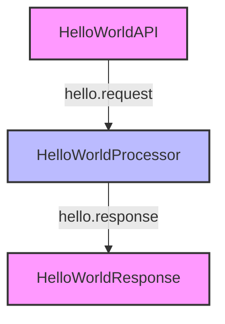

# Hello World Pattern

The "Hello World" pattern is the simplest possible Motia workflow, designed to help you understand the basic structure and concepts of Motia. This pattern serves as a foundation for more complex workflows and is an excellent starting point for beginners.

## Problem Statement

You want to create a minimal Motia workflow to understand the basic concepts and structure before building more complex applications.

## Solution Overview

The Hello World pattern consists of:

1. An **API Step** that receives an HTTP request
2. An **Event Step** that processes the request and returns a response

This simple workflow demonstrates the core concepts of Motia:
- Steps as the basic building blocks
- Events for communication between steps
- Flows for organizing related steps

## Implementation

### Step 1: Create the API Step

First, create an API step that will receive HTTP requests:

<Tabs items={['TypeScript', 'JavaScript', 'Python', 'Ruby']}>
  <Tab value="TypeScript">
    ```typescript
    // hello-api.step.ts
    export const config = {
      type: 'api',
      name: 'HelloWorldAPI',
      path: '/hello',
      method: 'GET',
      emits: ['hello.request'],
      flows: ['hello-world']
    };

    export const handler = async (request, { emit }) => {
      const name = request.query.name || 'World';
      
      // Emit an event to be processed by the next step
      await emit({
        topic: 'hello.request',
        data: { name }
      });
      
      // Return a simple response
      return {
        status: 200,
        body: { message: `Processing greeting for ${name}...` }
      };
    };
    ```
  </Tab>
  <Tab value="JavaScript">
    ```javascript
    // hello-api.step.js
    export const config = {
      type: 'api',
      name: 'HelloWorldAPI',
      path: '/hello',
      method: 'GET',
      emits: ['hello.request'],
      flows: ['hello-world']
    };

    export const handler = async (request, { emit }) => {
      const name = request.query.name || 'World';
      
      // Emit an event to be processed by the next step
      await emit({
        topic: 'hello.request',
        data: { name }
      });
      
      // Return a simple response
      return {
        status: 200,
        body: { message: `Processing greeting for ${name}...` }
      };
    };
    ```
  </Tab>
  <Tab value="Python">
    ```python
    # hello_api.step.py
    config = {
      "type": "api",
      "name": "HelloWorldAPI",
      "path": "/hello",
      "method": "GET",
      "emits": ["hello.request"],
      "flows": ["hello-world"]
    }

    async def handler(request, context):
      name = request.query.get("name", "World")
      
      # Emit an event to be processed by the next step
      await context.emit({
        "topic": "hello.request",
        "data": { "name": name }
      })
      
      # Return a simple response
      return {
        "status": 200,
        "body": { "message": f"Processing greeting for {name}..." }
      }
    ```
  </Tab>
  <Tab value="Ruby">
    ```ruby
    # hello_api.step.rb
    config = {
      type: 'api',
      name: 'HelloWorldAPI',
      path: '/hello',
      method: 'GET',
      emits: ['hello.request'],
      flows: ['hello-world']
    }

    def handler(request, context)
      name = request.query['name'] || 'World'
      
      # Emit an event to be processed by the next step
      context.emit(
        topic: 'hello.request',
        data: { name: name }
      )
      
      # Return a simple response
      {
        status: 200,
        body: { message: "Processing greeting for #{name}..." }
      }
    end
    ```
  </Tab>
</Tabs>

### Step 2: Create the Event Step

Next, create an event step that will process the request and generate a greeting:

<Tabs items={['TypeScript', 'JavaScript', 'Python', 'Ruby']}>
  <Tab value="TypeScript">
    ```typescript
    // hello-processor.step.ts
    export const config = {
      type: 'event',
      name: 'HelloWorldProcessor',
      subscribes: ['hello.request'],
      emits: ['hello.response'],
      flows: ['hello-world']
    };

    export const handler = async (input, { emit, logger }) => {
      const { name } = input;
      
      logger.info(`Generating greeting for ${name}`);
      
      // Generate the greeting
      const greeting = `Hello, ${name}!`;
      
      // Emit the response
      await emit({
        topic: 'hello.response',
        data: { greeting }
      });
      
      logger.info('Greeting generated successfully');
    };
    ```
  </Tab>
  <Tab value="JavaScript">
    ```javascript
    // hello-processor.step.js
    export const config = {
      type: 'event',
      name: 'HelloWorldProcessor',
      subscribes: ['hello.request'],
      emits: ['hello.response'],
      flows: ['hello-world']
    };

    export const handler = async (input, { emit, logger }) => {
      const { name } = input;
      
      logger.info(`Generating greeting for ${name}`);
      
      // Generate the greeting
      const greeting = `Hello, ${name}!`;
      
      // Emit the response
      await emit({
        topic: 'hello.response',
        data: { greeting }
      });
      
      logger.info('Greeting generated successfully');
    };
    ```
  </Tab>
  <Tab value="Python">
    ```python
    # hello_processor.step.py
    config = {
      "type": "event",
      "name": "HelloWorldProcessor",
      "subscribes": ["hello.request"],
      "emits": ["hello.response"],
      "flows": ["hello-world"]
    }

    async def handler(input, context):
      name = input["name"]
      
      context.logger.info(f"Generating greeting for {name}")
      
      # Generate the greeting
      greeting = f"Hello, {name}!"
      
      # Emit the response
      await context.emit({
        "topic": "hello.response",
        "data": { "greeting": greeting }
      })
      
      context.logger.info("Greeting generated successfully")
    ```
  </Tab>
  <Tab value="Ruby">
    ```ruby
    # hello_processor.step.rb
    config = {
      type: 'event',
      name: 'HelloWorldProcessor',
      subscribes: ['hello.request'],
      emits: ['hello.response'],
      flows: ['hello-world']
    }

    def handler(input, context)
      name = input[:name]
      
      context.logger.info("Generating greeting for #{name}")
      
      # Generate the greeting
      greeting = "Hello, #{name}!"
      
      # Emit the response
      context.emit(
        topic: 'hello.response',
        data: { greeting: greeting }
      )
      
      context.logger.info("Greeting generated successfully")
    end
    ```
  </Tab>
</Tabs>

### Step 3: Create the Response Step

Finally, create an API step that will subscribe to the response event and return the greeting:

<Tabs items={['TypeScript', 'JavaScript', 'Python', 'Ruby']}>
  <Tab value="TypeScript">
    ```typescript
    // hello-response.step.ts
    export const config = {
      type: 'api',
      name: 'HelloWorldResponse',
      path: '/hello-response',
      method: 'GET',
      subscribes: ['hello.response'],
      flows: ['hello-world']
    };

    export const handler = async (request, { state }) => {
      // Get the latest greeting from state
      const latestGreeting = await state.get('latest-greeting');
      
      if (!latestGreeting) {
        return {
          status: 404,
          body: { error: 'No greeting found. Try making a request to /hello first.' }
        };
      }
      
      return {
        status: 200,
        body: { message: latestGreeting.greeting }
      };
    };

    // Event handler for the hello.response event
    export const eventHandler = async (input, { state }) => {
      // Store the greeting in state
      await state.set('latest-greeting', input);
    };
    ```
  </Tab>
  <Tab value="JavaScript">
    ```javascript
    // hello-response.step.js
    export const config = {
      type: 'api',
      name: 'HelloWorldResponse',
      path: '/hello-response',
      method: 'GET',
      subscribes: ['hello.response'],
      flows: ['hello-world']
    };

    export const handler = async (request, { state }) => {
      // Get the latest greeting from state
      const latestGreeting = await state.get('latest-greeting');
      
      if (!latestGreeting) {
        return {
          status: 404,
          body: { error: 'No greeting found. Try making a request to /hello first.' }
        };
      }
      
      return {
        status: 200,
        body: { message: latestGreeting.greeting }
      };
    };

    // Event handler for the hello.response event
    export const eventHandler = async (input, { state }) => {
      // Store the greeting in state
      await state.set('latest-greeting', input);
    };
    ```
  </Tab>
  <Tab value="Python">
    ```python
    # hello_response.step.py
    config = {
      "type": "api",
      "name": "HelloWorldResponse",
      "path": "/hello-response",
      "method": "GET",
      "subscribes": ["hello.response"],
      "flows": ["hello-world"]
    }

    async def handler(request, context):
      # Get the latest greeting from state
      latest_greeting = await context.state.get("latest-greeting")
      
      if not latest_greeting:
        return {
          "status": 404,
          "body": { "error": "No greeting found. Try making a request to /hello first." }
        }
      
      return {
        "status": 200,
        "body": { "message": latest_greeting["greeting"] }
      }

    # Event handler for the hello.response event
    async def event_handler(input, context):
      # Store the greeting in state
      await context.state.set("latest-greeting", input)
    ```
  </Tab>
  <Tab value="Ruby">
    ```ruby
    # hello_response.step.rb
    config = {
      type: 'api',
      name: 'HelloWorldResponse',
      path: '/hello-response',
      method: 'GET',
      subscribes: ['hello.response'],
      flows: ['hello-world']
    }

    def handler(request, context)
      # Get the latest greeting from state
      latest_greeting = context.state.get('latest-greeting')
      
      if !latest_greeting
        return {
          status: 404,
          body: { error: 'No greeting found. Try making a request to /hello first.' }
        }
      end
      
      return {
        status: 200,
        body: { message: latest_greeting[:greeting] }
      }
    end

    # Event handler for the hello.response event
    def event_handler(input, context)
      # Store the greeting in state
      context.state.set('latest-greeting', input)
    end
    ```
  </Tab>
</Tabs>

## Running the Workflow

To run this workflow:

1. Start the Motia server:

```bash
npx motia dev
```

2. Make a request to the `/hello` endpoint:

```bash
curl "http://localhost:3000/hello?name=Motia"
```

You should receive a response like:

```json
{
  "message": "Processing greeting for Motia..."
}
```

3. Then, make a request to the `/hello-response` endpoint:

```bash
curl "http://localhost:3000/hello-response"
```

You should receive a response like:

```json
{
  "message": "Hello, Motia!"
}
```

## Workflow Visualization

In the Motia Workbench, your workflow will look something like this:



## Variations

### Direct Response

A simpler variation is to respond directly from the API step without using events:

<Tabs items={['TypeScript', 'JavaScript', 'Python', 'Ruby']}>
  <Tab value="TypeScript">
    ```typescript
    // simple-hello.step.ts
    export const config = {
      type: 'api',
      name: 'SimpleHello',
      path: '/simple-hello',
      method: 'GET',
      flows: ['hello-world']
    };

    export const handler = async (request) => {
      const name = request.query.name || 'World';
      
      return {
        status: 200,
        body: { message: `Hello, ${name}!` }
      };
    };
    ```
  </Tab>
  <Tab value="JavaScript">
    ```javascript
    // simple-hello.step.js
    export const config = {
      type: 'api',
      name: 'SimpleHello',
      path: '/simple-hello',
      method: 'GET',
      flows: ['hello-world']
    };

    export const handler = async (request) => {
      const name = request.query.name || 'World';
      
      return {
        status: 200,
        body: { message: `Hello, ${name}!` }
      };
    };
    ```
  </Tab>
  <Tab value="Python">
    ```python
    # simple_hello.step.py
    config = {
      "type": "api",
      "name": "SimpleHello",
      "path": "/simple-hello",
      "method": "GET",
      "flows": ["hello-world"]
    }

    async def handler(request, context):
      name = request.query.get("name", "World")
      
      return {
        "status": 200,
        "body": { "message": f"Hello, {name}!" }
      }
    ```
  </Tab>
  <Tab value="Ruby">
    ```ruby
    # simple_hello.step.rb
    config = {
      type: 'api',
      name: 'SimpleHello',
      path: '/simple-hello',
      method: 'GET',
      flows: ['hello-world']
    }

    def handler(request, context)
      name = request.query['name'] || 'World'
      
      {
        status: 200,
        body: { message: "Hello, #{name}!" }
      }
    end
    ```
  </Tab>
</Tabs>

### Event-Only Workflow

Another variation is an event-only workflow triggered by a cron step:

<Tabs items={['TypeScript', 'JavaScript', 'Python', 'Ruby']}>
  <Tab value="TypeScript">
    ```typescript
    // hello-cron.step.ts
    export const config = {
      type: 'cron',
      name: 'HelloCron',
      schedule: '*/5 * * * *', // Every 5 minutes
      emits: ['hello.scheduled'],
      flows: ['hello-world']
    };

    export const handler = async ({ emit, logger }) => {
      logger.info('Scheduled hello world triggered');
      
      await emit({
        topic: 'hello.scheduled',
        data: { time: new Date().toISOString() }
      });
    };
    ```
  </Tab>
  <Tab value="JavaScript">
    ```javascript
    // hello-cron.step.js
    export const config = {
      type: 'cron',
      name: 'HelloCron',
      schedule: '*/5 * * * *', // Every 5 minutes
      emits: ['hello.scheduled'],
      flows: ['hello-world']
    };

    export const handler = async ({ emit, logger }) => {
      logger.info('Scheduled hello world triggered');
      
      await emit({
        topic: 'hello.scheduled',
        data: { time: new Date().toISOString() }
      });
    };
    ```
  </Tab>
  <Tab value="Python">
    ```python
    # hello_cron.step.py
    config = {
      "type": "cron",
      "name": "HelloCron",
      "schedule": "*/5 * * * *", # Every 5 minutes
      "emits": ["hello.scheduled"],
      "flows": ["hello-world"]
    }

    async def handler(context):
      context.logger.info("Scheduled hello world triggered")
      
      await context.emit({
        "topic": "hello.scheduled",
        "data": { "time": context.now().isoformat() }
      })
    ```
  </Tab>
  <Tab value="Ruby">
    ```ruby
    # hello_cron.step.rb
    config = {
      type: 'cron',
      name: 'HelloCron',
      schedule: '*/5 * * * *', # Every 5 minutes
      emits: ['hello.scheduled'],
      flows: ['hello-world']
    }

    def handler(context)
      context.logger.info('Scheduled hello world triggered')
      
      context.emit(
        topic: 'hello.scheduled',
        data: { time: Time.now.iso8601 }
      )
    end
    ```
  </Tab>
</Tabs>

## Considerations

### When to Use This Pattern

The Hello World pattern is ideal for:

- **Learning Motia**: Understanding the basic concepts and structure
- **Testing Setup**: Verifying that your Motia installation is working correctly
- **Starting Point**: Creating a foundation for more complex workflows
- **Demonstrations**: Showing others how Motia works

### Limitations

This pattern is intentionally simple and has several limitations:

- **Limited Functionality**: Only demonstrates basic request-response flow
- **No Error Handling**: Doesn't include error handling or validation
- **No Authentication**: Doesn't implement any security measures
- **No Persistence**: Only uses simple state management

## Next Steps

After mastering the Hello World pattern, you can:

1. Add **error handling** to make your workflow more robust
2. Implement **input validation** to ensure data quality
3. Add **authentication** to secure your endpoints
4. Explore **state management** for more complex data persistence
5. Try more advanced patterns like [Parallel Processing](./parallel-processing) or [Error Handling](./error-handling)

## Related Concepts

- [Steps Introduction](/docs/concepts/getting-started/steps-intro)
- [Flows Introduction](/docs/concepts/getting-started/flows-intro)
- [Event-Driven Basics](/docs/concepts/getting-started/event-driven-basics)
- [API Steps](/docs/guides/step-creation/api-steps)
- [Event Steps](/docs/guides/step-creation/event-steps)
