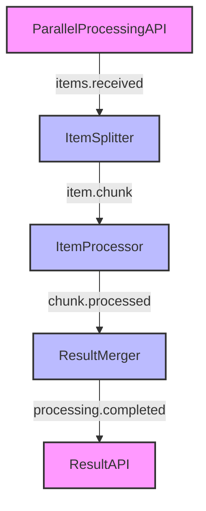

# Parallel Processing Pattern

The Parallel Processing pattern allows you to process multiple items simultaneously, improving performance and throughput in your Motia workflows. This pattern is particularly useful for data-intensive operations where tasks can be executed independently.

## Problem Statement

You have a large number of items to process, and processing them sequentially would take too long. You want to process multiple items in parallel to improve performance and reduce overall processing time.

## Solution Overview

The Parallel Processing pattern in Motia involves:

1. **Splitting** the input data into smaller chunks
2. **Processing** each chunk in parallel
3. **Merging** the results back together

This pattern leverages Motia's event-driven architecture to distribute work across multiple steps that can execute concurrently.

## Implementation

### Step 1: Create the API Entry Point

First, create an API step that will receive the data to be processed:

<Tabs items={['TypeScript', 'JavaScript', 'Python', 'Ruby']}>
  <Tab value="TypeScript">
    ```typescript
    // parallel-api.step.ts
    export const config = {
      type: 'api',
      name: 'ParallelProcessingAPI',
      path: '/process-items',
      method: 'POST',
      emits: ['items.received'],
      flows: ['parallel-processing']
    };

    export const handler = async (request, { emit, logger }) => {
      const items = request.body.items;
      
      if (!Array.isArray(items)) {
        return {
          status: 400,
          body: { error: 'Items must be an array' }
        };
      }
      
      logger.info(`Received ${items.length} items for processing`);
      
      // Emit the items for processing
      await emit({
        topic: 'items.received',
        data: { items, requestId: request.id }
      });
      
      return {
        status: 202,
        body: { 
          message: `Processing ${items.length} items`,
          requestId: request.id
        }
      };
    };
    ```
  </Tab>
  <Tab value="JavaScript">
    ```javascript
    // parallel-api.step.js
    export const config = {
      type: 'api',
      name: 'ParallelProcessingAPI',
      path: '/process-items',
      method: 'POST',
      emits: ['items.received'],
      flows: ['parallel-processing']
    };

    export const handler = async (request, { emit, logger }) => {
      const items = request.body.items;
      
      if (!Array.isArray(items)) {
        return {
          status: 400,
          body: { error: 'Items must be an array' }
        };
      }
      
      logger.info(`Received ${items.length} items for processing`);
      
      // Emit the items for processing
      await emit({
        topic: 'items.received',
        data: { items, requestId: request.id }
      });
      
      return {
        status: 202,
        body: { 
          message: `Processing ${items.length} items`,
          requestId: request.id
        }
      };
    };
    ```
  </Tab>
  <Tab value="Python">
    ```python
    # parallel_api.step.py
    config = {
      "type": "api",
      "name": "ParallelProcessingAPI",
      "path": "/process-items",
      "method": "POST",
      "emits": ["items.received"],
      "flows": ["parallel-processing"]
    }

    async def handler(request, context):
      items = request.body.get("items")
      
      if not isinstance(items, list):
        return {
          "status": 400,
          "body": { "error": "Items must be an array" }
        }
      
      context.logger.info(f"Received {len(items)} items for processing")
      
      # Emit the items for processing
      await context.emit({
        "topic": "items.received",
        "data": { "items": items, "requestId": request.id }
      })
      
      return {
        "status": 202,
        "body": { 
          "message": f"Processing {len(items)} items",
          "requestId": request.id
        }
      }
    ```
  </Tab>
  <Tab value="Ruby">
    ```ruby
    # parallel_api.step.rb
    config = {
      type: 'api',
      name: 'ParallelProcessingAPI',
      path: '/process-items',
      method: 'POST',
      emits: ['items.received'],
      flows: ['parallel-processing']
    }

    def handler(request, context)
      items = request.body['items']
      
      unless items.is_a?(Array)
        return {
          status: 400,
          body: { error: 'Items must be an array' }
        }
      end
      
      context.logger.info("Received #{items.length} items for processing")
      
      # Emit the items for processing
      context.emit(
        topic: 'items.received',
        data: { items: items, requestId: request.id }
      )
      
      return {
        status: 202,
        body: { 
          message: "Processing #{items.length} items",
          requestId: request.id
        }
      }
    end
    ```
  </Tab>
</Tabs>

### Step 2: Create the Splitter Step

Next, create a step that will split the input data into smaller chunks for parallel processing:

<Tabs items={['TypeScript', 'JavaScript', 'Python', 'Ruby']}>
  <Tab value="TypeScript">
    ```typescript
    // item-splitter.step.ts
    export const config = {
      type: 'event',
      name: 'ItemSplitter',
      subscribes: ['items.received'],
      emits: ['item.chunk'],
      flows: ['parallel-processing']
    };

    export const handler = async (input, { emit, logger }) => {
      const { items, requestId } = input;
      const CHUNK_SIZE = 10; // Process 10 items at a time
      
      logger.info(`Splitting ${items.length} items into chunks of ${CHUNK_SIZE}`);
      
      // Split items into chunks
      for (let i = 0; i < items.length; i += CHUNK_SIZE) {
        const chunk = items.slice(i, i + CHUNK_SIZE);
        const chunkId = `${requestId}-chunk-${i / CHUNK_SIZE}`;
        
        logger.debug(`Emitting chunk ${chunkId} with ${chunk.length} items`);
        
        // Emit each chunk for parallel processing
        await emit({
          topic: 'item.chunk',
          data: {
            items: chunk,
            chunkId,
            requestId,
            totalChunks: Math.ceil(items.length / CHUNK_SIZE),
            chunkIndex: i / CHUNK_SIZE
          }
        });
      }
      
      logger.info(`Split complete. Created ${Math.ceil(items.length / CHUNK_SIZE)} chunks`);
    };
    ```
  </Tab>
  <Tab value="JavaScript">
    ```javascript
    // item-splitter.step.js
    export const config = {
      type: 'event',
      name: 'ItemSplitter',
      subscribes: ['items.received'],
      emits: ['item.chunk'],
      flows: ['parallel-processing']
    };

    export const handler = async (input, { emit, logger }) => {
      const { items, requestId } = input;
      const CHUNK_SIZE = 10; // Process 10 items at a time
      
      logger.info(`Splitting ${items.length} items into chunks of ${CHUNK_SIZE}`);
      
      // Split items into chunks
      for (let i = 0; i < items.length; i += CHUNK_SIZE) {
        const chunk = items.slice(i, i + CHUNK_SIZE);
        const chunkId = `${requestId}-chunk-${i / CHUNK_SIZE}`;
        
        logger.debug(`Emitting chunk ${chunkId} with ${chunk.length} items`);
        
        // Emit each chunk for parallel processing
        await emit({
          topic: 'item.chunk',
          data: {
            items: chunk,
            chunkId,
            requestId,
            totalChunks: Math.ceil(items.length / CHUNK_SIZE),
            chunkIndex: i / CHUNK_SIZE
          }
        });
      }
      
      logger.info(`Split complete. Created ${Math.ceil(items.length / CHUNK_SIZE)} chunks`);
    };
    ```
  </Tab>
  <Tab value="Python">
    ```python
    # item_splitter.step.py
    import math
    
    config = {
      "type": "event",
      "name": "ItemSplitter",
      "subscribes": ["items.received"],
      "emits": ["item.chunk"],
      "flows": ["parallel-processing"]
    }

    async def handler(input, context):
      items = input["items"]
      request_id = input["requestId"]
      CHUNK_SIZE = 10  # Process 10 items at a time
      
      context.logger.info(f"Splitting {len(items)} items into chunks of {CHUNK_SIZE}")
      
      # Split items into chunks
      for i in range(0, len(items), CHUNK_SIZE):
        chunk = items[i:i + CHUNK_SIZE]
        chunk_id = f"{request_id}-chunk-{i // CHUNK_SIZE}"
        
        context.logger.debug(f"Emitting chunk {chunk_id} with {len(chunk)} items")
        
        # Emit each chunk for parallel processing
        await context.emit({
          "topic": "item.chunk",
          "data": {
            "items": chunk,
            "chunkId": chunk_id,
            "requestId": request_id,
            "totalChunks": math.ceil(len(items) / CHUNK_SIZE),
            "chunkIndex": i // CHUNK_SIZE
          }
        })
      
      context.logger.info(f"Split complete. Created {math.ceil(len(items) / CHUNK_SIZE)} chunks")
    ```
  </Tab>
  <Tab value="Ruby">
    ```ruby
    # item_splitter.step.rb
    config = {
      type: 'event',
      name: 'ItemSplitter',
      subscribes: ['items.received'],
      emits: ['item.chunk'],
      flows: ['parallel-processing']
    }

    def handler(input, context)
      items = input[:items]
      request_id = input[:requestId]
      CHUNK_SIZE = 10  # Process 10 items at a time
      
      context.logger.info("Splitting #{items.length} items into chunks of #{CHUNK_SIZE}")
      
      # Split items into chunks
      (0...items.length).step(CHUNK_SIZE) do |i|
        chunk = items[i, CHUNK_SIZE]
        chunk_id = "#{request_id}-chunk-#{i / CHUNK_SIZE}"
        
        context.logger.debug("Emitting chunk #{chunk_id} with #{chunk.length} items")
        
        # Emit each chunk for parallel processing
        context.emit(
          topic: 'item.chunk',
          data: {
            items: chunk,
            chunkId: chunk_id,
            requestId: request_id,
            totalChunks: (items.length.to_f / CHUNK_SIZE).ceil,
            chunkIndex: i / CHUNK_SIZE
          }
        )
      end
      
      context.logger.info("Split complete. Created #{(items.length.to_f / CHUNK_SIZE).ceil} chunks")
    end
    ```
  </Tab>
</Tabs>

### Step 3: Create the Processor Step

Now, create a step that will process each chunk of items. This step will be executed in parallel for each chunk:

<Tabs items={['TypeScript', 'JavaScript', 'Python', 'Ruby']}>
  <Tab value="TypeScript">
    ```typescript
    // item-processor.step.ts
    export const config = {
      type: 'event',
      name: 'ItemProcessor',
      subscribes: ['item.chunk'],
      emits: ['chunk.processed'],
      flows: ['parallel-processing']
    };

    export const handler = async (input, { emit, logger }) => {
      const { items, chunkId, requestId, totalChunks, chunkIndex } = input;
      
      logger.info(`Processing chunk ${chunkId} (${chunkIndex + 1}/${totalChunks})`);
      
      // Process each item in the chunk
      const processedItems = await Promise.all(items.map(async (item) => {
        // Simulate processing time
        await new Promise(resolve => setTimeout(resolve, 100));
        
        // Process the item (replace with your actual processing logic)
        return {
          ...item,
          processed: true,
          processingTime: new Date().toISOString()
        };
      }));
      
      logger.info(`Finished processing chunk ${chunkId}`);
      
      // Emit the processed chunk
      await emit({
        topic: 'chunk.processed',
        data: {
          processedItems,
          chunkId,
          requestId,
          totalChunks,
          chunkIndex
        }
      });
    };
    ```
  </Tab>
  <Tab value="JavaScript">
    ```javascript
    // item-processor.step.js
    export const config = {
      type: 'event',
      name: 'ItemProcessor',
      subscribes: ['item.chunk'],
      emits: ['chunk.processed'],
      flows: ['parallel-processing']
    };

    export const handler = async (input, { emit, logger }) => {
      const { items, chunkId, requestId, totalChunks, chunkIndex } = input;
      
      logger.info(`Processing chunk ${chunkId} (${chunkIndex + 1}/${totalChunks})`);
      
      // Process each item in the chunk
      const processedItems = await Promise.all(items.map(async (item) => {
        // Simulate processing time
        await new Promise(resolve => setTimeout(resolve, 100));
        
        // Process the item (replace with your actual processing logic)
        return {
          ...item,
          processed: true,
          processingTime: new Date().toISOString()
        };
      }));
      
      logger.info(`Finished processing chunk ${chunkId}`);
      
      // Emit the processed chunk
      await emit({
        topic: 'chunk.processed',
        data: {
          processedItems,
          chunkId,
          requestId,
          totalChunks,
          chunkIndex
        }
      });
    };
    ```
  </Tab>
  <Tab value="Python">
    ```python
    # item_processor.step.py
    import asyncio
    from datetime import datetime
    
    config = {
      "type": "event",
      "name": "ItemProcessor",
      "subscribes": ["item.chunk"],
      "emits": ["chunk.processed"],
      "flows": ["parallel-processing"]
    }

    async def handler(input, context):
      items = input["items"]
      chunk_id = input["chunkId"]
      request_id = input["requestId"]
      total_chunks = input["totalChunks"]
      chunk_index = input["chunkIndex"]
      
      context.logger.info(f"Processing chunk {chunk_id} ({chunk_index + 1}/{total_chunks})")
      
      # Process each item in the chunk
      processed_items = []
      for item in items:
        # Simulate processing time
        await asyncio.sleep(0.1)
        
        # Process the item (replace with your actual processing logic)
        processed_item = item.copy() if isinstance(item, dict) else item
        if isinstance(processed_item, dict):
          processed_item["processed"] = True
          processed_item["processingTime"] = datetime.now().isoformat()
        
        processed_items.append(processed_item)
      
      context.logger.info(f"Finished processing chunk {chunk_id}")
      
      # Emit the processed chunk
      await context.emit({
        "topic": "chunk.processed",
        "data": {
          "processedItems": processed_items,
          "chunkId": chunk_id,
          "requestId": request_id,
          "totalChunks": total_chunks,
          "chunkIndex": chunk_index
        }
      })
    ```
  </Tab>
  <Tab value="Ruby">
    ```ruby
    # item_processor.step.rb
    config = {
      type: 'event',
      name: 'ItemProcessor',
      subscribes: ['item.chunk'],
      emits: ['chunk.processed'],
      flows: ['parallel-processing']
    }

    def handler(input, context)
      items = input[:items]
      chunk_id = input[:chunkId]
      request_id = input[:requestId]
      total_chunks = input[:totalChunks]
      chunk_index = input[:chunkIndex]
      
      context.logger.info("Processing chunk #{chunk_id} (#{chunk_index + 1}/#{total_chunks})")
      
      # Process each item in the chunk
      processed_items = items.map do |item|
        # Simulate processing time
        sleep(0.1)
        
        # Process the item (replace with your actual processing logic)
        if item.is_a?(Hash)
          item.merge({
            processed: true,
            processingTime: Time.now.iso8601
          })
        else
          item
        end
      end
      
      context.logger.info("Finished processing chunk #{chunk_id}")
      
      # Emit the processed chunk
      context.emit(
        topic: 'chunk.processed',
        data: {
          processedItems: processed_items,
          chunkId: chunk_id,
          requestId: request_id,
          totalChunks: total_chunks,
          chunkIndex: chunk_index
        }
      )
    end
    ```
  </Tab>
</Tabs>

### Step 4: Create the Merger Step

Finally, create a step that will merge the processed chunks back together:

<Tabs items={['TypeScript', 'JavaScript', 'Python', 'Ruby']}>
  <Tab value="TypeScript">
    ```typescript
    // result-merger.step.ts
    export const config = {
      type: 'event',
      name: 'ResultMerger',
      subscribes: ['chunk.processed'],
      emits: ['processing.completed'],
      flows: ['parallel-processing']
    };

    export const handler = async (input, { emit, state, logger }) => {
      const { processedItems, requestId, totalChunks, chunkIndex } = input;
      
      // Get the current results for this request
      const resultsKey = `results-${requestId}`;
      const currentResults = await state.get(resultsKey) || { 
        chunks: Array(totalChunks).fill(null),
        totalItems: 0
      };
      
      // Add this chunk's results
      currentResults.chunks[chunkIndex] = processedItems;
      currentResults.totalItems += processedItems.length;
      
      // Update the state
      await state.set(resultsKey, currentResults);
      
      logger.info(`Merged chunk ${chunkIndex + 1}/${totalChunks} for request ${requestId}`);
      
      // Check if all chunks have been processed
      const allChunksProcessed = currentResults.chunks.every(chunk => chunk !== null);
      
      if (allChunksProcessed) {
        logger.info(`All chunks processed for request ${requestId}`);
        
        // Flatten the chunks into a single array
        const allProcessedItems = currentResults.chunks.flat();
        
        // Emit the final result
        await emit({
          topic: 'processing.completed',
          data: {
            requestId,
            items: allProcessedItems,
            totalItems: allProcessedItems.length
          }
        });
        
        // Clean up the state
        await state.delete(resultsKey);
      }
    };
    ```
  </Tab>
  <Tab value="JavaScript">
    ```javascript
    // result-merger.step.js
    export const config = {
      type: 'event',
      name: 'ResultMerger',
      subscribes: ['chunk.processed'],
      emits: ['processing.completed'],
      flows: ['parallel-processing']
    };

    export const handler = async (input, { emit, state, logger }) => {
      const { processedItems, requestId, totalChunks, chunkIndex } = input;
      
      // Get the current results for this request
      const resultsKey = `results-${requestId}`;
      const currentResults = await state.get(resultsKey) || { 
        chunks: Array(totalChunks).fill(null),
        totalItems: 0
      };
      
      // Add this chunk's results
      currentResults.chunks[chunkIndex] = processedItems;
      currentResults.totalItems += processedItems.length;
      
      // Update the state
      await state.set(resultsKey, currentResults);
      
      logger.info(`Merged chunk ${chunkIndex + 1}/${totalChunks} for request ${requestId}`);
      
      // Check if all chunks have been processed
      const allChunksProcessed = currentResults.chunks.every(chunk => chunk !== null);
      
      if (allChunksProcessed) {
        logger.info(`All chunks processed for request ${requestId}`);
        
        // Flatten the chunks into a single array
        const allProcessedItems = currentResults.chunks.flat();
        
        // Emit the final result
        await emit({
          topic: 'processing.completed',
          data: {
            requestId,
            items: allProcessedItems,
            totalItems: allProcessedItems.length
          }
        });
        
        // Clean up the state
        await state.delete(resultsKey);
      }
    };
    ```
  </Tab>
  <Tab value="Python">
    ```python
    # result_merger.step.py
    config = {
      "type": "event",
      "name": "ResultMerger",
      "subscribes": ["chunk.processed"],
      "emits": ["processing.completed"],
      "flows": ["parallel-processing"]
    }

    async def handler(input, context):
      processed_items = input["processedItems"]
      request_id = input["requestId"]
      total_chunks = input["totalChunks"]
      chunk_index = input["chunkIndex"]
      
      # Get the current results for this request
      results_key = f"results-{request_id}"
      current_results = await context.state.get(results_key) or { 
        "chunks": [None] * total_chunks,
        "totalItems": 0
      }
      
      # Add this chunk's results
      current_results["chunks"][chunk_index] = processed_items
      current_results["totalItems"] += len(processed_items)
      
      # Update the state
      await context.state.set(results_key, current_results)
      
      context.logger.info(f"Merged chunk {chunk_index + 1}/{total_chunks} for request {request_id}")
      
      # Check if all chunks have been processed
      all_chunks_processed = all(chunk is not None for chunk in current_results["chunks"])
      
      if all_chunks_processed:
        context.logger.info(f"All chunks processed for request {request_id}")
        
        # Flatten the chunks into a single array
        all_processed_items = [item for chunk in current_results["chunks"] for item in chunk]
        
        # Emit the final result
        await context.emit({
          "topic": "processing.completed",
          "data": {
            "requestId": request_id,
            "items": all_processed_items,
            "totalItems": len(all_processed_items)
          }
        })
        
        # Clean up the state
        await context.state.delete(results_key)
    ```
  </Tab>
  <Tab value="Ruby">
    ```ruby
    # result_merger.step.rb
    config = {
      type: 'event',
      name: 'ResultMerger',
      subscribes: ['chunk.processed'],
      emits: ['processing.completed'],
      flows: ['parallel-processing']
    }

    def handler(input, context)
      processed_items = input[:processedItems]
      request_id = input[:requestId]
      total_chunks = input[:totalChunks]
      chunk_index = input[:chunkIndex]
      
      # Get the current results for this request
      results_key = "results-#{request_id}"
      current_results = context.state.get(results_key) || { 
        chunks: Array.new(total_chunks),
        totalItems: 0
      }
      
      # Add this chunk's results
      current_results[:chunks][chunk_index] = processed_items
      current_results[:totalItems] += processed_items.length
      
      # Update the state
      context.state.set(results_key, current_results)
      
      context.logger.info("Merged chunk #{chunk_index + 1}/#{total_chunks} for request #{request_id}")
      
      # Check if all chunks have been processed
      all_chunks_processed = current_results[:chunks].all? { |chunk| !chunk.nil? }
      
      if all_chunks_processed
        context.logger.info("All chunks processed for request #{request_id}")
        
        # Flatten the chunks into a single array
        all_processed_items = current_results[:chunks].flatten
        
        # Emit the final result
        context.emit(
          topic: 'processing.completed',
          data: {
            requestId: request_id,
            items: all_processed_items,
            totalItems: all_processed_items.length
          }
        )
        
        # Clean up the state
        context.state.delete(results_key)
      end
    end
    ```
  </Tab>
</Tabs>

### Step 5: Create the Result API Step

Finally, create an API step that will allow clients to retrieve the processing results:

<Tabs items={['TypeScript', 'JavaScript', 'Python', 'Ruby']}>
  <Tab value="TypeScript">
    ```typescript
    // result-api.step.ts
    export const config = {
      type: 'api',
      name: 'ResultAPI',
      path: '/processing-results/:requestId',
      method: 'GET',
      subscribes: ['processing.completed'],
      flows: ['parallel-processing']
    };

    export const handler = async (request, { state }) => {
      const { requestId } = request.params;
      
      // Get the results for this request
      const resultsKey = `final-result-${requestId}`;
      const result = await state.get(resultsKey);
      
      if (!result) {
        return {
          status: 404,
          body: { 
            error: 'Results not found',
            message: 'Processing may still be in progress or the request ID is invalid'
          }
        };
      }
      
      return {
        status: 200,
        body: result
      };
    };

    // Event handler for the processing.completed event
    export const eventHandler = async (input, { state }) => {
      const { requestId, items, totalItems } = input;
      
      // Store the final result
      await state.set(`final-result-${requestId}`, {
        requestId,
        items,
        totalItems,
        completedAt: new Date().toISOString()
      });
    };
    ```
  </Tab>
  <Tab value="JavaScript">
    ```javascript
    // result-api.step.js
    export const config = {
      type: 'api',
      name: 'ResultAPI',
      path: '/processing-results/:requestId',
      method: 'GET',
      subscribes: ['processing.completed'],
      flows: ['parallel-processing']
    };

    export const handler = async (request, { state }) => {
      const { requestId } = request.params;
      
      // Get the results for this request
      const resultsKey = `final-result-${requestId}`;
      const result = await state.get(resultsKey);
      
      if (!result) {
        return {
          status: 404,
          body: { 
            error: 'Results not found',
            message: 'Processing may still be in progress or the request ID is invalid'
          }
        };
      }
      
      return {
        status: 200,
        body: result
      };
    };

    // Event handler for the processing.completed event
    export const eventHandler = async (input, { state }) => {
      const { requestId, items, totalItems } = input;
      
      // Store the final result
      await state.set(`final-result-${requestId}`, {
        requestId,
        items,
        totalItems,
        completedAt: new Date().toISOString()
      });
    };
    ```
  </Tab>
  <Tab value="Python">
    ```python
    # result_api.step.py
    from datetime import datetime
    
    config = {
      "type": "api",
      "name": "ResultAPI",
      "path": "/processing-results/:requestId",
      "method": "GET",
      "subscribes": ["processing.completed"],
      "flows": ["parallel-processing"]
    }

    async def handler(request, context):
      request_id = request.params["requestId"]
      
      # Get the results for this request
      results_key = f"final-result-{request_id}"
      result = await context.state.get(results_key)
      
      if not result:
        return {
          "status": 404,
          "body": { 
            "error": "Results not found",
            "message": "Processing may still be in progress or the request ID is invalid"
          }
        }
      
      return {
        "status": 200,
        "body": result
      }

    # Event handler for the processing.completed event
    async def event_handler(input, context):
      request_id = input["requestId"]
      items = input["items"]
      total_items = input["totalItems"]
      
      # Store the final result
      await context.state.set(f"final-result-{request_id}", {
        "requestId": request_id,
        "items": items,
        "totalItems": total_items,
        "completedAt": datetime.now().isoformat()
      })
    ```
  </Tab>
  <Tab value="Ruby">
    ```ruby
    # result_api.step.rb
    config = {
      type: 'api',
      name: 'ResultAPI',
      path: '/processing-results/:requestId',
      method: 'GET',
      subscribes: ['processing.completed'],
      flows: ['parallel-processing']
    }

    def handler(request, context)
      request_id = request.params['requestId']
      
      # Get the results for this request
      results_key = "final-result-#{request_id}"
      result = context.state.get(results_key)
      
      if !result
        return {
          status: 404,
          body: { 
            error: 'Results not found',
            message: 'Processing may still be in progress or the request ID is invalid'
          }
        }
      end
      
      return {
        status: 200,
        body: result
      }
    end

    # Event handler for the processing.completed event
    def event_handler(input, context)
      request_id = input[:requestId]
      items = input[:items]
      total_items = input[:totalItems]
      
      # Store the final result
      context.state.set("final-result-#{request_id}", {
        requestId: request_id,
        items: items,
        totalItems: total_items,
        completedAt: Time.now.iso8601
      })
    end
    ```
  </Tab>
</Tabs>

## Running the Workflow

To run this workflow:

1. Start the Motia server:

```bash
npx motia dev
```

2. Send a request to process items:

```bash
curl -X POST "http://localhost:3000/process-items" \
  -H "Content-Type: application/json" \
  -d '{"items": [1, 2, 3, 4, 5, 6, 7, 8, 9, 10, 11, 12, 13, 14, 15, 16, 17, 18, 19, 20, 21, 22, 23, 24, 25]}'
```

You should receive a response like:

```json
{
  "message": "Processing 25 items",
  "requestId": "abc123"
}
```

3. Check the processing results:

```bash
curl "http://localhost:3000/processing-results/abc123"
```

Once processing is complete, you should receive a response with all the processed items.

## Workflow Visualization

In the Motia Workbench, your workflow will look something like this:



## Variations

### Dynamic Chunk Size

You can make the chunk size dynamic based on the total number of items:

```typescript
// Dynamic chunk size calculation
const totalItems = items.length;
let chunkSize = 10; // Default chunk size

if (totalItems > 1000) {
  chunkSize = 100; // Larger chunks for large datasets
} else if (totalItems < 10) {
  chunkSize = 1; // Process individually for small datasets
}
```

### Worker Pool

For more control over parallelism, you can implement a worker pool pattern:

```typescript
// worker-pool.step.ts
export const config = {
  type: 'event',
  name: 'WorkerPool',
  subscribes: ['item.chunk'],
  emits: ['chunk.processed'],
  flows: ['parallel-processing']
};

export const handler = async (input, { emit, state, logger }) => {
  const { items, chunkId, requestId, totalChunks, chunkIndex } = input;
  
  // Get or initialize the worker pool
  const poolKey = 'worker-pool';
  const pool = await state.get(poolKey) || {
    activeWorkers: 0,
    maxWorkers: 5, // Maximum number of concurrent workers
    queue: []
  };
  
  // Function to process a chunk
  const processChunk = async () => {
    logger.info(`Processing chunk ${chunkId} (${chunkIndex + 1}/${totalChunks})`);
    
    // Process each item in the chunk
    const processedItems = await Promise.all(items.map(async (item) => {
      // Simulate processing time
      await new Promise(resolve => setTimeout(resolve, 100));
      
      // Process the item
      return {
        ...item,
        processed: true,
        processingTime: new Date().toISOString()
      };
    }));
    
    logger.info(`Finished processing chunk ${chunkId}`);
    
    // Emit the processed chunk
    await emit({
      topic: 'chunk.processed',
      data: {
        processedItems,
        chunkId,
        requestId,
        totalChunks,
        chunkIndex
      }
    });
    
    // Update the worker pool
    const updatedPool = await state.get(poolKey);
    updatedPool.activeWorkers--;
    
    // Process the next item in the queue if any
    if (updatedPool.queue.length > 0) {
      const nextChunk = updatedPool.queue.shift();
      updatedPool.activeWorkers++;
      await state.set(poolKey, updatedPool);
      
      // Process the next chunk
      await processChunk(nextChunk);
    } else {
      await state.set(poolKey, updatedPool);
    }
  };
  
  // Check if we can process this chunk immediately
  if (pool.activeWorkers < pool.maxWorkers) {
    pool.activeWorkers++;
    await state.set(poolKey, pool);
    await processChunk();
  } else {
    // Queue the chunk for later processing
    pool.queue.push(input);
    await state.set(poolKey, pool);
    logger.info(`Queued chunk ${chunkId} for later processing`);
  }
};
```

### Progress Tracking

You can add progress tracking to monitor the overall processing progress:

```typescript
// progress-tracker.step.ts
export const config = {
  type: 'event',
  name: 'ProgressTracker',
  subscribes: ['chunk.processed'],
  emits: ['progress.updated'],
  flows: ['parallel-processing']
};

export const handler = async (input, { emit, state, logger }) => {
  const { requestId, totalChunks, chunkIndex } = input;
  
  // Get or initialize the progress
  const progressKey = `progress-${requestId}`;
  const progress = await state.get(progressKey) || {
    totalChunks,
    processedChunks: 0,
    startTime: new Date().toISOString()
  };
  
  // Update the progress
  progress.processedChunks++;
  const percentComplete = Math.round((progress.processedChunks / totalChunks) * 100);
  
  // Update the state
  await state.set(progressKey, progress);
  
  logger.info(`Progress for request ${requestId}: ${percentComplete}% complete`);
  
  // Emit the progress update
  await emit({
    topic: 'progress.updated',
    data: {
      requestId,
      percentComplete,
      processedChunks: progress.processedChunks,
      totalChunks,
      startTime: progress.startTime,
      currentTime: new Date().toISOString()
    }
  });
};
```

## Considerations

### When to Use This Pattern

The Parallel Processing pattern is ideal for:

- **Data-intensive operations**: Processing large datasets
- **Independent tasks**: Operations that can be performed independently
- **Performance optimization**: Improving throughput and reducing processing time
- **Resource utilization**: Making better use of available resources

### Limitations

This pattern has some limitations to consider:

- **State management**: Requires careful state management to track and merge results
- **Resource constraints**: Too much parallelism can overwhelm system resources
- **Ordering**: May not preserve the original order of items
- **Error handling**: Requires additional complexity to handle errors in parallel tasks

### Performance Considerations

When implementing parallel processing, consider these performance factors:

- **Chunk size**: Choose an appropriate chunk size based on the nature of your data and processing
- **Concurrency limits**: Set limits on the number of concurrent operations
- **Resource usage**: Monitor CPU, memory, and network usage
- **Bottlenecks**: Identify and address bottlenecks in your workflow

## Next Steps

After mastering the Parallel Processing pattern, you can:

1. Implement **error handling** to make your workflow more robust
2. Add **progress tracking** to monitor processing status
3. Implement **retry mechanisms** for failed chunks
4. Explore **dynamic scaling** based on system load
5. Try more advanced patterns like [Error Handling](./error-handling) or [State Management](./state-management)

## Related Concepts

- [Event-Driven Basics](/docs/concepts/getting-started/event-driven-basics)
- [State Management](/docs/concepts/core-components/state-management)
- [Error Handling](/docs/concepts/deterministic-workflows/error-handling)
- [Performance Monitoring](/docs/guides/workbench/performance)
