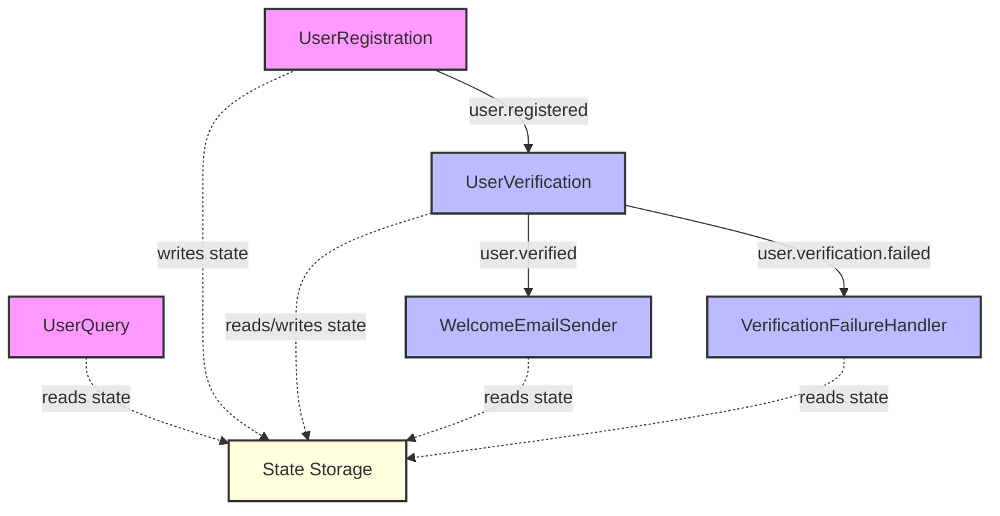

# State Management Pattern

The State Management pattern provides strategies for storing, retrieving, and updating state data in your Motia workflows. Effective state management is crucial for building workflows that can maintain context across steps and handle complex business processes.

## Problem Statement

In event-driven workflows, steps often need to share data or maintain context across multiple events. Without proper state management, you might encounter challenges such as:

- Loss of context between steps
- Difficulty tracking the progress of long-running processes
- Inability to resume workflows after interruptions
- Complexity in handling concurrent operations
- Challenges in debugging and monitoring workflow state

## Solution Overview

The State Management pattern in Motia involves:

1. **Storing state** in a persistent or semi-persistent storage
2. **Retrieving state** when needed by steps
3. **Updating state** as the workflow progresses
4. **Managing concurrency** to handle multiple operations on the same state

Motia provides a built-in state management system that makes it easy to implement these patterns while keeping your workflow steps focused on their core logic.

## Implementation

### Step 1: Basic State Management

Let's start with a simple example of storing and retrieving state:

<Tabs items={['TypeScript', 'JavaScript', 'Python', 'Ruby']}>
  <Tab value="TypeScript">
    ```typescript
    // user-registration.step.ts
    export const config = {
      type: 'api',
      name: 'UserRegistration',
      path: '/register',
      method: 'POST',
      emits: ['user.registered'],
      flows: ['user-management']
    };

    export const handler = async (request, { emit, state, logger }) => {
      try {
        const userData = request.body;
        
        // Validate user data
        if (!userData.email || !userData.password) {
          return {
            status: 400,
            body: { error: 'Email and password are required' }
          };
        }
        
        // Generate a unique user ID
        const userId = `user-${Date.now()}-${Math.random().toString(36).substring(2, 9)}`;
        
        // Create user object
        const user = {
          id: userId,
          email: userData.email,
          name: userData.name || '',
          createdAt: new Date().toISOString(),
          status: 'pending'
        };
        
        // Store user in state
        await state.set(`user:${userId}`, user);
        
        // Also store in a users list for easy lookup
        const usersList = await state.get('users:list') || [];
        usersList.push({
          id: userId,
          email: userData.email,
          createdAt: user.createdAt
        });
        await state.set('users:list', usersList);
        
        logger.info(`User ${userId} registered successfully`);
        
        // Emit event for further processing
        await emit({
          topic: 'user.registered',
          data: {
            userId,
            email: userData.email
          }
        });
        
        return {
          status: 201,
          body: {
            message: 'User registered successfully',
            userId
          }
        };
      } catch (error) {
        logger.error('Error registering user', error);
        
        return {
          status: 500,
          body: { error: 'Internal server error' }
        };
      }
    };
    ```
  </Tab>
  <Tab value="JavaScript">
    ```javascript
    // user-registration.step.js
    export const config = {
      type: 'api',
      name: 'UserRegistration',
      path: '/register',
      method: 'POST',
      emits: ['user.registered'],
      flows: ['user-management']
    };

    export const handler = async (request, { emit, state, logger }) => {
      try {
        const userData = request.body;
        
        // Validate user data
        if (!userData.email || !userData.password) {
          return {
            status: 400,
            body: { error: 'Email and password are required' }
          };
        }
        
        // Generate a unique user ID
        const userId = `user-${Date.now()}-${Math.random().toString(36).substring(2, 9)}`;
        
        // Create user object
        const user = {
          id: userId,
          email: userData.email,
          name: userData.name || '',
          createdAt: new Date().toISOString(),
          status: 'pending'
        };
        
        // Store user in state
        await state.set(`user:${userId}`, user);
        
        // Also store in a users list for easy lookup
        const usersList = await state.get('users:list') || [];
        usersList.push({
          id: userId,
          email: userData.email,
          createdAt: user.createdAt
        });
        await state.set('users:list', usersList);
        
        logger.info(`User ${userId} registered successfully`);
        
        // Emit event for further processing
        await emit({
          topic: 'user.registered',
          data: {
            userId,
            email: userData.email
          }
        });
        
        return {
          status: 201,
          body: {
            message: 'User registered successfully',
            userId
          }
        };
      } catch (error) {
        logger.error('Error registering user', error);
        
        return {
          status: 500,
          body: { error: 'Internal server error' }
        };
      }
    };
    ```
  </Tab>
  <Tab value="Python">
    ```python
    # user_registration.step.py
    import time
    import random
    import string
    from datetime import datetime
    
    config = {
      "type": "api",
      "name": "UserRegistration",
      "path": "/register",
      "method": "POST",
      "emits": ["user.registered"],
      "flows": ["user-management"]
    }

    async def handler(request, context):
      try:
        user_data = request.body
        
        # Validate user data
        if not user_data.get("email") or not user_data.get("password"):
          return {
            "status": 400,
            "body": { "error": "Email and password are required" }
          }
        
        # Generate a unique user ID
        random_suffix = ''.join(random.choices(string.ascii_lowercase + string.digits, k=7))
        user_id = f"user-{int(time.time() * 1000)}-{random_suffix}"
        
        # Create user object
        user = {
          "id": user_id,
          "email": user_data["email"],
          "name": user_data.get("name", ""),
          "createdAt": datetime.now().isoformat(),
          "status": "pending"
        }
        
        # Store user in state
        await context.state.set(f"user:{user_id}", user)
        
        # Also store in a users list for easy lookup
        users_list = await context.state.get("users:list") or []
        users_list.append({
          "id": user_id,
          "email": user_data["email"],
          "createdAt": user["createdAt"]
        })
        await context.state.set("users:list", users_list)
        
        context.logger.info(f"User {user_id} registered successfully")
        
        # Emit event for further processing
        await context.emit({
          "topic": "user.registered",
          "data": {
            "userId": user_id,
            "email": user_data["email"]
          }
        })
        
        return {
          "status": 201,
          "body": {
            "message": "User registered successfully",
            "userId": user_id
          }
        }
      except Exception as e:
        context.logger.error(f"Error registering user: {str(e)}")
        
        return {
          "status": 500,
          "body": { "error": "Internal server error" }
        }
    ```
  </Tab>
  <Tab value="Ruby">
    ```ruby
    # user_registration.step.rb
    config = {
      type: 'api',
      name: 'UserRegistration',
      path: '/register',
      method: 'POST',
      emits: ['user.registered'],
      flows: ['user-management']
    }

    def handler(request, context)
      begin
        user_data = request.body
        
        # Validate user data
        if !user_data['email'] || !user_data['password']
          return {
            status: 400,
            body: { error: 'Email and password are required' }
          }
        end
        
        # Generate a unique user ID
        random_suffix = (0...7).map { ('a'..'z').to_a[rand(26)] }.join
        user_id = "user-#{(Time.now.to_f * 1000).to_i}-#{random_suffix}"
        
        # Create user object
        user = {
          id: user_id,
          email: user_data['email'],
          name: user_data['name'] || '',
          createdAt: Time.now.iso8601,
          status: 'pending'
        }
        
        # Store user in state
        context.state.set("user:#{user_id}", user)
        
        # Also store in a users list for easy lookup
        users_list = context.state.get('users:list') || []
        users_list << {
          id: user_id,
          email: user_data['email'],
          createdAt: user[:createdAt]
        }
        context.state.set('users:list', users_list)
        
        context.logger.info("User #{user_id} registered successfully")
        
        # Emit event for further processing
        context.emit(
          topic: 'user.registered',
          data: {
            userId: user_id,
            email: user_data['email']
          }
        )
        
        return {
          status: 201,
          body: {
            message: 'User registered successfully',
            userId: user_id
          }
        }
      rescue => e
        context.logger.error("Error registering user: #{e.message}")
        
        return {
          status: 500,
          body: { error: 'Internal server error' }
        }
      end
    end
    ```
  </Tab>
</Tabs>

### Step 2: Retrieving and Updating State

Now, let's create a step that retrieves and updates the user's state:

<Tabs items={['TypeScript', 'JavaScript', 'Python', 'Ruby']}>
  <Tab value="TypeScript">
    ```typescript
    // user-verification.step.ts
    export const config = {
      type: 'event',
      name: 'UserVerification',
      subscribes: ['user.registered'],
      emits: ['user.verified', 'user.verification.failed'],
      flows: ['user-management']
    };

    export const handler = async (input, { emit, state, logger }) => {
      const { userId, email } = input;
      
      logger.info(`Processing verification for user ${userId}`);
      
      try {
        // Retrieve user from state
        const user = await state.get(`user:${userId}`);
        
        if (!user) {
          logger.error(`User ${userId} not found in state`);
          
          await emit({
            topic: 'user.verification.failed',
            data: {
              userId,
              reason: 'User not found'
            }
          });
          
          return;
        }
        
        // In a real application, you would perform actual verification
        // For this example, we'll simulate a verification process
        const isVerified = Math.random() > 0.2; // 80% chance of success
        
        if (isVerified) {
          // Update user status
          user.status = 'verified';
          user.verifiedAt = new Date().toISOString();
          
          // Save updated user to state
          await state.set(`user:${userId}`, user);
          
          logger.info(`User ${userId} verified successfully`);
          
          // Emit verification success event
          await emit({
            topic: 'user.verified',
            data: {
              userId,
              email,
              verifiedAt: user.verifiedAt
            }
          });
        } else {
          // Update user status
          user.status = 'verification_failed';
          user.verificationFailedAt = new Date().toISOString();
          
          // Save updated user to state
          await state.set(`user:${userId}`, user);
          
          logger.warn(`Verification failed for user ${userId}`);
          
          // Emit verification failure event
          await emit({
            topic: 'user.verification.failed',
            data: {
              userId,
              email,
              reason: 'Verification process failed'
            }
          });
        }
      } catch (error) {
        logger.error(`Error during verification for user ${userId}`, error);
        
        await emit({
          topic: 'user.verification.failed',
          data: {
            userId,
            reason: 'Internal error during verification'
          }
        });
      }
    };
    ```
  </Tab>
  <Tab value="JavaScript">
    ```javascript
    // user-verification.step.js
    export const config = {
      type: 'event',
      name: 'UserVerification',
      subscribes: ['user.registered'],
      emits: ['user.verified', 'user.verification.failed'],
      flows: ['user-management']
    };

    export const handler = async (input, { emit, state, logger }) => {
      const { userId, email } = input;
      
      logger.info(`Processing verification for user ${userId}`);
      
      try {
        // Retrieve user from state
        const user = await state.get(`user:${userId}`);
        
        if (!user) {
          logger.error(`User ${userId} not found in state`);
          
          await emit({
            topic: 'user.verification.failed',
            data: {
              userId,
              reason: 'User not found'
            }
          });
          
          return;
        }
        
        // In a real application, you would perform actual verification
        // For this example, we'll simulate a verification process
        const isVerified = Math.random() > 0.2; // 80% chance of success
        
        if (isVerified) {
          // Update user status
          user.status = 'verified';
          user.verifiedAt = new Date().toISOString();
          
          // Save updated user to state
          await state.set(`user:${userId}`, user);
          
          logger.info(`User ${userId} verified successfully`);
          
          // Emit verification success event
          await emit({
            topic: 'user.verified',
            data: {
              userId,
              email,
              verifiedAt: user.verifiedAt
            }
          });
        } else {
          // Update user status
          user.status = 'verification_failed';
          user.verificationFailedAt = new Date().toISOString();
          
          // Save updated user to state
          await state.set(`user:${userId}`, user);
          
          logger.warn(`Verification failed for user ${userId}`);
          
          // Emit verification failure event
          await emit({
            topic: 'user.verification.failed',
            data: {
              userId,
              email,
              reason: 'Verification process failed'
            }
          });
        }
      } catch (error) {
        logger.error(`Error during verification for user ${userId}`, error);
        
        await emit({
          topic: 'user.verification.failed',
          data: {
            userId,
            reason: 'Internal error during verification'
          }
        });
      }
    };
    ```
  </Tab>
  <Tab value="Python">
    ```python
    # user_verification.step.py
    import random
    from datetime import datetime
    
    config = {
      "type": "event",
      "name": "UserVerification",
      "subscribes": ["user.registered"],
      "emits": ["user.verified", "user.verification.failed"],
      "flows": ["user-management"]
    }

    async def handler(input, context):
      user_id = input["userId"]
      email = input["email"]
      
      context.logger.info(f"Processing verification for user {user_id}")
      
      try:
        # Retrieve user from state
        user = await context.state.get(f"user:{user_id}")
        
        if not user:
          context.logger.error(f"User {user_id} not found in state")
          
          await context.emit({
            "topic": "user.verification.failed",
            "data": {
              "userId": user_id,
              "reason": "User not found"
            }
          })
          
          return
        
        # In a real application, you would perform actual verification
        # For this example, we'll simulate a verification process
        is_verified = random.random() > 0.2  # 80% chance of success
        
        if is_verified:
          # Update user status
          user["status"] = "verified"
          user["verifiedAt"] = datetime.now().isoformat()
          
          # Save updated user to state
          await context.state.set(f"user:{user_id}", user)
          
          context.logger.info(f"User {user_id} verified successfully")
          
          # Emit verification success event
          await context.emit({
            "topic": "user.verified",
            "data": {
              "userId": user_id,
              "email": email,
              "verifiedAt": user["verifiedAt"]
            }
          })
        else:
          # Update user status
          user["status"] = "verification_failed"
          user["verificationFailedAt"] = datetime.now().isoformat()
          
          # Save updated user to state
          await context.state.set(f"user:{user_id}", user)
          
          context.logger.warn(f"Verification failed for user {user_id}")
          
          # Emit verification failure event
          await context.emit({
            "topic": "user.verification.failed",
            "data": {
              "userId": user_id,
              "email": email,
              "reason": "Verification process failed"
            }
          })
      except Exception as e:
        context.logger.error(f"Error during verification for user {user_id}: {str(e)}")
        
        await context.emit({
          "topic": "user.verification.failed",
          "data": {
            "userId": user_id,
            "reason": "Internal error during verification"
          }
        })
    ```
  </Tab>
  <Tab value="Ruby">
    ```ruby
    # user_verification.step.rb
    config = {
      type: 'event',
      name: 'UserVerification',
      subscribes: ['user.registered'],
      emits: ['user.verified', 'user.verification.failed'],
      flows: ['user-management']
    }

    def handler(input, context)
      user_id = input[:userId]
      email = input[:email]
      
      context.logger.info("Processing verification for user #{user_id}")
      
      begin
        # Retrieve user from state
        user = context.state.get("user:#{user_id}")
        
        if !user
          context.logger.error("User #{user_id} not found in state")
          
          context.emit(
            topic: 'user.verification.failed',
            data: {
              userId: user_id,
              reason: 'User not found'
            }
          )
          
          return
        end
        
        # In a real application, you would perform actual verification
        # For this example, we'll simulate a verification process
        is_verified = rand > 0.2  # 80% chance of success
        
        if is_verified
          # Update user status
          user[:status] = 'verified'
          user[:verifiedAt] = Time.now.iso8601
          
          # Save updated user to state
          context.state.set("user:#{user_id}", user)
          
          context.logger.info("User #{user_id} verified successfully")
          
          # Emit verification success event
          context.emit(
            topic: 'user.verified',
            data: {
              userId: user_id,
              email: email,
              verifiedAt: user[:verifiedAt]
            }
          )
        else
          # Update user status
          user[:status] = 'verification_failed'
          user[:verificationFailedAt] = Time.now.iso8601
          
          # Save updated user to state
          context.state.set("user:#{user_id}", user)
          
          context.logger.warn("Verification failed for user #{user_id}")
          
          # Emit verification failure event
          context.emit(
            topic: 'user.verification.failed',
            data: {
              userId: user_id,
              email: email,
              reason: 'Verification process failed'
            }
          )
        end
      rescue => e
        context.logger.error("Error during verification for user #{user_id}: #{e.message}")
        
        context.emit(
          topic: 'user.verification.failed',
          data: {
            userId: user_id,
            reason: 'Internal error during verification'
          }
        )
      end
    end
    ```
  </Tab>
</Tabs>

### Step 3: Querying State

Now, let's create an API step that allows querying the state:

<Tabs items={['TypeScript', 'JavaScript', 'Python', 'Ruby']}>
  <Tab value="TypeScript">
    ```typescript
    // user-query.step.ts
    export const config = {
      type: 'api',
      name: 'UserQuery',
      path: '/users',
      method: 'GET',
      flows: ['user-management']
    };

    export const handler = async (request, { state, logger }) => {
      try {
        const { userId, status } = request.query;
        
        // If userId is provided, return that specific user
        if (userId) {
          const user = await state.get(`user:${userId}`);
          
          if (!user) {
            return {
              status: 404,
              body: { error: 'User not found' }
            };
          }
          
          return {
            status: 200,
            body: { user }
          };
        }
        
        // Otherwise, return the list of users
        const usersList = await state.get('users:list') || [];
        
        // Filter by status if provided
        let filteredUsers = usersList;
        if (status) {
          // We need to fetch each user to check their status
          const usersWithStatus = await Promise.all(
            usersList.map(async (userSummary) => {
              const user = await state.get(`user:${userSummary.id}`);
              return user;
            })
          );
          
          filteredUsers = usersWithStatus.filter(user => user && user.status === status);
        }
        
        return {
          status: 200,
          body: {
            users: filteredUsers,
            count: filteredUsers.length
          }
        };
      } catch (error) {
        logger.error('Error querying users', error);
        
        return {
          status: 500,
          body: { error: 'Internal server error' }
        };
      }
    };
    ```
  </Tab>
  <Tab value="JavaScript">
    ```javascript
    // user-query.step.js
    export const config = {
      type: 'api',
      name: 'UserQuery',
      path: '/users',
      method: 'GET',
      flows: ['user-management']
    };

    export const handler = async (request, { state, logger }) => {
      try {
        const { userId, status } = request.query;
        
        // If userId is provided, return that specific user
        if (userId) {
          const user = await state.get(`user:${userId}`);
          
          if (!user) {
            return {
              status: 404,
              body: { error: 'User not found' }
            };
          }
          
          return {
            status: 200,
            body: { user }
          };
        }
        
        // Otherwise, return the list of users
        const usersList = await state.get('users:list') || [];
        
        // Filter by status if provided
        let filteredUsers = usersList;
        if (status) {
          // We need to fetch each user to check their status
          const usersWithStatus = await Promise.all(
            usersList.map(async (userSummary) => {
              const user = await state.get(`user:${userSummary.id}`);
              return user;
            })
          );
          
          filteredUsers = usersWithStatus.filter(user => user && user.status === status);
        }
        
        return {
          status: 200,
          body: {
            users: filteredUsers,
            count: filteredUsers.length
          }
        };
      } catch (error) {
        logger.error('Error querying users', error);
        
        return {
          status: 500,
          body: { error: 'Internal server error' }
        };
      }
    };
    ```
  </Tab>
  <Tab value="Python">
    ```python
    # user_query.step.py
    config = {
      "type": "api",
      "name": "UserQuery",
      "path": "/users",
      "method": "GET",
      "flows": ["user-management"]
    }

    async def handler(request, context):
      try:
        user_id = request.query.get("userId")
        status = request.query.get("status")
        
        # If userId is provided, return that specific user
        if user_id:
          user = await context.state.get(f"user:{user_id}")
          
          if not user:
            return {
              "status": 404,
              "body": { "error": "User not found" }
            }
          
          return {
            "status": 200,
            "body": { "user": user }
          }
        
        # Otherwise, return the list of users
        users_list = await context.state.get("users:list") or []
        
        # Filter by status if provided
        filtered_users = users_list
        if status:
          # We need to fetch each user to check their status
          users_with_status = []
          for user_summary in users_list:
            user = await context.state.get(f"user:{user_summary['id']}")
            if user:
              users_with_status.append(user)
          
          filtered_users = [user for user in users_with_status if user and user.get("status") == status]
        
        return {
          "status": 200,
          "body": {
            "users": filtered_users,
            "count": len(filtered_users)
          }
        }
      except Exception as e:
        context.logger.error(f"Error querying users: {str(e)}")
        
        return {
          "status": 500,
          "body": { "error": "Internal server error" }
        }
    ```
  </Tab>
  <Tab value="Ruby">
    ```ruby
    # user_query.step.rb
    config = {
      type: 'api',
      name: 'UserQuery',
      path: '/users',
      method: 'GET',
      flows: ['user-management']
    }

    def handler(request, context)
      begin
        user_id = request.query['userId']
        status = request.query['status']
        
        # If userId is provided, return that specific user
        if user_id
          user = context.state.get("user:#{user_id}")
          
          if !user
            return {
              status: 404,
              body: { error: 'User not found' }
            }
          end
          
          return {
            status: 200,
            body: { user: user }
          }
        end
        
        # Otherwise, return the list of users
        users_list = context.state.get('users:list') || []
        
        # Filter by status if provided
        filtered_users = users_list
        if status
          # We need to fetch each user to check their status
          users_with_status = users_list.map do |user_summary|
            context.state.get("user:#{user_summary[:id]}")
          end.compact
          
          filtered_users = users_with_status.select { |user| user && user[:status] == status }
        end
        
        return {
          status: 200,
          body: {
            users: filtered_users,
            count: filtered_users.length
          }
        }
      rescue => e
        context.logger.error("Error querying users: #{e.message}")
        
        return {
          status: 500,
          body: { error: 'Internal server error' }
        }
      end
    end
    ```
  </Tab>
</Tabs>

## State Management Strategies

### 1. Key-Value Storage

The simplest approach to state management is using key-value storage:

```typescript
// Store a value
await state.set('key', value);

// Retrieve a value
const value = await state.get('key');

// Delete a value
await state.delete('key');
```

This approach works well for simple use cases but can become unwieldy for complex data structures.

### 2. Namespaced Keys

For more complex applications, use namespaced keys to organize your state:

```typescript
// User-related state
await state.set(`user:${userId}`, userData);
await state.set(`user:${userId}:preferences`, userPreferences);
await state.set(`user:${userId}:sessions`, userSessions);

// Order-related state
await state.set(`order:${orderId}`, orderData);
await state.set(`order:${orderId}:items`, orderItems);
await state.set(`order:${orderId}:payments`, orderPayments);
```

This approach helps organize your state and makes it easier to manage related data.

### 3. Indexed Collections

For collections of items that need to be queried, maintain indexes:

```typescript
// Store the main data
await state.set(`user:${userId}`, userData);

// Update the index
const userIndex = await state.get('users:index') || {};
userIndex[userId] = {
  email: userData.email,
  createdAt: userData.createdAt
};
await state.set('users:index', userIndex);

// Query using the index
const userIndex = await state.get('users:index') || {};
const recentUsers = Object.entries(userIndex)
  .filter(([_, data]) => new Date(data.createdAt) > yesterday)
  .map(([id]) => id);
```

### 4. State Versioning

For workflows that need to track changes over time, implement state versioning:

```typescript
// Update state with versioning
const updateState = async (key, updateFn) => {
  const currentState = await state.get(key) || { version: 0, data: null };
  const newData = updateFn(currentState.data);
  
  await state.set(key, {
    version: currentState.version + 1,
    previousVersion: currentState.version,
    updatedAt: new Date().toISOString(),
    data: newData
  });
  
  return newData;
};

// Usage
const updatedUser = await updateState(`user:${userId}`, (userData) => ({
  ...userData,
  status: 'active',
  lastLoginAt: new Date().toISOString()
}));
```

### 5. Optimistic Concurrency Control

For workflows with potential concurrent updates, implement optimistic concurrency control:

```typescript
// Update with optimistic concurrency control
const updateWithConcurrency = async (key, updateFn) => {
  const currentState = await state.get(key);
  if (!currentState) {
    throw new Error(`State not found for key: ${key}`);
  }
  
  const { version } = currentState;
  const newData = updateFn(currentState);
  newData.version = version + 1;
  
  // Try to update with version check
  const success = await state.compareAndSet(key, version, newData);
  
  if (!success) {
    throw new Error(`Concurrent update detected for key: ${key}`);
  }
  
  return newData;
};
```

## Workflow Visualization

In the Motia Workbench, a workflow using state management might look like this:



## Variations

### 1. External State Storage

For production applications, you might want to use external state storage:

```typescript
// Configure external state storage
const config = {
  state: {
    provider: 'redis',
    options: {
      host: process.env.REDIS_HOST,
      port: process.env.REDIS_PORT,
      password: process.env.REDIS_PASSWORD
    }
  }
};
```

### 2. Scoped State

For multi-tenant applications, use scoped state:

```typescript
// Store tenant-specific state
await state.set(`tenant:${tenantId}:user:${userId}`, userData);

// Retrieve tenant-specific state
const userData = await state.get(`tenant:${tenantId}:user:${userId}`);
```

### 3. Time-to-Live (TTL) State

For temporary state, use TTL:

```typescript
// Store state with TTL
await state.set('session:token', token, { ttl: 3600 }); // Expires in 1 hour

// Check if state exists
const token = await state.get('session:token');
if (!token) {
  // Token has expired
}
```

## Considerations

### When to Use This Pattern

The State Management pattern is essential for:

- **Multi-step workflows**: Processes that span multiple steps
- **Long-running processes**: Workflows that take time to complete
- **User sessions**: Maintaining user context across requests
- **Stateful applications**: Applications that need to track state
- **Resumable workflows**: Processes that can be paused and resumed

### Limitations

This pattern has some limitations to consider:

- **Performance overhead**: State operations add latency
- **Consistency challenges**: Distributed state can be hard to keep consistent
- **Scaling complexity**: State management can complicate scaling
- **Storage limits**: Some state backends have size limits
- **Versioning challenges**: State schema changes can be difficult to manage

### Best Practices

When implementing state management, follow these best practices:

- **Keep state minimal**: Store only what you need
- **Use namespaced keys**: Organize state with clear naming conventions
- **Handle concurrency**: Implement strategies for concurrent updates
- **Consider TTL**: Use time-to-live for temporary state
- **Implement versioning**: Track state changes over time
- **Plan for scaling**: Consider how state will scale with your application
- **Back up state**: Implement backup and recovery strategies
- **Monitor state size**: Watch for state growth over time

## Next Steps

After mastering the State Management pattern, you can:

1. Implement **optimistic concurrency control** for concurrent updates
2. Add **state versioning** to track changes over time
3. Use **external state storage** for production applications
4. Implement **state migration** strategies for schema changes
5. Try more advanced patterns like [Error Handling](./error-handling) or [Testing Strategies](./testing-strategies)

## Related Concepts

- [Event-Driven Basics](/docs/concepts/getting-started/event-driven-basics)
- [Steps Introduction](/docs/concepts/getting-started/steps-intro)
- [Flows Introduction](/docs/concepts/getting-started/flows-intro)
- [Error Handling](/docs/guides/patterns/error-handling)
