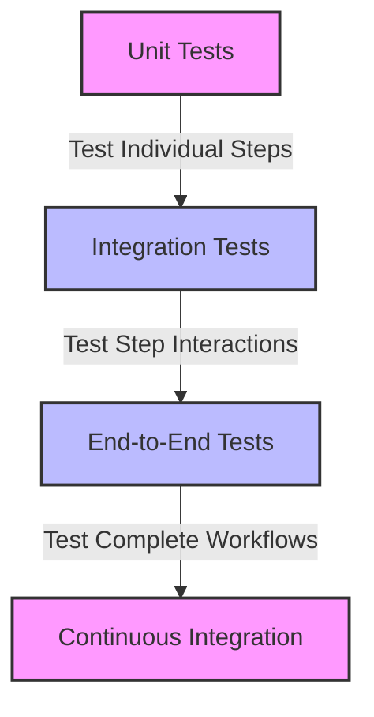

# Testing Strategies Pattern

The Testing Strategies pattern provides approaches for testing your Motia workflows at different levels, from individual steps to complete flows. Effective testing is crucial for building reliable, maintainable workflows that behave as expected in production.

## Problem Statement

Testing event-driven workflows presents unique challenges:

- Steps are loosely coupled, making it difficult to test interactions
- Asynchronous processing can complicate test assertions
- State management adds complexity to test setup and verification
- External dependencies need to be mocked or stubbed
- End-to-end testing requires orchestrating multiple components

Without a structured testing approach, you might encounter issues such as:

- Brittle tests that break with minor changes
- Missed edge cases that cause production failures
- Slow test suites that hinder development velocity
- Difficulty isolating failures to specific components
- Inconsistent test environments leading to flaky tests

## Solution Overview

The Testing Strategies pattern in Motia involves:

1. **Unit testing** individual steps in isolation
2. **Integration testing** interactions between steps
3. **End-to-end testing** complete workflows
4. **Mocking and stubbing** external dependencies
5. **Test fixtures** for consistent test data

Motia provides testing utilities that make it easier to implement these strategies while maintaining test readability and reliability.

## Implementation

### Step 1: Unit Testing Individual Steps

Let's start with a simple example of unit testing a step:

<Tabs items={['TypeScript', 'JavaScript', 'Python', 'Ruby']}>
  <Tab value="TypeScript">
    ```typescript
    // user-validation.step.ts
    export const config = {
      type: 'event',
      name: 'UserValidation',
      subscribes: ['user.submitted'],
      emits: ['user.validated', 'user.validation.failed'],
      flows: ['user-management']
    };

    export const handler = async (input, { emit, logger }) => {
      const { email, name, age } = input;
      const errors = [];
      
      // Validate email
      if (!email || !/^[^\s@]+@[^\s@]+\.[^\s@]+$/.test(email)) {
        errors.push('Invalid email address');
      }
      
      // Validate name
      if (!name || name.length < 2) {
        errors.push('Name must be at least 2 characters');
      }
      
      // Validate age
      if (age !== undefined && (isNaN(age) || age < 18)) {
        errors.push('Age must be at least 18');
      }
      
      if (errors.length > 0) {
        logger.warn(`Validation failed: ${errors.join(', ')}`);
        
        await emit({
          topic: 'user.validation.failed',
          data: {
            email,
            name,
            age,
            errors
          }
        });
        
        return { success: false, errors };
      }
      
      logger.info(`User validated successfully: ${email}`);
      
      await emit({
        topic: 'user.validated',
        data: {
          email,
          name,
          age
        }
      });
      
      return { success: true };
    };
    ```

    ```typescript
    // user-validation.test.ts
    import { mockEmit, mockLogger, mockState } from '@motia/testing';
    import { handler } from './user-validation.step';

    describe('UserValidation Step', () => {
      let emit;
      let logger;
      
      beforeEach(() => {
        emit = mockEmit();
        logger = mockLogger();
      });
      
      test('should validate a valid user', async () => {
        const input = {
          email: 'test@example.com',
          name: 'Test User',
          age: 25
        };
        
        const result = await handler(input, { emit, logger });
        
        expect(result).toEqual({ success: true });
        expect(emit).toHaveBeenCalledWith({
          topic: 'user.validated',
          data: {
            email: 'test@example.com',
            name: 'Test User',
            age: 25
          }
        });
        expect(logger.info).toHaveBeenCalled();
      });
      
      test('should reject invalid email', async () => {
        const input = {
          email: 'invalid-email',
          name: 'Test User',
          age: 25
        };
        
        const result = await handler(input, { emit, logger });
        
        expect(result).toEqual({
          success: false,
          errors: ['Invalid email address']
        });
        expect(emit).toHaveBeenCalledWith({
          topic: 'user.validation.failed',
          data: {
            email: 'invalid-email',
            name: 'Test User',
            age: 25,
            errors: ['Invalid email address']
          }
        });
        expect(logger.warn).toHaveBeenCalled();
      });
      
      test('should reject multiple validation errors', async () => {
        const input = {
          email: 'invalid-email',
          name: 'A',
          age: 16
        };
        
        const result = await handler(input, { emit, logger });
        
        expect(result.success).toBe(false);
        expect(result.errors).toHaveLength(3);
        expect(emit).toHaveBeenCalledWith(expect.objectContaining({
          topic: 'user.validation.failed'
        }));
      });
    });
    ```
  </Tab>
  <Tab value="JavaScript">
    ```javascript
    // user-validation.step.js
    export const config = {
      type: 'event',
      name: 'UserValidation',
      subscribes: ['user.submitted'],
      emits: ['user.validated', 'user.validation.failed'],
      flows: ['user-management']
    };

    export const handler = async (input, { emit, logger }) => {
      const { email, name, age } = input;
      const errors = [];
      
      // Validate email
      if (!email || !/^[^\s@]+@[^\s@]+\.[^\s@]+$/.test(email)) {
        errors.push('Invalid email address');
      }
      
      // Validate name
      if (!name || name.length < 2) {
        errors.push('Name must be at least 2 characters');
      }
      
      // Validate age
      if (age !== undefined && (isNaN(age) || age < 18)) {
        errors.push('Age must be at least 18');
      }
      
      if (errors.length > 0) {
        logger.warn(`Validation failed: ${errors.join(', ')}`);
        
        await emit({
          topic: 'user.validation.failed',
          data: {
            email,
            name,
            age,
            errors
          }
        });
        
        return { success: false, errors };
      }
      
      logger.info(`User validated successfully: ${email}`);
      
      await emit({
        topic: 'user.validated',
        data: {
          email,
          name,
          age
        }
      });
      
      return { success: true };
    };
    ```

    ```javascript
    // user-validation.test.js
    import { mockEmit, mockLogger, mockState } from '@motia/testing';
    import { handler } from './user-validation.step';

    describe('UserValidation Step', () => {
      let emit;
      let logger;
      
      beforeEach(() => {
        emit = mockEmit();
        logger = mockLogger();
      });
      
      test('should validate a valid user', async () => {
        const input = {
          email: 'test@example.com',
          name: 'Test User',
          age: 25
        };
        
        const result = await handler(input, { emit, logger });
        
        expect(result).toEqual({ success: true });
        expect(emit).toHaveBeenCalledWith({
          topic: 'user.validated',
          data: {
            email: 'test@example.com',
            name: 'Test User',
            age: 25
          }
        });
        expect(logger.info).toHaveBeenCalled();
      });
      
      test('should reject invalid email', async () => {
        const input = {
          email: 'invalid-email',
          name: 'Test User',
          age: 25
        };
        
        const result = await handler(input, { emit, logger });
        
        expect(result).toEqual({
          success: false,
          errors: ['Invalid email address']
        });
        expect(emit).toHaveBeenCalledWith({
          topic: 'user.validation.failed',
          data: {
            email: 'invalid-email',
            name: 'Test User',
            age: 25,
            errors: ['Invalid email address']
          }
        });
        expect(logger.warn).toHaveBeenCalled();
      });
      
      test('should reject multiple validation errors', async () => {
        const input = {
          email: 'invalid-email',
          name: 'A',
          age: 16
        };
        
        const result = await handler(input, { emit, logger });
        
        expect(result.success).toBe(false);
        expect(result.errors).toHaveLength(3);
        expect(emit).toHaveBeenCalledWith(expect.objectContaining({
          topic: 'user.validation.failed'
        }));
      });
    });
    ```
  </Tab>
  <Tab value="Python">
    ```python
    # user_validation.step.py
    import re
    
    config = {
      "type": "event",
      "name": "UserValidation",
      "subscribes": ["user.submitted"],
      "emits": ["user.validated", "user.validation.failed"],
      "flows": ["user-management"]
    }

    async def handler(input, context):
      email = input.get("email")
      name = input.get("name")
      age = input.get("age")
      errors = []
      
      # Validate email
      if not email or not re.match(r'^[^\s@]+@[^\s@]+\.[^\s@]+$', email):
        errors.append("Invalid email address")
      
      # Validate name
      if not name or len(name) < 2:
        errors.append("Name must be at least 2 characters")
      
      # Validate age
      if age is not None and (not isinstance(age, (int, float)) or age < 18):
        errors.append("Age must be at least 18")
      
      if errors:
        context.logger.warn(f"Validation failed: {', '.join(errors)}")
        
        await context.emit({
          "topic": "user.validation.failed",
          "data": {
            "email": email,
            "name": name,
            "age": age,
            "errors": errors
          }
        })
        
        return {"success": False, "errors": errors}
      
      context.logger.info(f"User validated successfully: {email}")
      
      await context.emit({
        "topic": "user.validated",
        "data": {
          "email": email,
          "name": name,
          "age": age
        }
      })
      
      return {"success": True}
    ```

    ```python
    # test_user_validation.py
    import pytest
    from unittest.mock import AsyncMock, MagicMock
    from user_validation.step import handler

    class TestUserValidation:
      @pytest.fixture
      def context(self):
        context = MagicMock()
        context.emit = AsyncMock()
        context.logger = MagicMock()
        return context
      
      @pytest.mark.asyncio
      async def test_valid_user(self, context):
        input_data = {
          "email": "test@example.com",
          "name": "Test User",
          "age": 25
        }
        
        result = await handler(input_data, context)
        
        assert result == {"success": True}
        context.emit.assert_called_once_with({
          "topic": "user.validated",
          "data": {
            "email": "test@example.com",
            "name": "Test User",
            "age": 25
          }
        })
        assert context.logger.info.called
      
      @pytest.mark.asyncio
      async def test_invalid_email(self, context):
        input_data = {
          "email": "invalid-email",
          "name": "Test User",
          "age": 25
        }
        
        result = await handler(input_data, context)
        
        assert result == {
          "success": False,
          "errors": ["Invalid email address"]
        }
        context.emit.assert_called_once_with({
          "topic": "user.validation.failed",
          "data": {
            "email": "invalid-email",
            "name": "Test User",
            "age": 25,
            "errors": ["Invalid email address"]
          }
        })
        assert context.logger.warn.called
      
      @pytest.mark.asyncio
      async def test_multiple_validation_errors(self, context):
        input_data = {
          "email": "invalid-email",
          "name": "A",
          "age": 16
        }
        
        result = await handler(input_data, context)
        
        assert result["success"] is False
        assert len(result["errors"]) == 3
        context.emit.assert_called_once()
        assert context.emit.call_args[0][0]["topic"] == "user.validation.failed"
    ```
  </Tab>
  <Tab value="Ruby">
    ```ruby
    # user_validation.step.rb
    config = {
      type: 'event',
      name: 'UserValidation',
      subscribes: ['user.submitted'],
      emits: ['user.validated', 'user.validation.failed'],
      flows: ['user-management']
    }

    def handler(input, context)
      email = input[:email]
      name = input[:name]
      age = input[:age]
      errors = []
      
      # Validate email
      if !email || !(email =~ /\A[^@\s]+@[^@\s]+\.[^@\s]+\z/)
        errors << 'Invalid email address'
      end
      
      # Validate name
      if !name || name.length < 2
        errors << 'Name must be at least 2 characters'
      end
      
      # Validate age
      if !age.nil? && (!age.is_a?(Numeric) || age < 18)
        errors << 'Age must be at least 18'
      end
      
      if !errors.empty?
        context.logger.warn("Validation failed: #{errors.join(', ')}")
        
        context.emit(
          topic: 'user.validation.failed',
          data: {
            email: email,
            name: name,
            age: age,
            errors: errors
          }
        )
        
        return { success: false, errors: errors }
      end
      
      context.logger.info("User validated successfully: #{email}")
      
      context.emit(
        topic: 'user.validated',
        data: {
          email: email,
          name: name,
          age: age
        }
      )
      
      return { success: true }
    end
    ```

    ```ruby
    # user_validation_spec.rb
    require 'rspec'
    require_relative '../steps/user_validation.step'

    RSpec.describe 'UserValidation Step' do
      let(:context) do
        double('context').tap do |ctx|
          allow(ctx).to receive(:emit)
          allow(ctx).to receive(:logger).and_return(
            double('logger').tap do |logger|
              allow(logger).to receive(:info)
              allow(logger).to receive(:warn)
            end
          )
        end
      end
      
      it 'validates a valid user' do
        input = {
          email: 'test@example.com',
          name: 'Test User',
          age: 25
        }
        
        result = handler(input, context)
        
        expect(result).to eq({ success: true })
        expect(context).to have_received(:emit).with(
          topic: 'user.validated',
          data: {
            email: 'test@example.com',
            name: 'Test User',
            age: 25
          }
        )
        expect(context.logger).to have_received(:info)
      end
      
      it 'rejects invalid email' do
        input = {
          email: 'invalid-email',
          name: 'Test User',
          age: 25
        }
        
        result = handler(input, context)
        
        expect(result).to eq({
          success: false,
          errors: ['Invalid email address']
        })
        expect(context).to have_received(:emit).with(
          topic: 'user.validation.failed',
          data: {
            email: 'invalid-email',
            name: 'Test User',
            age: 25,
            errors: ['Invalid email address']
          }
        )
        expect(context.logger).to have_received(:warn)
      end
      
      it 'rejects multiple validation errors' do
        input = {
          email: 'invalid-email',
          name: 'A',
          age: 16
        }
        
        result = handler(input, context)
        
        expect(result[:success]).to be false
        expect(result[:errors].length).to eq(3)
        expect(context).to have_received(:emit) do |args|
          expect(args[:topic]).to eq('user.validation.failed')
        end
      end
    end
    ```
  </Tab>
</Tabs>

### Step 2: Integration Testing Step Interactions

Now, let's create an integration test that tests the interaction between steps:

<Tabs items={['TypeScript', 'JavaScript', 'Python', 'Ruby']}>
  <Tab value="TypeScript">
    ```typescript
    // user-registration.integration.test.ts
    import { createTestFlow } from '@motia/testing';
    import { handler as validationHandler } from './user-validation.step';
    import { handler as registrationHandler } from './user-registration.step';
    import { handler as notificationHandler } from './user-notification.step';

    describe('User Registration Flow', () => {
      test('should register a valid user and send notification', async () => {
        // Create a test flow with mocked state
        const flow = createTestFlow({
          steps: {
            'UserValidation': {
              handler: validationHandler,
              subscribes: ['user.submitted'],
              emits: ['user.validated', 'user.validation.failed']
            },
            'UserRegistration': {
              handler: registrationHandler,
              subscribes: ['user.validated'],
              emits: ['user.registered']
            },
            'UserNotification': {
              handler: notificationHandler,
              subscribes: ['user.registered'],
              emits: ['notification.sent']
            }
          }
        });
        
        // Initialize test state
        await flow.state.set('users', []);
        
        // Trigger the flow
        await flow.emit({
          topic: 'user.submitted',
          data: {
            email: 'test@example.com',
            name: 'Test User',
            age: 25
          }
        });
        
        // Wait for all events to be processed
        await flow.waitForIdle();
        
        // Verify the flow executed as expected
        expect(flow.emittedEvents).toContainEqual(
          expect.objectContaining({
            topic: 'user.validated'
          })
        );
        
        expect(flow.emittedEvents).toContainEqual(
          expect.objectContaining({
            topic: 'user.registered'
          })
        );
        
        expect(flow.emittedEvents).toContainEqual(
          expect.objectContaining({
            topic: 'notification.sent'
          })
        );
        
        // Verify state was updated correctly
        const users = await flow.state.get('users');
        expect(users).toHaveLength(1);
        expect(users[0].email).toBe('test@example.com');
      });
      
      test('should reject invalid user registration', async () => {
        const flow = createTestFlow({
          steps: {
            'UserValidation': {
              handler: validationHandler,
              subscribes: ['user.submitted'],
              emits: ['user.validated', 'user.validation.failed']
            },
            'UserRegistration': {
              handler: registrationHandler,
              subscribes: ['user.validated'],
              emits: ['user.registered']
            }
          }
        });
        
        await flow.state.set('users', []);
        
        await flow.emit({
          topic: 'user.submitted',
          data: {
            email: 'invalid-email',
            name: 'Test User',
            age: 25
          }
        });
        
        await flow.waitForIdle();
        
        expect(flow.emittedEvents).toContainEqual(
          expect.objectContaining({
            topic: 'user.validation.failed'
          })
        );
        
        expect(flow.emittedEvents).not.toContainEqual(
          expect.objectContaining({
            topic: 'user.registered'
          })
        );
        
        const users = await flow.state.get('users');
        expect(users).toHaveLength(0);
      });
    });
    ```
  </Tab>
  <Tab value="JavaScript">
    ```javascript
    // user-registration.integration.test.js
    import { createTestFlow } from '@motia/testing';
    import { handler as validationHandler } from './user-validation.step';
    import { handler as registrationHandler } from './user-registration.step';
    import { handler as notificationHandler } from './user-notification.step';

    describe('User Registration Flow', () => {
      test('should register a valid user and send notification', async () => {
        // Create a test flow with mocked state
        const flow = createTestFlow({
          steps: {
            'UserValidation': {
              handler: validationHandler,
              subscribes: ['user.submitted'],
              emits: ['user.validated', 'user.validation.failed']
            },
            'UserRegistration': {
              handler: registrationHandler,
              subscribes: ['user.validated'],
              emits: ['user.registered']
            },
            'UserNotification': {
              handler: notificationHandler,
              subscribes: ['user.registered'],
              emits: ['notification.sent']
            }
          }
        });
        
        // Initialize test state
        await flow.state.set('users', []);
        
        // Trigger the flow
        await flow.emit({
          topic: 'user.submitted',
          data: {
            email: 'test@example.com',
            name: 'Test User',
            age: 25
          }
        });
        
        // Wait for all events to be processed
        await flow.waitForIdle();
        
        // Verify the flow executed as expected
        expect(flow.emittedEvents).toContainEqual(
          expect.objectContaining({
            topic: 'user.validated'
          })
        );
        
        expect(flow.emittedEvents).toContainEqual(
          expect.objectContaining({
            topic: 'user.registered'
          })
        );
        
        expect(flow.emittedEvents).toContainEqual(
          expect.objectContaining({
            topic: 'notification.sent'
          })
        );
        
        // Verify state was updated correctly
        const users = await flow.state.get('users');
        expect(users).toHaveLength(1);
        expect(users[0].email).toBe('test@example.com');
      });
      
      test('should reject invalid user registration', async () => {
        const flow = createTestFlow({
          steps: {
            'UserValidation': {
              handler: validationHandler,
              subscribes: ['user.submitted'],
              emits: ['user.validated', 'user.validation.failed']
            },
            'UserRegistration': {
              handler: registrationHandler,
              subscribes: ['user.validated'],
              emits: ['user.registered']
            }
          }
        });
        
        await flow.state.set('users', []);
        
        await flow.emit({
          topic: 'user.submitted',
          data: {
            email: 'invalid-email',
            name: 'Test User',
            age: 25
          }
        });
        
        await flow.waitForIdle();
        
        expect(flow.emittedEvents).toContainEqual(
          expect.objectContaining({
            topic: 'user.validation.failed'
          })
        );
        
        expect(flow.emittedEvents).not.toContainEqual(
          expect.objectContaining({
            topic: 'user.registered'
          })
        );
        
        const users = await flow.state.get('users');
        expect(users).toHaveLength(0);
      });
    });
    ```
  </Tab>
  <Tab value="Python">
    ```python
    # test_user_registration_integration.py
    import pytest
    from motia.testing import create_test_flow
    from user_validation.step import handler as validation_handler
    from user_registration.step import handler as registration_handler
    from user_notification.step import handler as notification_handler

    class TestUserRegistrationFlow:
      @pytest.mark.asyncio
      async def test_register_valid_user_and_send_notification(self):
        # Create a test flow with mocked state
        flow = create_test_flow({
          "steps": {
            "UserValidation": {
              "handler": validation_handler,
              "subscribes": ["user.submitted"],
              "emits": ["user.validated", "user.validation.failed"]
            },
            "UserRegistration": {
              "handler": registration_handler,
              "subscribes": ["user.validated"],
              "emits": ["user.registered"]
            },
            "UserNotification": {
              "handler": notification_handler,
              "subscribes": ["user.registered"],
              "emits": ["notification.sent"]
            }
          }
        })
        
        # Initialize test state
        await flow.state.set("users", [])
        
        # Trigger the flow
        await flow.emit({
          "topic": "user.submitted",
          "data": {
            "email": "test@example.com",
            "name": "Test User",
            "age": 25
          }
        })
        
        # Wait for all events to be processed
        await flow.wait_for_idle()
        
        # Verify the flow executed as expected
        assert any(event["topic"] == "user.validated" for event in flow.emitted_events)
        assert any(event["topic"] == "user.registered" for event in flow.emitted_events)
        assert any(event["topic"] == "notification.sent" for event in flow.emitted_events)
        
        # Verify state was updated correctly
        users = await flow.state.get("users")
        assert len(users) == 1
        assert users[0]["email"] == "test@example.com"
      
      @pytest.mark.asyncio
      async def test_reject_invalid_user_registration(self):
        flow = create_test_flow({
          "steps": {
            "UserValidation": {
              "handler": validation_handler,
              "subscribes": ["user.submitted"],
              "emits": ["user.validated", "user.validation.failed"]
            },
            "UserRegistration": {
              "handler": registration_handler,
              "subscribes": ["user.validated"],
              "emits": ["user.registered"]
            }
          }
        })
        
        await flow.state.set("users", [])
        
        await flow.emit({
          "topic": "user.submitted",
          "data": {
            "email": "invalid-email",
            "name": "Test User",
            "age": 25
          }
        })
        
        await flow.wait_for_idle()
        
        assert any(event["topic"] == "user.validation.failed" for event in flow.emitted_events)
        assert not any(event["topic"] == "user.registered" for event in flow.emitted_events)
        
        users = await flow.state.get("users")
        assert len(users) == 0
    ```
  </Tab>
  <Tab value="Ruby">
    ```ruby
    # user_registration_integration_spec.rb
    require 'rspec'
    require 'motia/testing'
    require_relative '../steps/user_validation.step'
    require_relative '../steps/user_registration.step'
    require_relative '../steps/user_notification.step'

    RSpec.describe 'User Registration Flow' do
      it 'registers a valid user and sends notification' do
        # Create a test flow with mocked state
        flow = Motia::Testing.create_test_flow(
          steps: {
            'UserValidation' => {
              handler: method(:validation_handler),
              subscribes: ['user.submitted'],
              emits: ['user.validated', 'user.validation.failed']
            },
            'UserRegistration' => {
              handler: method(:registration_handler),
              subscribes: ['user.validated'],
              emits: ['user.registered']
            },
            'UserNotification' => {
              handler: method(:notification_handler),
              subscribes: ['user.registered'],
              emits: ['notification.sent']
            }
          }
        )
        
        # Initialize test state
        flow.state.set('users', [])
        
        # Trigger the flow
        flow.emit(
          topic: 'user.submitted',
          data: {
            email: 'test@example.com',
            name: 'Test User',
            age: 25
          }
        )
        
        # Wait for all events to be processed
        flow.wait_for_idle
        
        # Verify the flow executed as expected
        expect(flow.emitted_events).to include(
          hash_including(topic: 'user.validated')
        )
        
        expect(flow.emitted_events).to include(
          hash_including(topic: 'user.registered')
        )
        
        expect(flow.emitted_events).to include(
          hash_including(topic: 'notification.sent')
        )
        
        # Verify state was updated correctly
        users = flow.state.get('users')
        expect(users.length).to eq(1)
        expect(users[0][:email]).to eq('test@example.com')
      end
      
      it 'rejects invalid user registration' do
        flow = Motia::Testing.create_test_flow(
          steps: {
            'UserValidation' => {
              handler: method(:validation_handler),
              subscribes: ['user.submitted'],
              emits: ['user.validated', 'user.validation.failed']
            },
            'UserRegistration' => {
              handler: method(:registration_handler),
              subscribes: ['user.validated'],
              emits: ['user.registered']
            }
          }
        )
        
        flow.state.set('users', [])
        
        flow.emit(
          topic: 'user.submitted',
          data: {
            email: 'invalid-email',
            name: 'Test User',
            age: 25
          }
        )
        
        flow.wait_for_idle
        
        expect(flow.emitted_events).to include(
          hash_including(topic: 'user.validation.failed')
        )
        
        expect(flow.emitted_events).not_to include(
          hash_including(topic: 'user.registered')
        )
        
        users = flow.state.get('users')
        expect(users.length).to eq(0)
      end
    end
    ```
  </Tab>
</Tabs>

### Step 3: End-to-End Testing

Finally, let's create an end-to-end test that tests the complete workflow:

<Tabs items={['TypeScript', 'JavaScript', 'Python', 'Ruby']}>
  <Tab value="TypeScript">
    ```typescript
    // user-registration.e2e.test.ts
    import { startTestServer, stopTestServer, request } from '@motia/testing';

    describe('User Registration E2E', () => {
      beforeAll(async () => {
        // Start a test server with all steps
        await startTestServer({
          flowsDir: './flows',
          stepsDir: './steps'
        });
      });
      
      afterAll(async () => {
        // Stop the test server
        await stopTestServer();
      });
      
      test('should register a valid user', async () => {
        // Send a request to the API
        const response = await request({
          method: 'POST',
          path: '/process-data',
          body: {
            email: 'test@example.com',
            name: 'Test User',
            age: 25
          }
        });
        
        // Verify the response
        expect(response.status).toBe(202);
        expect(response.body).toHaveProperty('requestId');
        
        // Wait for processing to complete
        await new Promise(resolve => setTimeout(resolve, 500));
        
        // Check the result
        const resultResponse = await request({
          method: 'GET',
          path: `/users/${response.body.requestId}`
        });
        
        expect(resultResponse.status).toBe(200);
        expect(resultResponse.body).toHaveProperty('user');
        expect(resultResponse.body.user.email).toBe('test@example.com');
        expect(resultResponse.body.user.status).toBe('registered');
      });
      
      test('should reject invalid user data', async () => {
        const response = await request({
          method: 'POST',
          path: '/process-data',
          body: {
            email: 'invalid-email',
            name: 'A',
            age: 16
          }
        });
        
        expect(response.status).toBe(400);
        expect(response.body).toHaveProperty('errors');
        expect(response.body.errors).toHaveLength(3);
      });
    });
    ```
  </Tab>
  <Tab value="JavaScript">
    ```javascript
    // user-registration.e2e.test.js
    import { startTestServer, stopTestServer, request } from '@motia/testing';

    describe('User Registration E2E', () => {
      beforeAll(async () => {
        // Start a test server with all steps
        await startTestServer({
          flowsDir: './flows',
          stepsDir: './steps'
        });
      });
      
      afterAll(async () => {
        // Stop the test server
        await stopTestServer();
      });
      
      test('should register a valid user', async () => {
        // Send a request to the API
        const response = await request({
          method: 'POST',
          path: '/process-data',
          body: {
            email: 'test@example.com',
            name: 'Test User',
            age: 25
          }
        });
        
        // Verify the response
        expect(response.status).toBe(202);
        expect(response.body).toHaveProperty('requestId');
        
        // Wait for processing to complete
        await new Promise(resolve => setTimeout(resolve, 500));
        
        // Check the result
        const resultResponse = await request({
          method: 'GET',
          path: `/users/${response.body.requestId}`
        });
        
        expect(resultResponse.status).toBe(200);
        expect(resultResponse.body).toHaveProperty('user');
        expect(resultResponse.body.user.email).toBe('test@example.com');
        expect(resultResponse.body.user.status).toBe('registered');
      });
      
      test('should reject invalid user data', async () => {
        const response = await request({
          method: 'POST',
          path: '/process-data',
          body: {
            email: 'invalid-email',
            name: 'A',
            age: 16
          }
        });
        
        expect(response.status).toBe(400);
        expect(response.body).toHaveProperty('errors');
        expect(response.body.errors).toHaveLength(3);
      });
    });
    ```
  </Tab>
  <Tab value="Python">
    ```python
    # test_user_registration_e2e.py
    import pytest
    import asyncio
    from motia.testing import start_test_server, stop_test_server, request

    class TestUserRegistrationE2E:
      @classmethod
      def setup_class(cls):
        # Start a test server with all steps
        asyncio.run(start_test_server({
          "flowsDir": "./flows",
          "stepsDir": "./steps"
        }))
      
      @classmethod
      def teardown_class(cls):
        # Stop the test server
        asyncio.run(stop_test_server())
      
      @pytest.mark.asyncio
      async def test_register_valid_user(self):
        # Send a request to the API
        response = await request({
          "method": "POST",
          "path": "/process-data",
          "body": {
            "email": "test@example.com",
            "name": "Test User",
            "age": 25
          }
        })
        
        # Verify the response
        assert response["status"] == 202
        assert "requestId" in response["body"]
        
        # Wait for processing to complete
        await asyncio.sleep(0.5)
        
        # Check the result
        result_response = await request({
          "method": "GET",
          "path": f"/users/{response['body']['requestId']}"
        })
        
        assert result_response["status"] == 200
        assert "user" in result_response["body"]
        assert result_response["body"]["user"]["email"] == "test@example.com"
        assert result_response["body"]["user"]["status"] == "registered"
      
      @pytest.mark.asyncio
      async def test_reject_invalid_user_data(self):
        response = await request({
          "method": "POST",
          "path": "/process-data",
          "body": {
            "email": "invalid-email",
            "name": "A",
            "age": 16
          }
        })
        
        assert response["status"] == 400
        assert "errors" in response["body"]
        assert len(response["body"]["errors"]) == 3
    ```
  </Tab>
  <Tab value="Ruby">
    ```ruby
    # user_registration_e2e_spec.rb
    require 'rspec'
    require 'motia/testing'

    RSpec.describe 'User Registration E2E' do
      before(:all) do
        # Start a test server with all steps
        Motia::Testing.start_test_server(
          flows_dir: './flows',
          steps_dir: './steps'
        )
      end
      
      after(:all) do
        # Stop the test server
        Motia::Testing.stop_test_server
      end
      
      it 'registers a valid user' do
        # Send a request to the API
        response = Motia::Testing.request(
          method: 'POST',
          path: '/process-data',
          body: {
            email: 'test@example.com',
            name: 'Test User',
            age: 25
          }
        )
        
        # Verify the response
        expect(response[:status]).to eq(202)
        expect(response[:body]).to have_key('requestId')
        
        # Wait for processing to complete
        sleep(0.5)
        
        # Check the result
        result_response = Motia::Testing.request(
          method: 'GET',
          path: "/users/#{response[:body]['requestId']}"
        )
        
        expect(result_response[:status]).to eq(200)
        expect(result_response[:body]).to have_key('user')
        expect(result_response[:body]['user']['email']).to eq('test@example.com')
        expect(result_response[:body]['user']['status']).to eq('registered')
      end
      
      it 'rejects invalid user data' do
        response = Motia::Testing.request(
          method: 'POST',
          path: '/process-data',
          body: {
            email: 'invalid-email',
            name: 'A',
            age: 16
          }
        )
        
        expect(response[:status]).to eq(400)
        expect(response[:body]).to have_key('errors')
        expect(response[:body]['errors'].length).to eq(3)
      end
    end
    ```
  </Tab>
</Tabs>

## Testing Strategies

### 1. Unit Testing

Unit tests focus on testing individual steps in isolation:

- **Mock dependencies**: Use `mockEmit`, `mockLogger`, and `mockState` to isolate the step
- **Test happy path**: Verify the step works correctly with valid input
- **Test edge cases**: Verify the step handles invalid input and edge cases
- **Test error handling**: Verify the step handles errors gracefully

```typescript
// Example of mocking dependencies
import { mockEmit, mockLogger, mockState } from '@motia/testing';

const emit = mockEmit();
const logger = mockLogger();
const state = mockState({
  'users': []
});

// Call the handler with mocked dependencies
const result = await handler(input, { emit, logger, state });

// Verify the result
expect(result).toEqual({ success: true });

// Verify emit was called correctly
expect(emit).toHaveBeenCalledWith({
  topic: 'user.validated',
  data: { /* expected data */ }
});

// Verify state was updated correctly
expect(state.set).toHaveBeenCalledWith('users', expect.any(Array));
```

### 2. Integration Testing

Integration tests focus on testing the interaction between steps:

- **Create test flows**: Use `createTestFlow` to create a test flow with multiple steps
- **Initialize test state**: Set up the initial state for the test
- **Trigger events**: Emit events to trigger the flow
- **Verify events**: Check that the expected events were emitted
- **Verify state**: Check that the state was updated correctly

```typescript
// Example of creating a test flow
import { createTestFlow } from '@motia/testing';

const flow = createTestFlow({
  steps: {
    'StepA': {
      handler: handlerA,
      subscribes: ['event.a'],
      emits: ['event.b']
    },
    'StepB': {
      handler: handlerB,
      subscribes: ['event.b'],
      emits: ['event.c']
    }
  }
});

// Trigger the flow
await flow.emit({
  topic: 'event.a',
  data: { /* input data */ }
});

// Wait for all events to be processed
await flow.waitForIdle();

// Verify the flow executed as expected
expect(flow.emittedEvents).toContainEqual(
  expect.objectContaining({
    topic: 'event.c'
  })
);
```

### 3. End-to-End Testing

End-to-end tests focus on testing the complete workflow:

- **Start a test server**: Use `startTestServer` to start a server with all steps
- **Send requests**: Use `request` to send HTTP requests to the server
- **Verify responses**: Check that the responses are as expected
- **Clean up**: Stop the test server when done

```typescript
// Example of starting a test server
import { startTestServer, stopTestServer, request } from '@motia/testing';

// Start a test server
await startTestServer({
  flowsDir: './flows',
  stepsDir: './steps'
});

// Send a request
const response = await request({
  method: 'POST',
  path: '/api/endpoint',
  body: { /* request body */ }
});

// Verify the response
expect(response.status).toBe(200);
expect(response.body).toEqual({ /* expected response */ });

// Stop the test server
await stopTestServer();
```

### 4. Mocking External Dependencies

For steps that interact with external services, use mocks:

```typescript
// Example of mocking an external service
import { mockExternalService } from '@motia/testing';

// Mock the external service
const mockService = mockExternalService('https://api.example.com');
mockService.onGet('/users').reply(200, [
  { id: 1, name: 'User 1' },
  { id: 2, name: 'User 2' }
]);

// Test the step that uses the external service
const result = await handler(input, { emit, logger, state });

// Verify the mock was called
expect(mockService.getRequests()).toHaveLength(1);
```

### 5. Test Fixtures

Use test fixtures to provide consistent test data:

```typescript
// Example of using test fixtures
import { loadFixture } from '@motia/testing';

// Load a fixture
const userData = loadFixture('user-data.json');

// Use the fixture in a test
const result = await handler({ user: userData }, { emit, logger, state });

// Verify the result
expect(result).toEqual({ success: true });
```

## Workflow Visualization

In the Motia Workbench, a testing workflow might look like this:



## Variations

### 1. Test-Driven Development

For a test-driven development approach:

1. Write a failing test for a new feature
2. Implement the feature to make the test pass
3. Refactor the code while keeping the tests passing

```typescript
// Example of a failing test
test('should handle feature X', async () => {
  const input = { /* test input */ };
  const result = await handler(input, { emit, logger, state });
  
  // This will fail until the feature is implemented
  expect(result).toHaveProperty('featureX');
});
```

### 2. Property-Based Testing

For testing with a wide range of inputs:

```typescript
// Example of property-based testing
import fc from 'fast-check';

test('should validate email addresses', () => {
  fc.assert(
    fc.property(fc.emailAddress(), (email) => {
      const result = validateEmail(email);
      return result === true;
    })
  );
});
```

### 3. Snapshot Testing

For testing complex outputs:

```typescript
// Example of snapshot testing
test('should generate the expected output', async () => {
  const input = { /* test input */ };
  const result = await handler(input, { emit, logger, state });
  
  // Compare the result to a stored snapshot
  expect(result).toMatchSnapshot();
});
```

## Considerations

### When to Use This Pattern

The Testing Strategies pattern is essential for:

- **Production applications**: Any workflow that runs in production
- **Complex workflows**: Workflows with multiple steps and interactions
- **Critical systems**: Systems where reliability is important
- **Team environments**: Projects with multiple developers
- **Continuous integration**: Projects with automated builds and deployments

### Limitations

This pattern has some limitations to consider:

- **Test maintenance**: Tests need to be maintained as the application evolves
- **Test performance**: Large test suites can be slow to run
- **Test complexity**: Complex workflows can be difficult to test
- **External dependencies**: External services can be difficult to mock
- **Test environment**: Test environments may differ from production

### Best Practices

When implementing testing strategies, follow these best practices:

- **Test pyramid**: Write more unit tests than integration tests, and more integration tests than end-to-end tests
- **Test isolation**: Each test should be independent of other tests
- **Test readability**: Tests should be easy to understand and maintain
- **Test coverage**: Aim for high test coverage, but focus on critical paths
- **Test performance**: Keep tests fast to encourage frequent testing
- **Test fixtures**: Use fixtures for consistent test data
- **Test naming**: Use clear, descriptive names for tests
- **Test organization**: Organize tests to match the structure of the code

## Next Steps

After mastering the Testing Strategies pattern, you can:

1. Implement **continuous integration** to run tests automatically
2. Add **code coverage** reporting to identify untested code
3. Use **mutation testing** to verify test quality
4. Implement **performance testing** to ensure workflows meet performance requirements
5. Try more advanced patterns like [State Management](./state-management) or [Error Handling](./error-handling)

## Related Concepts

- [Event-Driven Basics](/docs/concepts/getting-started/event-driven-basics)
- [Steps Introduction](/docs/concepts/getting-started/steps-intro)
- [Flows Introduction](/docs/concepts/getting-started/flows-intro)
- [State Management](/docs/guides/patterns/state-management)
- [Error Handling](/docs/guides/patterns/error-handling)
