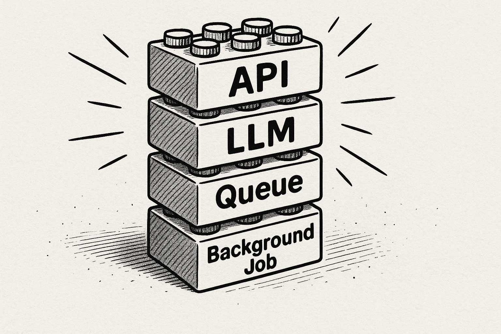
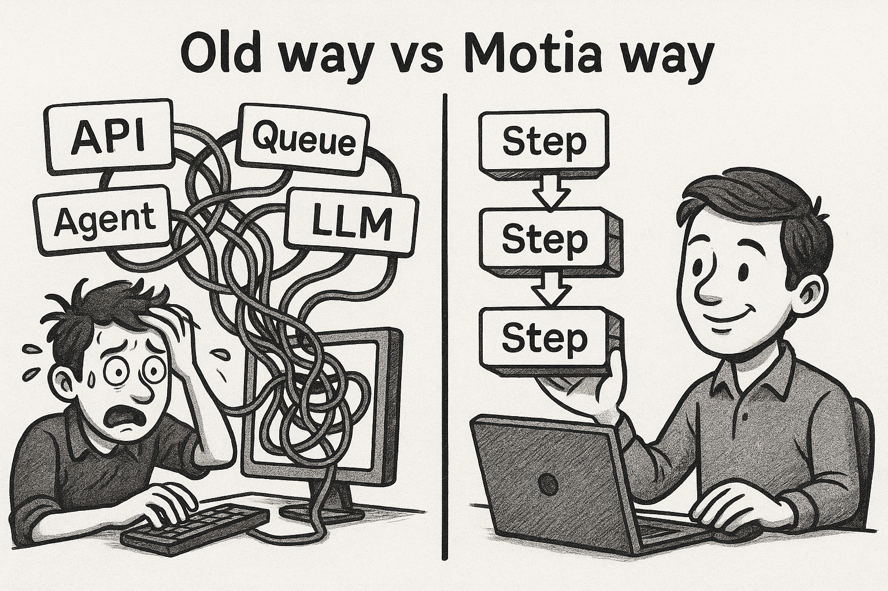

Motia is built around a single powerful primitive: the **Step**

Steps are the language-agnostic, building blocks of a Motia app. 

Just like how in a React app, everything is a component, similarly, in a Motia app, everything is a Step. Read our [introductory blog](https://dev.to/motiadev/introducing-motia-3oja-temp-slug-3967652?preview=c67eba085f74a7cf7b2c509a1548676bce436734e51ef49f52b1927b110de0fa2e214aa713e90c7a3301332e5d0eb658a6d1bdacb9a4777d93f37b52) to know more about this parallel.

Conceptually, Steps are modular and reusable bits of logic, each of whom perform a specific task. They are stitched together to compose a workflow.

## Steps are basically Lego blocks
You can think of steps like lego blocks. 
Each Step performs one job, and then optionally passes the baton. Put enough Steps together, and you’ve built an entire backend system: _from an API to AI._ 

  

Intially, this might sound jarring but once you start building, it becomes clear how powerful and flexible this abstraction is. Whether you're:

- exposing an API,

- processing a queue event,

- calling an LLM,

- or even triggering a background job

Whatever you're doing, _you’re always writing a Step!_

> Each Step handles a single task, then optionally hands off control to the next. Chain them together, and you’ve got a full backend system - from API to AI.

## Why a new mental model?

Modern backends are no longer just about REST APIs and databases. They now include:
- Integrating AI and LLM-powered functionality
- Responding to events from dozens of sources
- Orchestrating workflows across queues, agents, and services
- Dealing with retry logic, observability, and failure recovery

Trying to manage all this with traditional patterns leads to fragmented systems. Motia offers a unified mental model: build your backend as a graph of Steps.

## What is a Step?
A Step is a language-agnostic, modular and reusable unit of logic that listens to a trigger (an API call, a queue event, a cron job etc) and processes an input using your logic. Optionally, Steps can emit follow up events or pass on data or processed result to continue the workflow.

Steps are:
- Isolated – each step can run independently
- Composable – steps can be connected into flows
- Multilingual – write steps in TypeScript, Python, or more
- Reusable – just like components, you can use the same step in multiple workflows

Two key behaviours of a Step are - Subscription and Emission. Each step can subscribe to one/many event(s) and emit one/many event(s).

Using these behaviours of a Step, you can chain different steps together by having them subscribe to the events emitted by one (or many) of the previous steps, enabling a natural event-driven flow where each Step reacts to meaningful triggers.

This lets you compose powerful, modular workflows like: listening for a user.registered event to trigger a send-welcome-email step, which in turn emits a log-onboarding-started event for analytics, all without tightly coupling your logic.

> Just like React taught us to build everything as Components. Motia teaches you to model everything as a Step.

## Ready to step up your AI-native backends?
This new abstraction might feel unfamiliar at first—but once you build with it, you’ll realize how intuitive, composable, and powerful it is. Steps let you:

- Scale complexity without losing clarity

- Connect APIs, background jobs, and AI logic in one unified system

- Reuse business logic like Lego blocks across multiple workflows

- Gain observability and traceability through structured execution flows

You no longer need to juggle disconnected tools for APIs, queues, and AI agents. With Motia, everything is a Step—and that changes how we build backends for good.
  
🎯 Next up: Understanding Steps
Learn how to define, structure, and connect your first real Step inside a Motia app.