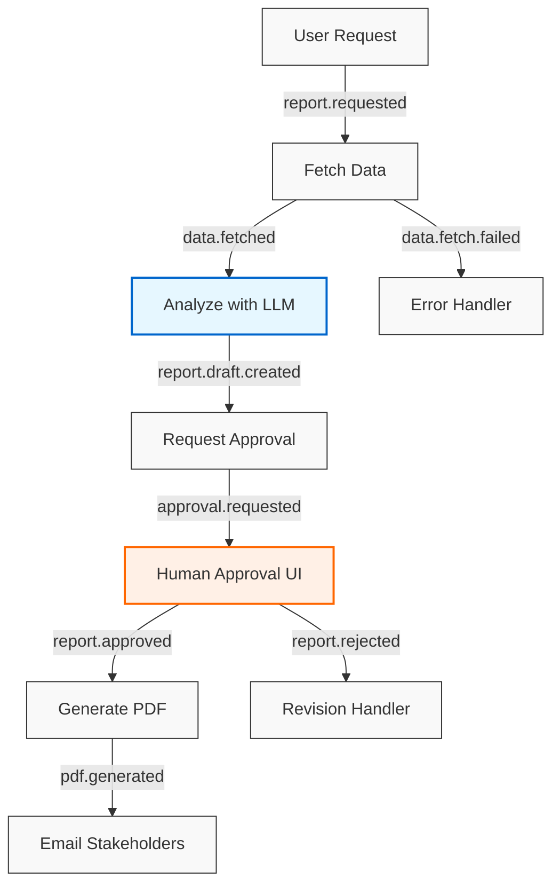
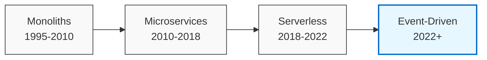
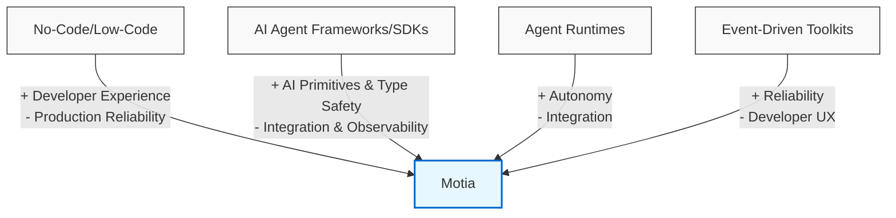

# The Backend Convergence

## TL;DR
**The Problem:** Modern backends are fragmented into three disconnected worlds: API handlers, background job systems, and AI agent frameworks. This separation creates unnecessary complexity—different programming models, separate observability systems, and brittle integration points.

**The Pattern:** After 25 years of backend evolution—from monoliths to microservices to serverless—we've circled around the same solution: event-driven architecture. It's the natural foundation that can unify all three execution models.

**The Solution:** Motia delivers a single, unified system where APIs, Automations, and Agents all operate as first-class citizens with the same programming model, observability, and state management. No more stitching LLM calls, cron jobs, and REST endpoints together with duct tape—everything lives under one coherent system.

## Why This Manifesto Exists

The software industry has a habit of bolting the future onto the past. We added microservices to monolith thinking, serverless to microservice sprawl, and now we're stapling large-language models onto REST chains that were never designed for probabilistic, long-running work. I've spent the last twelve years shipping all of those layers—loving their wins, cursing their costs, and watching each "fix" expose a fresh bottleneck.

I was sitting in a coffee shop when ChatGPT launched in November 2022. As I watched the beginnings of what looked like legitamte, computable reasoning, a strange déjà vu hit me: I'd seen this movie before. A decade earlier, I was building admin systems for "non-tech" businesses—screen-printing shops, insurance claims processors—where every workflow was a graph of human steps we desperately wanted to automate. Back then, we built complex backends, logic and UI's that managed state through incremental stages, but most steps still required humans to read, reason, and update records.

Now, as LLMs and agents began automating those exact reasoning steps, I realized something profound: **our backends weren't ready**. The problem wasn't just that synchronous REST chains couldn't handle long-running operations—it was the fundamental fragmentation of our systems. API servers, background job processors, and now AI agent frameworks all existed as separate islands with different programming models, observability systems, and deployment patterns. What we needed wasn't another specialized tool, but a unified system that could seamlessly integrate all three—something that had actually been hiding in plain sight through 25 years of backend evolution.

This essay traces the arc that took us from Rails scaffolds to autonomous agents, shows why event-driven architecture is the connective tissue we've been circling for 25 years, and explains why I built Motia to finish the job. If you're tired of stitching LLM calls, cron jobs, and human approvals together with duct tape, read on. The backend is shifting again—let's get ahead of it this time.

## Why Fragmented Systems Break Under AI Workflows: A Real-World Example

To understand why traditional architectures strugle under AI workflows, let's walk through a seemingly simple task: generating a monthly financial report that requires coordination across three different system types.

### The Fragmented Workflow

1. User requests a financial report through your **REST API server**
2. API server enqueues tasks in your **background job system**
3. Background jobs fetch data from multiple sources
4. An **AI agent framework** analyzes the data and drafts the report
5. Results are stored in a database
6. A notification is sent to request human approval
7. After approval, final processing and delivery occurs

### The Three-System Orchestration Nightmare

In today's typical architecture, this workflow requires stitching together three completely different systems, each with its own programming model, deployment patterns, and observability tools:

```
System 1: REST API Server (Express/Rails/Django)
  POST /generate-report
    → Validates request
    → Stores initial state in database
    → Enqueues background job
    → Returns 202 Accepted

System 2: Background Job System (Sidekiq/Celery/Bull)
  Job 1: Fetch CRM data
  Job 2: Fetch accounting data
  Job 3: Prepare data for AI analysis
  Job 4: Call AI agent service
  Job 5: Store results and request approval
  Job 6: [WAIT FOR WEBHOOK/POLLING]
  Job 7: Generate PDF
  Job 8: Send email

System 3: AI Agent Framework (LangChain/CrewAI/Custom)
  Agent 1: Analyze financial data
    → Load data from parameters
    → Run multi-step reasoning with LLM
    → Format analysis results
    → Return to job system
```

This fragmented approach introduces crippling complexity:

1. **Three Different Programming Models**: Your team needs to master Express/Rails routes, Sidekiq/Celery job definitions, AND LangChain/CrewAI agent patterns—each with different abstractions and best practices.

2. **State Management Nightmare**: How do you pass context between these systems? Database records? Redis? Serialized arguments? Each boundary crossing requires custom serialization/deserialization code.

3. **Deployment Complexity**: Three different systems means three different deployment pipelines, scaling considerations, and infrastructure requirements.

4. **Observability Black Holes**: When something fails, you're hunting through three different logging systems, tracing tools, and monitoring dashboards to piece together what happened.

5. **Error Handling Fragmentation**: Each system has its own retry mechanisms, timeout configurations, and error reporting—creating inconsistent recovery behavior.

**How Motia Solves This**: Motia provides a unified model that eliminates these orchestration headaches:

- All steps—whether API handlers, background jobs, LLM calls, or human gates—use the same event-driven contract
- State is automatically persisted between steps, with no custom serialization needed
- Workflows are defined declaratively, making the entire execution graph visible and understandable
- Retries, error handling, and observability are built into the framework, not scattered across your application
- Human approvals and long-running operations fit naturally into the same model as quick background tasks

This isn't just an architectural preference—it's the difference between a demo that works in the conference room and a system that runs reliably in production for years.

You've felt this pain if you've ever cobbled together a multi-step AI workflow and watched it crumble in production.

### The Event-Driven Solution

An event-driven approach transforms this brittle chain into a resilient graph:



Each step becomes an idempotent handler that:
- Consumes specific events
- Performs its work (whether deterministic code or stochastic LLM calls)
- Emits new events based on the outcome
- Persists state between steps

This isn't just theoretical—it's the difference between a prototype that demos well and a production system that runs reliably for years.

## Businesses Are Giant Graphs of Steps

### The Raw Topology

Every purchase order, ticket, invoice, or shipment moves through a chain of state-changing steps: a status flip triggers a webhook, an approval spawns a background job, an exception fires a compensation loop. Stitch those chains together and you get a single, sprawling graph—thousands of nodes and edges that no human can fully load into working memory.

### Workflows as Human-Sized Lenses

Teams stay sane by drawing soft boundaries around step clusters—"sales pipeline," "fulfillment," "collections." These workflows (and their sub-workflows) are lenses, not walls: they exist so we can visualize slices of the graph, run focused tests, or hand an auditor a clean story. Underneath, the steps remain part of one continuous mesh.

### Implications for Any Modern Framework

A backend model built for today's organizations has to respect both realities:

1. First-class steps that connect freely across the entire graph.
2. Lightweight, nestable workflow overlays that teams can zoom into or collapse on demand—useful during development, optional at runtime.

Get either side wrong and you're back to spreadsheets, tribal knowledge, and 3 a.m. Post-its—the very complexity we're trying to retire.

## 25 Years of Backend Evolution in 3 Minutes

Our journey through backend architecture reveals a pattern: each era solved one set of problems while creating new integration challenges that the next wave had to address.



### Monoliths (Rails, Django, Spring)

The monolith era prioritized developer productivity: scaffold a model, generate CRUD endpoints, ship in days. Teams moved fast until scale hit—then performance bottlenecks, deployment conflicts, and "one database to rule them all" became the new headache.

**The pain point**: "We can't deploy because the billing team is pushing a migration." "The app is down because the recommendation engine is hogging all the CPU."

**The lesson**: Productivity without scalability has a ceiling.

### Microservices (REST APIs, Docker, Kubernetes)

Microservices solved the scaling problem by breaking monoliths into independently deployable services. Each team owned their domain, scaled their domain scoped services, and shipped without waiting on the entire org. But as service counts grew from dozens to hundreds, a new monster emerged: integration sprawl. Debugging a single user journey now meant tracing through 30+ services, with cascading failures when any link broke.

**The pain point**: "The order failed but we don't know which of the 12 services in the chain is responsible." "We need three weeks to add this feature because it touches 8 different teams' services."

**The lesson**: Scalability without resilient integration creates fragility.

### Serverless (Lambda, Cloud Functions, Vercel)

Serverless promised to eliminate infrastructure management: write a function, deploy it, let the cloud handle scaling. It worked beautifully for stateless, short-lived operations. But complex workflows spanning multiple functions required external orchestrators (Step Functions, Temporal), and the infrastructure around these functions became its own operational burden.

**The pain point**: "Debugging feels like reading tea leaves across CloudWatch logs, Step Function history, and X-Ray traces." "Our Step Function definition is now 1000 lines of YAML and nobody understands it." "Local development is impossible; we can only test this by deploying to staging."

**The lesson**: Operational simplicity without workflow coherence creates hidden complexity.

### Event-Driven (Kafka, SNS/SQS, and now Motia)

The event-driven paradigm addresses the integration challenge head-on: services communicate through durable, asynchronous events rather than brittle, synchronous calls. This pattern has quietly powered mission-critical systems for decades—from financial trading platforms to e-commerce order processors. Now, with AI agents demanding resilient, long-running workflows, event-driven architecture is having its mainstream moment.

**The solution**: "Our payment service was down for an hour, but the orders kept flowing—they just processed when it came back online." "We added the new compliance step to the workflow without touching any other services."

**The lesson**: Durable events + idempotent handlers = resilient systems at any scale.

## From Chatbots to Agents → Ambient Workflows

Since ChatGPT dropped, the industry's mental model for "what to do with an LLM" has raced through five distinct phases—each pushing the boundary between UI trick and backend reality further to the right:

| Stage (Timeline) | Market Mindset / Typical Build | What Each Stage Added | What Was Still Missing |
|------------------|--------------------------------|----------------------|------------------------|
| Chatbots (Q4 2022) | Drop a textbox on your site; pipe queries to gpt-3.5-turbo. | Natural language understanding; conversational UI | Memory across sessions; ability to take actions in the world |
| Copilot Assistants (Early 2023) | Inline AI in existing apps: draft emails, suggest code | Context-aware suggestions; domain-specific knowledge | Ability to execute multi-step tasks; limited to suggestion rather than action |
| Tool-Calling Agents (Mid 2023) | Standalone API calls for specific tasks (e.g., scheduling appointments) | Ability to call external APIs; perform concrete actions | Planning capabilities; multi-step reasoning; persistent state management |
| Orchestrated Agents (2023-24) | Multi-step planners (AutoGPT, CrewAI, LangGraph); wait on webhooks, loop retries | Planning and reasoning; multi-step execution; memory | Integration with existing systems; production-grade reliability; unified observability |
| Ambient Workflows (Emerging) | Agent logic becomes just another event handler within the system | Unified programming model; shared observability; consistent deployment | Industry-wide standards; mature patterns and best practices |

**Key idea**: The farther we move right, the fuzzier the distinctions become. What starts as a chatbot UI slowly melts into task-specific assistants, then into multi-step agents, and finally into ambient steps that are indistinguishable from any other backend handler.

When that happens, arguments about "agent frameworks" vs. "application frameworks" stop making sense—the backend itself is the framework.

**This is exactly what Motia delivers**: Motia is the concrete implementation of the Ambient Workflows approach. In Motia, an AI agent step is just another event handler in your system—it uses the same programming model, observability, and deployment patterns as your API endpoints and background jobs. There's no separate "agent runtime" or "AI framework" bolted onto your application—just a unified system where all components speak the same language of events.


## Today's Fragmented Solution Landscape

The current ecosystem offers multiple approaches to building AI-powered systems, each with strengths and critical weaknesses:

| Approach | Examples | Strengths | Critical Weakness |
|----------|----------|-----------|-------------------|
| **No-Code / Low-Code** | Zapier, Make, n8n | Fast prototyping; accessible to non-developers | Opaque logic and brittle UI when complexity grows |
| **AI/ML Orchestration SDKs** | LangChain, LlamaIndex, DSPy | Abstract away prompt engineering and embedding boilerplate | Orchestration ends where ops and testing begin—DIY territory |
| **Code-First AI Agent Frameworks/SDKs** | OpenAI SDK, Cloudflare AI, Mastra | Code-first contracts & strong typing between LLM and function layer | Single-language; separate from your API/background job systems; async events require ad-hoc glue code |
| **Agentic Framework/Runtimes** | CrewAI, Agnu | Built-in planning loops and memory for autonomous agents | Separate runtime means duplicate observability, deployment, and policy layers |
| **Event-Driven Toolkits** | Early EDA implementations | Proven reliability patterns—retries, ordering, durability | Most are plumbing-only—missing the Rails-like developer ergonomics teams crave |

**The Fundamental Problem**: Each approach excels in one dimension—speed, typing, autonomy, or durability—but none delivers all four in one cohesive, code-first package. Teams end up stitching together multiple tools, creating brittle integration points and inconsistent developer experiences.



import { ComparisonTableModal } from '../../components/ComparisonTableModal';

## Motia vs. Other Frameworks: Beyond Just Agents

Motia stands apart from other solutions by being a **complete backend framework** that also happens to excel at managing AI agents—not just an agent framework with some workflow capabilities bolted on. 

<ComparisonTableModal 
  buttonText="View Full Framework Comparison (10 frameworks, 25+ capabilities)"
  previewImage="/img/framework-comparison.png"
  imageAlt="Framework Comparison Chart showing Motia's capabilities compared to other frameworks"
  fullTable={
    <div>
      <table>
        <thead>
          <tr>
            <th>Capability</th>
            <th>Motia</th>
            <th>LangGraph</th>
            <th>Agents SDK</th>
            <th>AutoGen</th>
            <th>CrewAI</th>
            <th>Temporal</th>
            <th>LlamaIndex</th>
            <th>DSPy</th>
            <th>Pydantic AI</th>
            <th>Mastra</th>
          </tr>
        </thead>
        <tbody>
          <tr>
            <td colSpan={11}><strong>Framework Type</strong></td>
          </tr>
          <tr>
            <td>Full Workflow Orchestration</td>
            <td>✅</td>
            <td>✅</td>
            <td>⚠️</td>
            <td>✅</td>
            <td>⚠️</td>
            <td>✅</td>
            <td>✅</td>
            <td>✅</td>
            <td>⚠️</td>
            <td>✅</td>
          </tr>
          <tr>
            <td>Agent Abstractions</td>
            <td>⚠️</td>
            <td>✅</td>
            <td>✅</td>
            <td>✅</td>
            <td>✅</td>
            <td>❌</td>
            <td>✅</td>
            <td>✅</td>
            <td>✅</td>
            <td>✅</td>
          </tr>
          <tr>
            <td>Multi-Agent Abstractions</td>
            <td>⚠️</td>
            <td>✅</td>
            <td>✅</td>
            <td>✅</td>
            <td>✅</td>
            <td>❌</td>
            <td>✅</td>
            <td>❌</td>
            <td>❌</td>
            <td>⚠️</td>
          </tr>
          <tr>
            <td colSpan={11}><strong>API Style</strong></td>
          </tr>
          <tr>
            <td>Declarative API</td>
            <td>❌</td>
            <td>❌</td>
            <td>❌</td>
            <td>✅</td>
            <td>✅</td>
            <td>❌</td>
            <td>✅</td>
            <td>❌</td>
            <td>✅</td>
            <td>✅</td>
          </tr>
          <tr>
            <td>Imperative API</td>
            <td>✅</td>
            <td>✅</td>
            <td>✅</td>
            <td>❌</td>
            <td>❌</td>
            <td>✅</td>
            <td>❌</td>
            <td>✅</td>
            <td>❌</td>
            <td>❌</td>
          </tr>
          <tr>
            <td colSpan={11}><strong>Production Features</strong></td>
          </tr>
          <tr>
            <td>Short-term Memory Storage</td>
            <td>✅</td>
            <td>✅</td>
            <td>⚠️</td>
            <td>✅</td>
            <td>✅</td>
            <td>✅</td>
            <td>✅</td>
            <td>❌</td>
            <td>❌</td>
            <td>✅</td>
          </tr>
          <tr>
            <td>Long-term Memory Storage</td>
            <td>✅</td>
            <td>✅</td>
            <td>⚠️</td>
            <td>✅</td>
            <td>✅</td>
            <td>❌</td>
            <td>❌</td>
            <td>❌</td>
            <td>❌</td>
            <td>✅</td>
          </tr>
          <tr>
            <td>Human-in-the-Loop</td>
            <td>✅</td>
            <td>✅</td>
            <td>❌</td>
            <td>❌</td>
            <td>❌</td>
            <td>⚠️</td>
            <td>✅</td>
            <td>❌</td>
            <td>❌</td>
            <td>✅</td>
          </tr>
          <tr>
            <td>Human-on-the-Loop</td>
            <td>❌</td>
            <td>✅</td>
            <td>❌</td>
            <td>❌</td>
            <td>❌</td>
            <td>❌</td>
            <td>✅</td>
            <td>❌</td>
            <td>❌</td>
            <td>❌</td>
          </tr>
          <tr>
            <td>Streaming</td>
            <td>🔜</td>
            <td>✅</td>
            <td>✅</td>
            <td>✅</td>
            <td>✅</td>
            <td>❌</td>
            <td>✅</td>
            <td>❌</td>
            <td>✅</td>
            <td>✅</td>
          </tr>
          <tr>
            <td>Optimization / Auto-evals</td>
            <td>❌</td>
            <td>❌</td>
            <td>❌</td>
            <td>❌</td>
            <td>❌</td>
            <td>❌</td>
            <td>❌</td>
            <td>✅</td>
            <td>❌</td>
            <td>❌</td>
          </tr>
          <tr>
            <td>Code Interpreter</td>
            <td>✅</td>
            <td>❌</td>
            <td>✅</td>
            <td>✅</td>
            <td>✅</td>
            <td>❌</td>
            <td>❌</td>
            <td>❌</td>
            <td>✅</td>
            <td>❌</td>
          </tr>
          <tr>
            <td>Tracing</td>
            <td>✅</td>
            <td>✅</td>
            <td>✅</td>
            <td>❌</td>
            <td>❌</td>
            <td>❌</td>
            <td>❌</td>
            <td>❌</td>
            <td>✅</td>
            <td>❌</td>
          </tr>
          <tr>
            <td>Studio / Visual Workspace</td>
            <td>✅</td>
            <td>✅</td>
            <td>❌</td>
            <td>✅</td>
            <td>❌</td>
            <td>❌</td>
            <td>❌</td>
            <td>❌</td>
            <td>❌</td>
            <td>✅</td>
          </tr>
          <tr>
            <td>Low-code Builder</td>
            <td>❌</td>
            <td>❌</td>
            <td>❌</td>
            <td>✅</td>
            <td>✅</td>
            <td>❌</td>
            <td>❌</td>
            <td>❌</td>
            <td>❌</td>
            <td>❌</td>
          </tr>
          <tr>
            <td>Prescribed Project Setup</td>
            <td>✅</td>
            <td>⚠️</td>
            <td>❌</td>
            <td>❌</td>
            <td>✅</td>
            <td>❌</td>
            <td>⚠️</td>
            <td>❌</td>
            <td>❌</td>
            <td>✅</td>
          </tr>
          <tr>
            <td colSpan={11}><strong>Backend Framework Features</strong></td>
          </tr>
          <tr>
            <td>API Endpoints</td>
            <td>✅</td>
            <td>❌</td>
            <td>❌</td>
            <td>❌</td>
            <td>❌</td>
            <td>✅</td>
            <td>❌</td>
            <td>❌</td>
            <td>❌</td>
            <td>⚠️</td>
          </tr>
          <tr>
            <td>Cron Jobs</td>
            <td>✅</td>
            <td>⚠️</td>
            <td>❌</td>
            <td>❌</td>
            <td>❌</td>
            <td>✅</td>
            <td>❌</td>
            <td>❌</td>
            <td>❌</td>
            <td>❌</td>
          </tr>
          <tr>
            <td>Event System / Pub-Sub</td>
            <td>✅</td>
            <td>⚠️</td>
            <td>❌</td>
            <td>❌</td>
            <td>❌</td>
            <td>✅</td>
            <td>❌</td>
            <td>❌</td>
            <td>❌</td>
            <td>❌</td>
          </tr>
          <tr>
            <td>Sockets (SSE/WS)</td>
            <td>🔜</td>
            <td>⚠️</td>
            <td>❌</td>
            <td>❌</td>
            <td>❌</td>
            <td>❌</td>
            <td>❌</td>
            <td>❌</td>
            <td>❌</td>
            <td>❌</td>
          </tr>
          <tr>
            <td colSpan={11}><strong>Cloud & Deployment</strong></td>
          </tr>
          <tr>
            <td>Cloud Hosting</td>
            <td>✅</td>
            <td>⚠️</td>
            <td>❌</td>
            <td>❌</td>
            <td>⚠️</td>
            <td>✅</td>
            <td>❌</td>
            <td>❌</td>
            <td>❌</td>
            <td>✅</td>
          </tr>
          <tr>
            <td>Canary / Blue-Green Deploys</td>
            <td>✅</td>
            <td>❌</td>
            <td>❌</td>
            <td>❌</td>
            <td>❌</td>
            <td>⚠️</td>
            <td>❌</td>
            <td>❌</td>
            <td>❌</td>
            <td>❌</td>
          </tr>
          <tr>
            <td>Environments (dev/stage/prod)</td>
            <td>✅</td>
            <td>⚠️</td>
            <td>❌</td>
            <td>❌</td>
            <td>❌</td>
            <td>✅</td>
            <td>❌</td>
            <td>❌</td>
            <td>❌</td>
            <td>❌</td>
          </tr>
          <tr>
            <td>Versioning / Roll-back</td>
            <td>✅</td>
            <td>❌</td>
            <td>❌</td>
            <td>❌</td>
            <td>❌</td>
            <td>✅</td>
            <td>❌</td>
            <td>❌</td>
            <td>❌</td>
            <td>❌</td>
          </tr>
        </tbody>
      </table>
      <div className="mt-4">
        <p><small>⚠️ means it technically has the feature but it's limited or not the primary recommended approach</small><br />
        <small>🔜 indicates features on Motia's roadmap</small></p>
      </div>
    </div>
  }
/>

**The key insight**: While many frameworks excel at specific aspects of AI development, they typically focus on either agent abstractions OR workflow orchestration, but rarely both. Traditional workflow engines like Temporal provide robust orchestration but lack native AI capabilities, while agent frameworks offer sophisticated AI tools but often require additional infrastructure for production deployment.

Motia uniquely bridges this gap by providing a unified system where agents, APIs, and background jobs all operate as first-class citizens with the same programming model, observability, and deployment patterns.

## New Protocols, Same Lesson — MCP & A2A

### MCP — A Universal Context Envelope

The Model Context Protocol (MCP) proposes a single, typed container for everything an AI worker might need—task prompts, user metadata, relevant docs, prior messages. Standardizing that envelope lets tool vendors and data providers plug into any model without arguing over field names.

### A2A — A Common Wire for Agent Chat

Meanwhile Agent-to-Agent (A2A) defines how autonomous agents pass work items among themselves: intent, state, confidence scores, suggested next steps. A shared message format means a sourcing bot, a summarizer, and an executor can live on different clouds yet still collaborate fluently.

### History's Refrain — Adapt at the Edge, Stay Simple at the Core

We've danced this dance before: SOAP vs. REST, XML vs. JSON, AMQP vs. Kafka protocols. The successful pattern is clear: keep the core model lean—events, payload, handler—then bolt on thin adapters to speak whatever dialect the ecosystem invents next. Embed a heavyweight protocol too deeply and you're rewriting your framework when the spec revs. A modern backend should embrace MCP and A2A at the edges, translating them into its own minimal event contract rather than rebuilding its heart around any one spec.

## The Unified System: APIs, Automations, and Agents Under One Roof

The most powerful insight of event-driven architecture is that it dissolves the artificial boundaries between different execution models. Give an "agent" the ability to fire events, call downstream code, await a human approval, and ship new versions like any other function, and something interesting happens: it stops looking special. In practice it's just another Step in the execution graph—one that happens to use an LLM for part of its logic.

This unification is transformative:

- **API endpoints** become event handlers that emit follow-up events
- **Background jobs** become event handlers that process work asynchronously
- **AI agents** become event handlers that use LLMs for reasoning

Strip away the marketing labels and what remains is a single, coherent system: versioned handlers listening on topics, emitting new events, and obeying the same deployment, observability, and state management rules.

That's the power of an event loop: it doesn't care whether a handler runs deterministic business code, a stochastic LLM prompt chain, or a "pause-until-manager-signs" gate. All three surface through the exact same contract—event in, event out, state in between. When the plumbing makes no distinction, the boundaries between API, automation, and agent dissolve into implementation details, and the entire system stays comprehensible.

This unified model is the abstraction at Motia's core—one system to rule them all.

## 25 Years of Event-Driven Patterns—Stop Reinventing the Wheel

### Queues, Pub/Sub, and Serverless Triggers

We've been shipping production systems on events for a quarter century. Early 2000s shops buffered traffic with RabbitMQ or JMS queues; 2010s clouds scaled that pattern into SNS, SQS, and Kafka pub/sub streams; the serverless wave finished the job, turning events into first-class citizens via AWS Lambda, GCP Cloud Events, and every webhook-driven SaaS in your billing sheet.

### Reliability Patterns Already Solved

Out of those pipes grew battle-tested playbooks:
- Event sourcing for full-replay audit trails
- CQRS to separate read and write workloads
- Change-data-capture (CDC) to propagate database mutations in real time

Ordering guarantees, back-pressure handling, at-least-once delivery—these aren't research problems; they're table-stakes patterns every major language and cloud supports.

### Agents Belong on That Backbone

So when AI agents show up needing retries, long-running state, idempotency, and audit logs, the sane move isn't to invent a brand-new protocol stack—it's to drop them onto the mature event backbone the industry already trusts. That convergence point is exactly what Motia codifies: agents as just another step in a resilient, observable, event-driven fabric.

## Motia: The 2025-Ready Backend Framework

After years of watching each wave of tooling solve one problem while creating others, I built Motia—a framework that delivers on all the requirements of a modern backend while feeling familiar to developers.

Here's what a simple Motia step looks like:

```typescript
// steps/generateReport/index.ts
import { EventConfig, StepHandler } from 'motia';

export const config: EventConfig = {
  type: 'event',
  name: 'Generate Financial Report',
  subscribes: ['report.requested'],
  emits: ['report.draft.created', 'data.fetch.failed'],
  flows: ['financial-reporting']
};

export const handler: StepHandler<typeof config> = async (input, { emit, traceId, state, logger }) => {
  try {
    logger.info('Starting financial report generation', { month: input.month });
    
    // Fetch data from multiple sources
    const crmData = await fetchFromCRM(input.month);
    const accountingData = await fetchFromAccounting(input.month);
    
    // Use an LLM to analyze and generate the report
    const reportDraft = await generateReportWithLLM({
      crmData,
      accountingData,
      month: input.month
    });
    
    // Emit a new event with the draft report
    await emit({
      topic: 'report.draft.created',
      data: {
        reportId: generateId(),
        content: reportDraft,
        requestedBy: input.userId
      }
    });
    
    logger.info('Report draft created successfully');
    return { success: true };
  } catch (error) {
    // Log the error
    logger.error('Failed to generate report', { error: error.message });
    
    // Emit a failure event
    await emit({
      topic: 'data.fetch.failed',
      data: {
        error: error.message,
        requestId: traceId
      }
    });
    
    return { success: false, error: error.message };
  }
};
```

This simple pattern—define a step, handle events, emit new events—scales from basic CRUD operations to complex AI workflows. Behind the scenes, Motia provides everything a modern backend needs:

| Requirement | What You Need | How Motia Delivers |
|-------------|--------------|-------------------|
| **Massive Asynchronous Orchestration** | Thousands of long-running, fan-out/fan-in steps must execute in parallel without melting the call stack—or the ops team. | The Step engine fans out across managed queues; thousands of concurrent executions are durable & replay-able |
| **Human-in-the-Loop, by Design** | Approvals, overrides, expert labeling, and ad-hoc decisions must plug into the same flow model—no e-mail hacks or side channels. | API Steps allow for seamless entry and reentry from any webhook or UI |
| **Polyglot Runtime** | Steps written in TypeScript today, Python tomorrow, Go next quarter—each bundled with its own deps and deployed the same way. | TypeScript/JavaScript & Ruby today, Python in preview; container-based path for larger dependencies |
| **Legacy & Third-Party Connectivity** | REST, GraphQL, gRPC, SOAP, FTP, cron, on-prem SQL—whatever still runs the business must slot into the graph with minimal glue. | HTTP, Webhook, Cron, and On-Prem connectors use the same event contract—zero custom broker config |
| **Ecosystem Leverage** | Full access to the vast worlds of npm and PyPI (and future registries) so teams don't trade today's libraries for tomorrow's walled gardens. | Bundler ships any npm or PyPI dependency; no walled-garden plugin store |
| **Classical Testing Patterns** | Unit tests, integration tests, mocks, and fixtures should feel as natural as they do in MVC apps—green dots in CI or it doesn't count. | Local Runner + Jest/Pytest harness; run Steps and Flows with fixtures exactly as you would MVC controllers |
| **LLM-Centric Evaluations** | Accuracy, cost, and latency gates run automatically on every deploy; stochastic evals are first-class, not bolt-ons. | Built-in observability surfaces cost, latency, and output; wire automated pass/fail gates in CI |
| **Nestable Workflow Hierarchies** | Collapse or expand the step graph into workflows and sub-workflows that mirror org boundaries—zoom in to debug, zoom out to reason. | Core concepts (Steps → Flows → Events) map directly to nested org workflows; Workbench visualizes at any level |

## One System to Rule Them All: Build It With Us

The backend landscape is shifting beneath our feet. The artificial boundaries between APIs, background jobs, and AI agents are dissolving, revealing what we've always needed: a single, unified system that handles all three execution models with the same programming model, observability, and state management.

This unified system must support:
- Long-running, probabilistic operations (AI agents)
- Complex orchestration across multiple services (background jobs)
- Human-in-the-loop approvals and interventions
- Resilient, observable execution paths
- Synchronous entry points (APIs)

Traditional architectures force you to stitch these components together with different tools, different programming models, and different observability systems. Motia eliminates this fragmentation by providing a single, event-driven foundation where APIs, Automations, and Agents all operate as first-class citizens.

### Ready to Stop Fighting Your Backend?

Stop bending LLMs to fit decade-old REST chains and brittle cron scripts. Wire them into a backend that speaks their language—events, concurrency, human gates, versioned rollouts—then get back to shipping product.

### Three Ways to Get Started Today:

1. **Build Your First Flow in 10 Minutes**: Follow our [Quick Start Guide](https://motia.dev/docs/getting-started) to create a multi-step workflow with human approval gates and LLM integration.

2. **See Real-World Examples**: Check out our [example repository](https://github.com/MotiaDev/motia-examples) with production-ready patterns for common AI agent scenarios.

3. **Join Our Community**: Share your use cases, get help, and shape the future of event-driven AI in our [Discord](https://discord.gg/nJFfsH5d6v).

### All the Resources You Need:

- GitHub: [https://github.com/MotiaDev/motia](https://github.com/MotiaDev/motia)
- Docs & Quick-start: [https://motia.dev/docs](https://motia.dev/docs)
- Discord: [https://discord.gg/nJFfsH5d6v](https://discord.gg/nJFfsH5d6v)
- Examples: [https://github.com/MotiaDev/motia-examples](https://github.com/MotiaDev/motia-examples)
- NPM: [https://www.npmjs.com/package/motia](https://www.npmjs.com/package/motia)
- Motia Workbench Extension: [https://marketplace.visualstudio.com/items?itemName=motiadev.motia-vscode](https://marketplace.visualstudio.com/items?itemName=motiadev.motia-vscode)
- MotiaCloud Alpha API keys: email mike@motia.dev or DM me on Discord

The future backend is event-driven and agent-native—let's build it together.
