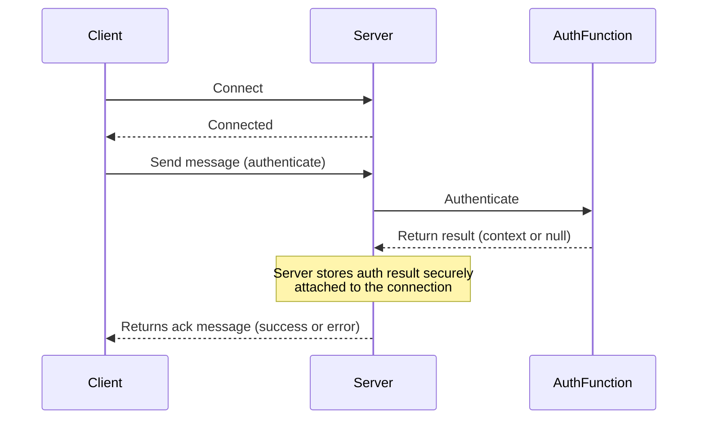
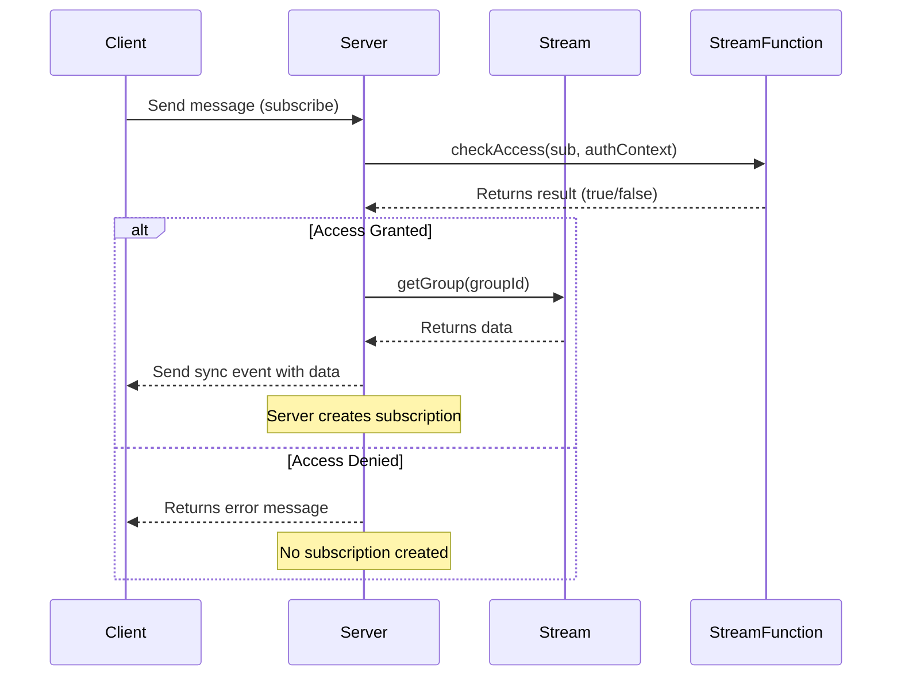

# RFC: Role-Based Access Control for Motia Streams

**Author:** Sergio Marcelino
**Status:** Ready
**Created:** 2025-06-11  
**Target Release:** v0.23.0  
**Topic:** Streams, WebSockets, Authentication, RBAC

---

## Summary

This RFC proposes an RBAC mechanism for the Motia Streams feature. Currently, any client can subscribe to any stream, with no enforcement of access rules. This proposal introduces a pluggable authentication entry point and per-stream authorization checks to enable secure, context-aware stream subscriptions.

---

## Motivation

- Improve security by controlling stream access via authentication and authorization logic.
- Provide flexibility for developers to define custom access policies.
- Support anonymous access for public streams when desired.

---

## Guide-Level Explanation

### Client Message Format

Motia Client Library will send a message of type `authentication` with the token as soon as it connects to the server.

```json
{
  "type": "authentication",
  "data": {
    "token": "string"
  }
}
```

The Websocket server will ultimately invoke the defined authentication function defined in the project.

### Defining the authentication function

Developers need to create a file called `/motia/stream-auth.ts` to define the authentication function.
The file content should export an `authenticate` function that should receive only one parameter, the token, in string.

```typescript
export async function authenticate(token: string): Promise<StreamAuthContext | null> {
  // returning null means the user is not authenticated and will be considered anonymous
  // anonymous users can still have access to streams depending on the logic
  return null
}
```

The function can return a `StreamAuthContext` object or `null` if the authentication fails.
The file can also export a type called contextSchema using zod

```typescript
export const contextSchema = z.object({
  userId: z.string(),
  userName: z.string(),
  userStatus: z.enum(['active', 'inactive']),
  projectIds: z.array(z.string()),
})
```

Motia framework will automatically create the `StreamAuthContext` object based on the `contextSchema` type inside `types.d.ts` file for the project.

```typescript
interface StreamAuthContext {
  userId: string
  userName: string
  userStatus: 'active' | 'inactive'
  projectIds: string[]
}
```

### Validating user access to a stream

Here's an existing stream definition:

```typescript
import { StreamConfig } from 'motia'
import { z } from 'zod'

export const config: StreamConfig = {
  name: 'message',
  schema: z.object({
    message: z.string(),
    from: z.enum(['user', 'assistant']),
    status: z.enum(['created', 'pending', 'completed']),
  }),
  baseConfig: { storageType: 'default' },
}
```

Users will be able to control whoever has access to a stream subscription using the `checkAccess` function.

```typescript
export const config: StreamConfig = {
  name: 'message',
  schema: z.object({
    message: z.string(),
    from: z.enum(['user', 'assistant']),
    status: z.enum(['created', 'pending', 'completed']),
  }),
  baseConfig: { storageType: 'default' },

  /**
   * type Subscription = { groupId: string, itemId?: string }
   * type StreamAuthContext depends on the contextSchema defined in the stream-auth.ts file
   *
   * If this function is not defined, anonymous user has access to the stream
   *
   * Since we receive groupId and itemId, developers are able to give granular access to the stream
   *
   * @param subscription - The subscription context
   * @param authContext - The authentication context
   * @returns true if the user has access to the stream, false otherwise
   */
  checkAccess: (subscription: Subscription, authContext?: StreamAuthContext): boolean => {
    return true
  },
}
```

### Flow of authentication in Motia Streams client



### Flow of subscription in Motia Streams client


